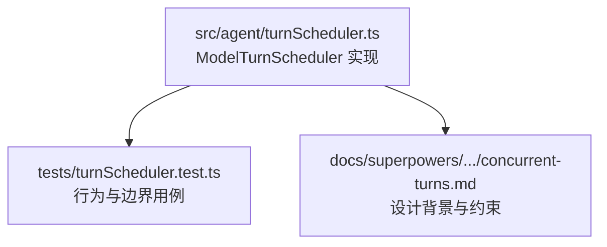
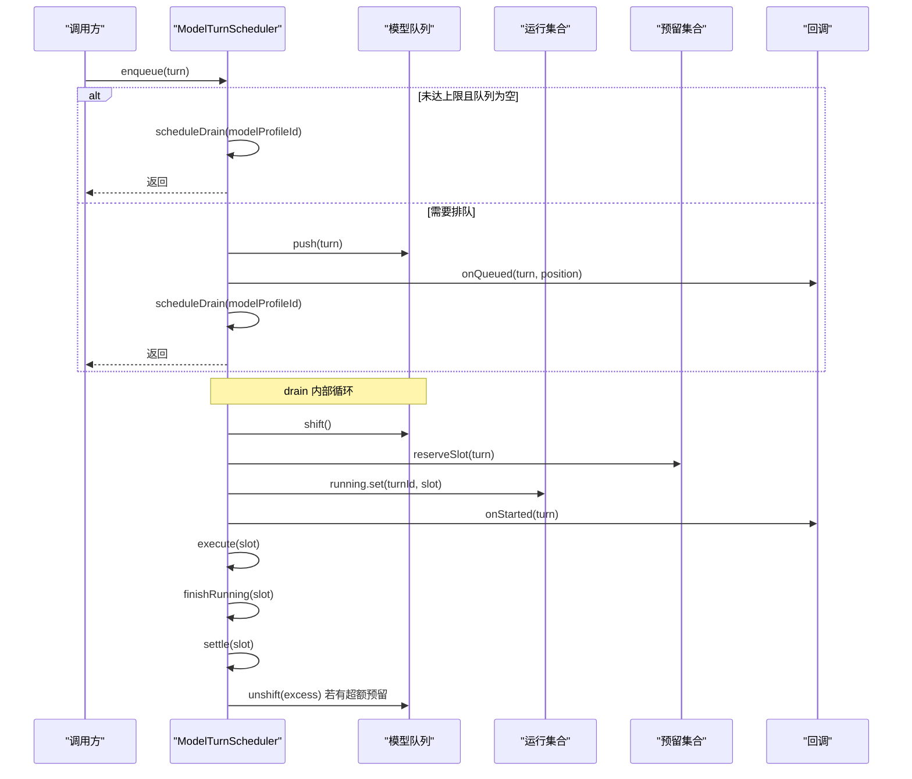
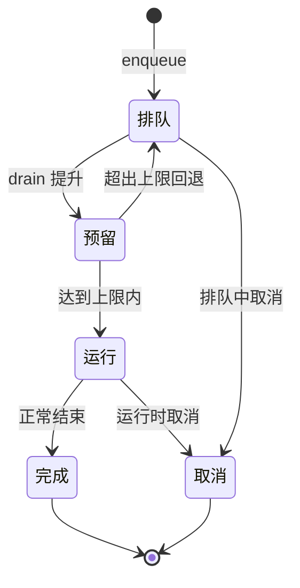
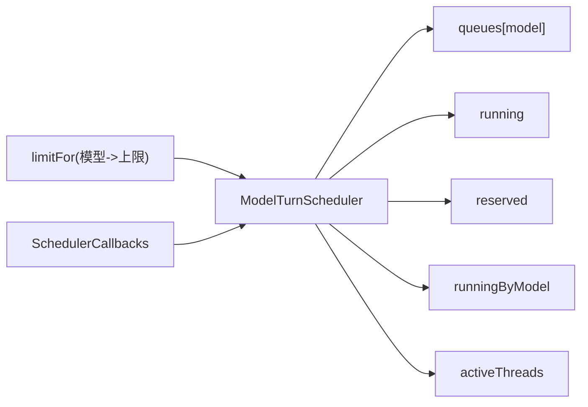

# 任务调度器核心

<cite>
**本文引用的文件**
- [src/agent/turnScheduler.ts](file://src/agent/turnScheduler.ts)
- [tests/turnScheduler.test.ts](file://tests/turnScheduler.test.ts)
- [docs/superpowers/plans/2026-08-17-provider-capabilities-concurrent-turns.md](file://docs/superpowers/plans/2026-08-17-provider-capabilities-concurrent-turns.md)
</cite>

## 目录
1. [简介](#简介)
2. [项目结构](#项目结构)
3. [核心组件](#核心组件)
4. [架构总览](#架构总览)
5. [详细组件分析](#详细组件分析)
6. [依赖关系分析](#依赖关系分析)
7. [性能考量](#性能考量)
8. [故障排查指南](#故障排查指南)
9. [结论](#结论)
10. [附录：使用示例与最佳实践](#附录使用示例与最佳实践)

## 简介
本技术文档围绕 ModelTurnScheduler 类展开，系统性阐述其任务调度算法、队列管理、并发限制控制、任务生命周期管理与资源分配策略。重点解释 ScheduledTurn 接口的设计理念与实现细节，说明 enqueue、cancel、updateLimit 等核心方法的工作原理与调用时机，并给出任务状态转换机制（排队、预留、运行、完成/取消）的完整流转图。文末提供基于测试用例的使用示例与性能优化建议，帮助读者正确、高效地使用调度器进行任务管理。

## 项目结构
本项目将“按模型分组的 FIFO 调度”作为核心能力之一，调度器位于 agent 层，通过回调与上层 worker/客户端交互，并通过测试覆盖关键行为。

图表来源
- [src/agent/turnScheduler.ts:1-378](file://src/agent/turnScheduler.ts#L1-L378)
- [tests/turnScheduler.test.ts:1-780](file://tests/turnScheduler.test.ts#L1-L780)
- [docs/superpowers/plans/2026-08-17-provider-capabilities-concurrent-turns.md:607-722](file://docs/superpowers/plans/2026-08-17-provider-capabilities-concurrent-turns.md#L607-L722)

章节来源
- [src/agent/turnScheduler.ts:1-378](file://src/agent/turnScheduler.ts#L1-L378)
- [tests/turnScheduler.test.ts:1-780](file://tests/turnScheduler.test.ts#L1-L780)
- [docs/superpowers/plans/2026-08-17-provider-capabilities-concurrent-turns.md:607-722](file://docs/superpowers/plans/2026-08-17-provider-capabilities-concurrent-turns.md#L607-L722)

## 核心组件
- ScheduledTurn：表示一个可被调度的“回合”任务，包含 turnId、threadId、modelProfileId、title 以及 run(signal) 执行函数。
- SchedulerCallbacks：调度器对外事件回调，包括 onQueued、onStarted、onCancelling、onCancelled、onQueuePositions。
- ModelTurnScheduler：核心调度器，维护每模型的队列、预留集合、运行集合、线程活跃集合、操作队列与处理标记，负责入队、出队、并发限制、取消与位置通知。

章节来源
- [src/agent/turnScheduler.ts:1-45](file://src/agent/turnScheduler.ts#L1-L45)

## 架构总览
调度器以“每模型独立队列 + 全局 per-model 并发上限”的方式工作。入队时若当前模型未达到上限且无等待队列，则直接尝试启动；否则进入队列并触发 drain 流程。drain 会批量从队列中取出任务，先“预留”再“运行”，并在运行结束后释放槽位并继续 drain。取消可在运行中或排队前阶段生效，分别走不同路径。

图表来源
- [src/agent/turnScheduler.ts:47-72](file://src/agent/turnScheduler.ts#L47-L72)
- [src/agent/turnScheduler.ts:146-200](file://src/agent/turnScheduler.ts#L146-L200)
- [src/agent/turnScheduler.ts:229-263](file://src/agent/turnScheduler.ts#L229-L263)

## 详细组件分析

### 数据结构与职责
- queues: Map<modelProfileId, ScheduledTurn[]> 每个模型的 FIFO 队列。
- reserved: Map<turnId, TurnSlot> 已预留但未运行的任务。
- running: Map<turnId, TurnSlot> 正在运行的任务。
- runningByModel: Map<modelProfileId, Set<turnId>> 用于统计每模型当前占用槽数。
- activeThreads: Set<threadId> 防止同一线程重复入队。
- cancellingBeforeStart: Set<turnId> 在开始前的取消暂存集合。
- modelOperations: Map<modelProfileId, ModelOperation[]> 模型级串行操作队列（如 drain）。
- processingModels: Set<modelProfileId> 避免重复处理同一模型的操作。

章节来源
- [src/agent/turnScheduler.ts:32-40](file://src/agent/turnScheduler.ts#L32-L40)

### 并发限制与有效上限
- effectiveLimit(modelProfileId): 通过 limitFor 获取配置上限，并钳制为至少 1。
- slotCount(modelProfileId): 统计 runningByModel 中该模型的槽数。
- 当 slotCount < effectiveLimit 且队列非空时，drain 会提升任务到运行态。

章节来源
- [src/agent/turnScheduler.ts:137-144](file://src/agent/turnScheduler.ts#L137-L144)
- [src/agent/turnScheduler.ts:153-169](file://src/agent/turnScheduler.ts#L153-L169)

### 入队与队列位置通知
- enqueue 首先校验 threadId 是否已在 activeThreads，避免同一线程重复入队。
- 若必须排队（队列非空或已达上限），则将任务加入队列，计算位置并触发 onQueued。
- 同时安排 drain 与 onQueuePositions 更新，确保 UI 能显示稳定、有序的位置快照。

章节来源
- [src/agent/turnScheduler.ts:47-72](file://src/agent/turnScheduler.ts#L47-L72)
- [src/agent/turnScheduler.ts:280-297](file://src/agent/turnScheduler.ts#L280-L297)

### 取消流程
- cancel 支持三种场景：
  - 运行中：调用 AbortController.abort，触发 onCancelling（可选），随后 finishRunning 中根据信号判断是否报告 onCancelled(true)。
  - 已预留未运行：移除预留、释放槽位，并触发 onCancelled(false)。
  - 排队中：从队列删除，标记 cancellingBeforeStart，异步回调 onCancelled(false)，清理 activeThreads。
- 取消幂等：重复取消返回 false。

章节来源
- [src/agent/turnScheduler.ts:74-113](file://src/agent/turnScheduler.ts#L74-L113)
- [src/agent/turnScheduler.ts:243-278](file://src/agent/turnScheduler.ts#L243-L278)

### 运行与收尾
- drain 将队列中的任务先“预留”（reserved），再检查实际运行计数，超过上限的任务会被回退到队列头部（excess），保证 FIFO 顺序。
- execute 调用 turn.run(signal)，异常由任务自身负责上报；finally 中统一调度 finishRunning。
- finishRunning 根据是否被中止决定回调参数，然后 settle 清理运行态、释放槽位、移除 activeThreads，并再次 drain。

章节来源
- [src/agent/turnScheduler.ts:153-200](file://src/agent/turnScheduler.ts#L153-L200)
- [src/agent/turnScheduler.ts:229-263](file://src/agent/turnScheduler.ts#L229-L263)

### 动态调整并发上限
- updateLimit 仅调度 drain，不主动中断运行中的任务；减少上限不会取消已运行的任务，增加上限会在下一轮 drain 中启动排队任务。

章节来源
- [src/agent/turnScheduler.ts:115-117](file://src/agent/turnScheduler.ts#L115-L117)
- [tests/turnScheduler.test.ts:105-150](file://tests/turnScheduler.test.ts#L105-L150)

### 回调与错误隔离
- invoke/invokeMaybeAsync 包裹所有回调调用，捕获异常并吞掉未处理的拒绝，避免回调失败导致槽位泄漏或全局未处理拒绝。

章节来源
- [src/agent/turnScheduler.ts:362-376](file://src/agent/turnScheduler.ts#L362-L376)
- [tests/turnScheduler.test.ts:673-707](file://tests/turnScheduler.test.ts#L673-L707)

### 任务状态转换机制

图表来源
- [src/agent/turnScheduler.ts:153-200](file://src/agent/turnScheduler.ts#L153-L200)
- [src/agent/turnScheduler.ts:243-278](file://src/agent/turnScheduler.ts#L243-L278)

## 依赖关系分析
- 外部依赖：
  - limitFor：由调用方提供，决定每个模型的有效并发上限。
  - SchedulerCallbacks：由调用方实现，用于持久化状态、推送事件与 UI 更新。
- 内部耦合：
  - drain 与 execute/settle 紧密协作，形成“预留-运行-释放”闭环。
  - modelOperations 串行化同模型的关键操作（如 drain），避免竞态。

图表来源
- [src/agent/turnScheduler.ts:32-45](file://src/agent/turnScheduler.ts#L32-L45)
- [src/agent/turnScheduler.ts:146-200](file://src/agent/turnScheduler.ts#L146-L200)

章节来源
- [src/agent/turnScheduler.ts:32-45](file://src/agent/turnScheduler.ts#L32-L45)
- [src/agent/turnScheduler.ts:146-200](file://src/agent/turnScheduler.ts#L146-L200)

## 性能考量
- 每模型独立队列与串行操作：避免跨模型干扰，降低锁竞争。
- 批量预留与回退：drain 一次性提升多个任务，但仅在真正可用容量内运行，多余预留立即回退，减少频繁切换。
- 回调批处理：onQueuePositions 按模型串行输出，避免 UI 抖动。
- 错误隔离：回调异常被吞掉，不影响槽位释放与后续调度。
- 建议：
  - 合理设置 limitFor，避免过大导致资源争用，过小导致吞吐不足。
  - 尽量让 onQueued/onStarted/onCancelled 保持轻量，必要时异步化以避免阻塞 drain。
  - 对长耗时任务，及时响应 AbortSignal，缩短取消延迟。

[本节为通用指导，不直接分析具体文件]

## 故障排查指南
- 现象：同一线程重复入队抛出异常
  - 原因：activeThreads 已存在该 threadId
  - 处理：确保线程生命周期与任务一一对应，任务完成后自动清理
  - 参考：[src/agent/turnScheduler.ts:47-52](file://src/agent/turnScheduler.ts#L47-L52)
- 现象：取消无效或多次取消
  - 原因：任务已结束或被提前取消，cancel 返回 false
  - 处理：检查 running/reserved/queue 是否存在对应 turnId
  - 参考：[src/agent/turnScheduler.ts:74-113](file://src/agent/turnScheduler.ts#L74-L113)
- 现象：回调抛错导致槽位泄漏
  - 原因：回调未正确捕获异常
  - 处理：使用 invoke/invokeMaybeAsync 包装回调，确保异常被吞掉
  - 参考：[src/agent/turnScheduler.ts:362-376](file://src/agent/turnScheduler.ts#L362-L376)
- 现象：队列位置不稳定
  - 原因：多处并发更新位置
  - 处理：依赖 onQueuePositions 的模型级串行输出，避免自行拼接
  - 参考：[src/agent/turnScheduler.ts:280-297](file://src/agent/turnScheduler.ts#L280-L297)

章节来源
- [src/agent/turnScheduler.ts:47-52](file://src/agent/turnScheduler.ts#L47-L52)
- [src/agent/turnScheduler.ts:74-113](file://src/agent/turnScheduler.ts#L74-L113)
- [src/agent/turnScheduler.ts:280-297](file://src/agent/turnScheduler.ts#L280-L297)
- [src/agent/turnScheduler.ts:362-376](file://src/agent/turnScheduler.ts#L362-L376)

## 结论
ModelTurnScheduler 提供了健壮、可扩展的 per-model FIFO 调度能力，具备明确的并发上限、完善的取消语义与稳定的队列位置通知。通过回调与 limitFor 注入，调度器与上层业务解耦，易于集成到 worker/客户端体系。遵循本文的最佳实践与故障排查建议，可获得高吞吐、低抖动、可观测的调度体验。

[本节为总结性内容，不直接分析具体文件]

## 附录：使用示例与最佳实践

### 基本用法（基于测试构造）
- 创建调度器：传入 limitFor 与 SchedulerCallbacks
- 构造 ScheduledTurn：包含 turnId、threadId、modelProfileId、title、run(signal)
- 入队：scheduler.enqueue(task)
- 取消：scheduler.cancel(turnId)
- 调整上限：scheduler.updateLimit(modelProfileId)
- 查询线程活跃：scheduler.hasActiveThread(threadId)

章节来源
- [tests/turnScheduler.test.ts:710-750](file://tests/turnScheduler.test.ts#L710-L750)
- [tests/turnScheduler.test.ts:743-750](file://tests/turnScheduler.test.ts#L743-L750)

### 典型场景与期望行为
- 单模型限流为 1：FIFO 顺序执行，第二个任务进入队列并收到 onQueued(position=1)
  - 参考：[tests/turnScheduler.test.ts:9-24](file://tests/turnScheduler.test.ts#L9-L24)
- 多模型独立容量：不同 modelProfileId 互不影响
  - 参考：[tests/turnScheduler.test.ts:26-40](file://tests/turnScheduler.test.ts#L26-L40)
- 取消排队任务：不会运行，回调 onCancelled(wasRunning=false)
  - 参考：[tests/turnScheduler.test.ts:42-63](file://tests/turnScheduler.test.ts#L42-L63)
- 取消运行任务：AbortSignal 触发，回调 onCancelled(wasRunning=true)
  - 参考：[tests/turnScheduler.test.ts:65-88](file://tests/turnScheduler.test.ts#L65-L88)
- 运行失败释放槽位：下一个任务得以启动
  - 参考：[tests/turnScheduler.test.ts:90-103](file://tests/turnScheduler.test.ts#L90-L103)
- 动态提高上限：排队任务启动
  - 参考：[tests/turnScheduler.test.ts:105-125](file://tests/turnScheduler.test.ts#L105-L125)
- 动态降低上限：不中断运行中任务
  - 参考：[tests/turnScheduler.test.ts:127-150](file://tests/turnScheduler.test.ts#L127-L150)
- 同一线程禁止重复入队：抛出异常
  - 参考：[tests/turnScheduler.test.ts:152-177](file://tests/turnScheduler.test.ts#L152-L177)
- 队列位置快照稳定且单调递增
  - 参考：[tests/turnScheduler.test.ts:179-205](file://tests/turnScheduler.test.ts#L179-L205)
- 异步 onQueued 与 onQueuePositions 的序列化与先后顺序
  - 参考：[tests/turnScheduler.test.ts:207-302](file://tests/turnScheduler.test.ts#L207-L302)
- 重入式 limit 更新与回调安全
  - 参考：[tests/turnScheduler.test.ts:553-591](file://tests/turnScheduler.test.ts#L553-L591)
- 回调异常不泄露槽位或未处理拒绝
  - 参考：[tests/turnScheduler.test.ts:673-707](file://tests/turnScheduler.test.ts#L673-L707)

### 最佳实践
- 始终监听并响应 AbortSignal，确保取消快速生效。
- 将 onQueued/onStarted/onCancelled 的副作用（如 UI 更新、日志记录）保持轻量，必要时异步化。
- 合理设置 limitFor，结合模型能力与系统资源评估。
- 使用 hasActiveThread 避免同一线程并发提交。
- 利用 onQueuePositions 做 UI 展示，不要自行维护队列位置。

[本节为实践指导，不直接分析具体文件]