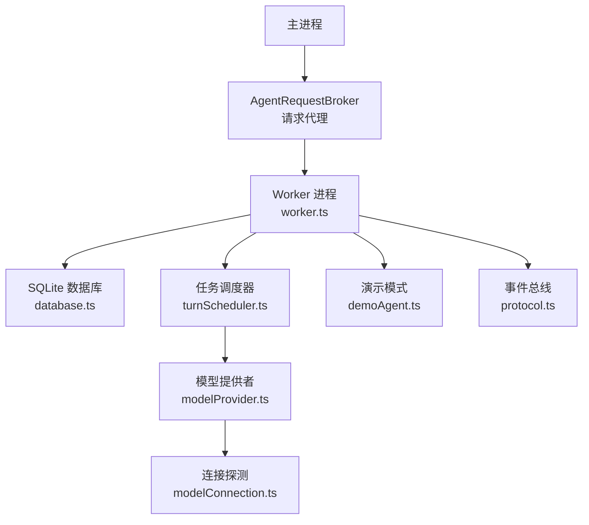
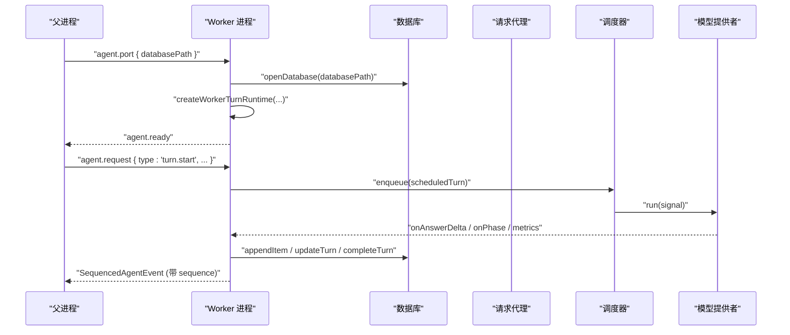
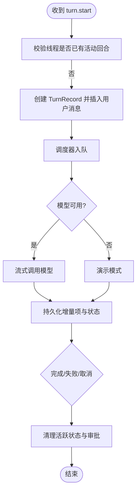
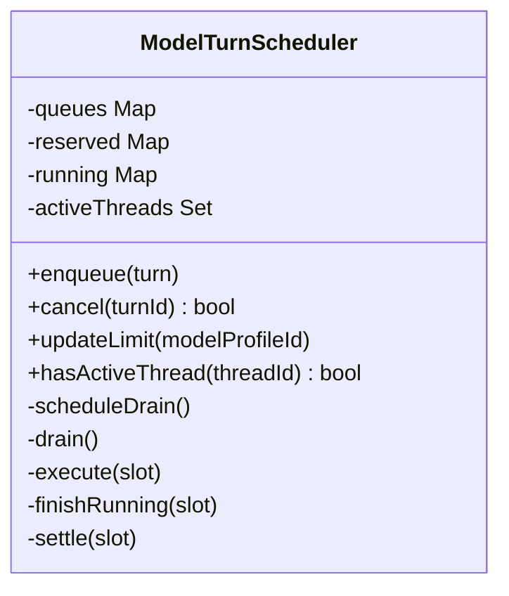
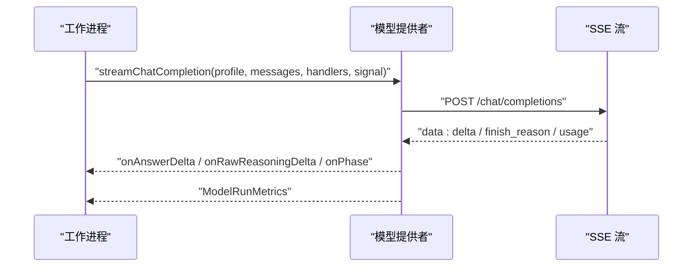
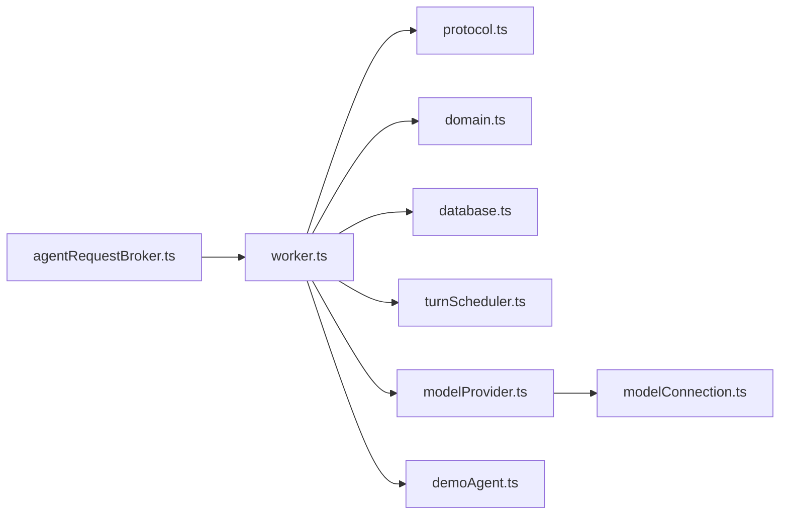

# 工作进程生命周期管理

<cite>
**本文引用的文件**
- [worker.ts](file://src/agent/worker.ts)
- [protocol.ts](file://src/shared/protocol.ts)
- [domain.ts](file://src/shared/domain.ts)
- [agentRequestBroker.ts](file://src/main/agentRequestBroker.ts)
- [modelProvider.ts](file://src/agent/modelProvider.ts)
- [modelConnection.ts](file://src/agent/modelConnection.ts)
- [database.ts](file://src/agent/database.ts)
- [demoAgent.ts](file://src/agent/demoAgent.ts)
- [turnScheduler.ts](file://src/agent/turnScheduler.ts)
- [worker.test.ts](file://tests/worker.test.ts)
</cite>

## 目录
1. [简介](#简介)
2. [项目结构](#项目结构)
3. [核心组件](#核心组件)
4. [架构总览](#架构总览)
5. [详细组件分析](#详细组件分析)
6. [依赖关系分析](#依赖关系分析)
7. [性能与资源管理](#性能与资源管理)
8. [监控、诊断与可观测性](#监控诊断与可观测性)
9. [健康检查、自动重启与优雅退出](#健康检查自动重启与优雅退出)
10. [故障排查指南](#故障排查指南)
11. [结论](#结论)
12. [附录：协议与事件速查](#附录协议与事件速查)

## 简介
本文件面向 Agent 工作进程的完整生命周期管理，覆盖启动、初始化、运行、销毁全过程；详细说明进程间通信协议（消息格式、事件类型、错误码）；解释资源管理机制（内存、文件句柄、网络连接清理策略）；并给出监控与诊断能力（指标收集、日志记录、调试支持）。同时提供健康检查、自动重启与优雅退出的实现方案，以及实际使用示例与故障恢复策略。

## 项目结构
工作进程由主进程通过 IPC 通道创建并驱动，内部包含请求路由、任务调度、模型流式调用、数据库持久化等模块。关键路径如下：
- 进程入口与 IPC：worker.ts 监听父进程消息，建立子端口，初始化数据库与工作运行时，发送就绪事件。
- 协议与领域模型：protocol.ts 定义桌面端请求与事件类型；domain.ts 定义领域数据结构与状态枚举。
- 请求代理：agentRequestBroker.ts 封装请求-响应语义、超时与断连处理。
- 任务调度：turnScheduler.ts 按模型配置并发度维护队列、执行与释放。
- 模型调用：modelProvider.ts 负责流式对话、上下文压缩、超时控制、指标聚合；modelConnection.ts 负责连接探测与槽位校验。
- 数据持久化：database.ts 基于 SQLite 的会话、回合、审批、设置、工作区等持久化。
- 演示模式：demoAgent.ts 提供无需真实模型的本地演示流程。

图表来源
- [worker.ts:115-128](file://src/agent/worker.ts#L115-L128)
- [agentRequestBroker.ts:15-85](file://src/main/agentRequestBroker.ts#L15-L85)
- [turnScheduler.ts:32-45](file://src/agent/turnScheduler.ts#L32-L45)
- [modelProvider.ts:55-197](file://src/agent/modelProvider.ts#L55-L197)
- [modelConnection.ts:11-91](file://src/agent/modelConnection.ts#L11-L91)
- [database.ts:38-66](file://src/agent/database.ts#L38-L66)
- [protocol.ts:22-65](file://src/shared/protocol.ts#L22-L65)

章节来源
- [worker.ts:115-128](file://src/agent/worker.ts#L115-L128)
- [agentRequestBroker.ts:15-85](file://src/main/agentRequestBroker.ts#L15-L85)
- [protocol.ts:22-65](file://src/shared/protocol.ts#L22-L65)
- [domain.ts:107-115](file://src/shared/domain.ts#L107-L115)

## 核心组件
- 工作进程入口与运行时：worker.ts 暴露 createWorkerTurnRuntime，封装 startTurn/cancelTurn/respondApproval/updateLimit/deleteThread/deleteGroup 等能力。
- 请求代理：agentRequestBroker.ts 提供 request/handleReply/disconnect，统一超时与断线重投逻辑。
- 任务调度：turnScheduler.ts 维护每个模型配置的队列、预留槽位、运行中集合，回调 onQueued/onStarted/onCancelling/onCancelled/onQueuePositions。
- 模型流式调用：modelProvider.ts 实现 streamChatCompletion，含上下文压缩、重试续写、SSE 解析、指标合并。
- 连接探测：modelConnection.ts 实现 inspectModelConnection，校验模型列表与服务槽位一致性。
- 持久化：database.ts 提供 AppDatabase 接口，事务化写入，支持中断恢复。
- 演示模式：demoAgent.ts 模拟审批与输出，便于无模型环境验证流程。

章节来源
- [worker.ts:85-101](file://src/agent/worker.ts#L85-L101)
- [agentRequestBroker.ts:15-85](file://src/main/agentRequestBroker.ts#L15-L85)
- [turnScheduler.ts:32-45](file://src/agent/turnScheduler.ts#L32-L45)
- [modelProvider.ts:55-197](file://src/agent/modelProvider.ts#L55-L197)
- [modelConnection.ts:11-91](file://src/agent/modelConnection.ts#L11-L91)
- [database.ts:38-66](file://src/agent/database.ts#L38-L66)
- [demoAgent.ts:16-65](file://src/agent/demoAgent.ts#L16-L65)

## 架构总览
工作进程的生命周期分为四个阶段：
- 启动：父进程通过 parentPort 发送 agent.port 消息，携带数据库路径；worker 打开数据库，创建工作运行时，绑定子端口消息处理，发送 agent.ready。
- 初始化：构建事件发射器、调度器、活跃任务映射、审批解析器；注册桌面端请求路由。
- 运行：接收 turn.start 后入队调度，按模型并发限制执行；流式事件经序列号排序后持久化并转发；支持取消、审批等待。
- 销毁：关闭数据库、释放信号与流、清理活跃状态；未完成的回合标记为 interrupted，待重启恢复。

图表来源
- [worker.ts:115-128](file://src/agent/worker.ts#L115-L128)
- [worker.ts:132-157](file://src/agent/worker.ts#L132-L157)
- [worker.ts:159-409](file://src/agent/worker.ts#L159-L409)
- [turnScheduler.ts:47-72](file://src/agent/turnScheduler.ts#L47-L72)
- [modelProvider.ts:55-197](file://src/agent/modelProvider.ts#L55-L197)
- [database.ts:490-464](file://src/agent/database.ts#L490-L464)

章节来源
- [worker.ts:115-128](file://src/agent/worker.ts#L115-L128)
- [worker.ts:159-409](file://src/agent/worker.ts#L159-L409)
- [turnScheduler.ts:47-72](file://src/agent/turnScheduler.ts#L47-L72)
- [modelProvider.ts:55-197](file://src/agent/modelProvider.ts#L55-L197)
- [database.ts:490-464](file://src/agent/database.ts#L490-L464)

## 详细组件分析

### 工作进程入口与运行时（worker.ts）
- 启动与初始化：监听 parentPort 消息，解析 agent.port，打开数据库，创建运行时，绑定 workerPort 消息处理，发送 agent.ready。
- 事件序列化：createTurnEventEmitter 为每个 turn 生成递增 sequence，保证有序投递；终端事件（completed/failed/cancelled）仅排队一次。
- 任务执行：execute 封装模型或演示执行，捕获异常并持久化失败；支持 approval 等待与取消。
- 桌面端请求路由：handleDesktopRequest 分发 snapshot.get/thread.create/group.delete/modelProfile.save/settings.update/approval.respond/turn.cancel/turn.start/workspace.register 等。
- 资源清理：在取消或完成时清理 active 映射与审批解析器；失败时标记 incomplete。

图表来源
- [worker.ts:311-409](file://src/agent/worker.ts#L311-L409)
- [worker.ts:227-309](file://src/agent/worker.ts#L227-L309)
- [worker.ts:421-449](file://src/agent/worker.ts#L421-L449)

章节来源
- [worker.ts:115-128](file://src/agent/worker.ts#L115-L128)
- [worker.ts:132-157](file://src/agent/worker.ts#L132-L157)
- [worker.ts:227-309](file://src/agent/worker.ts#L227-L309)
- [worker.ts:311-409](file://src/agent/worker.ts#L311-L409)
- [worker.ts:421-449](file://src/agent/worker.ts#L421-L449)

### 进程间通信协议（protocol.ts）
- 桌面端请求 DesktopRequest：包括快照获取、群组/会话管理、回合控制、模型配置、设置更新、工作区注册等。
- 事件 AgentEvent：包含快照与 SequencedAgentEvent；后者附带 threadId/turnId/modelProfileId/sequence，确保顺序。
- 事件类型：turn.queued/started/message.delta/answer.delta/reasoning.raw.delta/reasoning.summary.delta/model.progress/tool.started/tool.output/model.metrics/approval.required/turn.cancelling/completed/failed/cancelled。
- 校验函数：isDesktopRequest/isAgentEvent 对字段进行严格类型与范围校验。

章节来源
- [protocol.ts:22-65](file://src/shared/protocol.ts#L22-L65)
- [protocol.ts:274-371](file://src/shared/protocol.ts#L274-L371)

### 任务调度器（turnScheduler.ts）
- 并发控制：按 modelProfileId 维度维护队列与运行计数，依据 limitFor 回调计算有效并发上限。
- 生命周期回调：onQueued/onStarted/onCancelling/onCancelled/onQueuePositions，供上层同步 UI 与数据库状态。
- 取消与抢占：cancel 支持队列中移除、预留槽释放、运行中中止；pre-start cancellation 异步通知。
- 操作批处理：按模型维度串行化 drain/position 等操作，避免竞态。

图表来源
- [turnScheduler.ts:32-45](file://src/agent/turnScheduler.ts#L32-L45)
- [turnScheduler.ts:47-117](file://src/agent/turnScheduler.ts#L47-L117)
- [turnScheduler.ts:146-200](file://src/agent/turnScheduler.ts#L146-L200)
- [turnScheduler.ts:229-278](file://src/agent/turnScheduler.ts#L229-L278)

章节来源
- [turnScheduler.ts:32-45](file://src/agent/turnScheduler.ts#L32-L45)
- [turnScheduler.ts:47-117](file://src/agent/turnScheduler.ts#L47-L117)
- [turnScheduler.ts:146-200](file://src/agent/turnScheduler.ts#L146-L200)
- [turnScheduler.ts:229-278](file://src/agent/turnScheduler.ts#L229-L278)

### 模型流式调用（modelProvider.ts）
- 超时与信号：默认基础超时与每 token 超时，结合 AbortSignal 实现可中断的请求；linkedTimeoutSignal 将外部信号与定时器联动。
- 上下文压缩：当接近上下文窗口时，压缩历史、系统提示与最新用户消息，必要时多次续写直至完成。
- SSE 解析：readSSE 分块读取，去重 id，阶段切换（connecting→reasoning→answering），累积指标。
- 指标聚合：合并多轮指标，计算 tokensPerSecond、speedSource、usageSource、timeToFirstTokenMs 等。
- 错误处理：区分上下文超限、压缩后仍失败、长度限制无进展等场景，抛出可读错误。

图表来源
- [modelProvider.ts:55-197](file://src/agent/modelProvider.ts#L55-L197)
- [modelProvider.ts:563-680](file://src/agent/modelProvider.ts#L563-L680)
- [modelProvider.ts:720-756](file://src/agent/modelProvider.ts#L720-L756)

章节来源
- [modelProvider.ts:55-197](file://src/agent/modelProvider.ts#L55-L197)
- [modelProvider.ts:563-680](file://src/agent/modelProvider.ts#L563-L680)
- [modelProvider.ts:720-756](file://src/agent/modelProvider.ts#L720-L756)

### 连接探测（modelConnection.ts）
- 探测流程：访问 /models 校验模型存在，访问 /slots 校验服务槽位与客户端并发一致。
- 结果类型：connected/concurrency-warning/slots-unverified/offline/model-mismatch，用于上层展示与调整。
- 超时与中止：withExplicitAbort 确保 AbortSignal 及时传播。

章节来源
- [modelConnection.ts:11-91](file://src/agent/modelConnection.ts#L11-L91)
- [modelConnection.ts:117-136](file://src/agent/modelConnection.ts#L117-L136)

### 持久化与恢复（database.ts）
- 事务化写入：所有写操作包裹 transaction，保证一致性。
- 回合状态：createTurn/updateTurn/failTurn/completeTurn/interruptUnfinishedTurns，支持重启后恢复。
- 审批状态：upsertApproval，配合中断逻辑拒绝悬挂审批。
- 工作区：registerWorkspace/deleteWorkspace/touchWorkspace，规范化路径与安全策略。

章节来源
- [database.ts:38-66](file://src/agent/database.ts#L38-L66)
- [database.ts:360-464](file://src/agent/database.ts#L360-L464)
- [database.ts:466-488](file://src/agent/database.ts#L466-L488)
- [database.ts:632-717](file://src/agent/database.ts#L632-L717)

### 演示模式（demoAgent.ts）
- 审批流程：检测敏感词触发 approval.required，等待批准后再继续。
- 输出模拟：分段 message.delta，便于端到端验证事件流与 UI。

章节来源
- [demoAgent.ts:16-65](file://src/agent/demoAgent.ts#L16-L65)
- [demoAgent.ts:67-74](file://src/agent/demoAgent.ts#L67-L74)

## 依赖关系分析
- worker.ts 依赖 protocol.ts（消息类型）、domain.ts（领域模型）、database.ts（持久化）、turnScheduler.ts（调度）、modelProvider.ts（模型调用）、demoAgent.ts（演示）。
- agentRequestBroker.ts 作为主进程侧代理，向 worker 发送 agent.request，接收 agent.reply。
- modelProvider.ts 依赖 modelConnection.ts（连接探测）、streamTextNormalizer（文本归一化）。
- database.ts 依赖 modelCapabilities/localQwenProfile 等工具模块进行配置归一化。

图表来源
- [worker.ts:1-53](file://src/agent/worker.ts#L1-L53)
- [agentRequestBroker.ts:1-85](file://src/main/agentRequestBroker.ts#L1-L85)
- [modelProvider.ts:1-7](file://src/agent/modelProvider.ts#L1-L7)

章节来源
- [worker.ts:1-53](file://src/agent/worker.ts#L1-L53)
- [agentRequestBroker.ts:1-85](file://src/main/agentRequestBroker.ts#L1-L85)
- [modelProvider.ts:1-7](file://src/agent/modelProvider.ts#L1-L7)

## 性能与资源管理
- 并发控制：调度器按模型配置限制并发，避免过载；动态更新限制以适配后端槽位变化。
- 超时与中断：模型请求具备基础超时与 per-token 超时；AbortSignal 贯穿调用链，确保快速释放网络与流资源。
- 上下文压缩：接近上下文窗口时压缩历史，减少请求大小，提高成功率；必要时多次续写。
- 流式处理：SSE 逐行解析，增量推送，降低内存峰值；reader 取消与锁释放确保资源回收。
- 持久化优化：批量追加与合并助手消息，减少重复写入；事务化保证原子性。

章节来源
- [turnScheduler.ts:137-140](file://src/agent/turnScheduler.ts#L137-L140)
- [modelProvider.ts:40-53](file://src/agent/modelProvider.ts#L40-L53)
- [modelProvider.ts:209-339](file://src/agent/modelProvider.ts#L209-L339)
- [modelProvider.ts:563-680](file://src/agent/modelProvider.ts#L563-L680)
- [database.ts:335-358](file://src/agent/database.ts#L335-L358)

## 监控、诊断与可观测性
- 指标收集：ModelRunMetrics 包含 durationMs、tokensPerSecond、timeToFirstTokenMs、promptTokens/completionTokens/totalTokens/reasoningTokens、reasoningObserved、speedSource、usageSource。
- 事件追踪：SequencedAgentEvent 提供 turn 全生命周期事件，含 tool.started/output、model.progress、approval.required 等。
- 错误脱敏：safeErrorText 屏蔽 API Key 等敏感信息，防止泄露到存储与事件。
- 调试支持：测试用例覆盖典型场景（并发、取消、审批、中断恢复、错误脱敏、长度限制等），便于回归验证。

章节来源
- [domain.ts:238-257](file://src/shared/domain.ts#L238-L257)
- [protocol.ts:48-65](file://src/shared/protocol.ts#L48-L65)
- [worker.ts:677-679](file://src/agent/worker.ts#L677-L679)
- [worker.test.ts:145-197](file://tests/worker.test.ts#L145-L197)
- [worker.test.ts:555-573](file://tests/worker.test.ts#L555-L573)

## 健康检查、自动重启与优雅退出
- 健康检查：testModelProfile/testRuntimeModelProfileConnection 调用 inspectModelConnection，返回 connected/concurrency-warning/slots-unverified/offline/model-mismatch，用于前端展示与配置修正。
- 自动重启：数据库支持 interruptUnfinishedTurns，重启后将 queued/running/cancelling 的回合标记为 interrupted，并拒绝悬挂审批，保证状态一致。
- 优雅退出：关闭数据库、释放信号与流；取消进行中任务，确保未完成内容保持 incomplete，下次启动可恢复。

章节来源
- [modelProvider.ts:535-561](file://src/agent/modelProvider.ts#L535-L561)
- [modelConnection.ts:11-91](file://src/agent/modelConnection.ts#L11-L91)
- [database.ts:466-488](file://src/agent/database.ts#L466-L488)
- [worker.ts:364-375](file://src/agent/worker.ts#L364-L375)

## 故障排查指南
- 常见问题定位：
  - 模型不可用：检查 /models 与 /slots 连通性与模型名匹配；查看 connection 结果状态。
  - 上下文超限：观察 model.progress 与压缩标志；适当增加 maxOutputTokens 或拆分对话。
  - 审批卡住：确认 approval.required 已持久化且 pending；若取消或失败，审批将被拒绝。
  - 事件丢失：检查 sequence 与终端事件；若 delivery 失败，数据库快照仍可重建。
- 恢复策略：
  - 重启后查询 interrupted 回合，重新提交或清理。
  - 调整并发与输出限制，匹配后端槽位。
  - 启用更严格的超时与重试策略，提升鲁棒性。

章节来源
- [modelConnection.ts:11-91](file://src/agent/modelConnection.ts#L11-L91)
- [modelProvider.ts:469-484](file://src/agent/modelProvider.ts#L469-L484)
- [database.ts:466-488](file://src/agent/database.ts#L466-L488)
- [worker.test.ts:366-385](file://tests/worker.test.ts#L366-L385)

## 结论
该工作进程实现了完整的生命周期管理：从启动初始化、任务调度、模型流式调用、持久化到优雅销毁。通过严格的协议校验、并发控制、超时与中断机制，保障了高可靠与高性能。监控与诊断能力完善，支持健康检查与自动恢复。建议在生产环境中结合连接探测与并发调优，持续监控指标与事件，及时处理异常与资源泄漏。

## 附录：协议与事件速查
- 桌面端请求类型：snapshot.get、group.create/delete、thread.create/delete/setModel、turn.start/cancel、approval.respond、modelProfile.save/delete/test、settings.update、workspace.register/delete、language.set、theme.set。
- 事件类型：turn.queued/started/message.delta/answer.delta/reasoning.raw.delta/reasoning.summary.delta/model.progress/tool.started/tool.output/model.metrics/approval.required/turn.cancelling/completed/failed/cancelled。
- 错误码与状态：
  - 连接结果：connected/concurrency-warning/slots-unverified/offline/model-mismatch。
  - 回合状态：idle/queued/running/cancelling/completed/failed/cancelled/interrupted。

章节来源
- [protocol.ts:22-65](file://src/shared/protocol.ts#L22-L65)
- [domain.ts:107-115](file://src/shared/domain.ts#L107-L115)
- [domain.ts:194-236](file://src/shared/domain.ts#L194-L236)