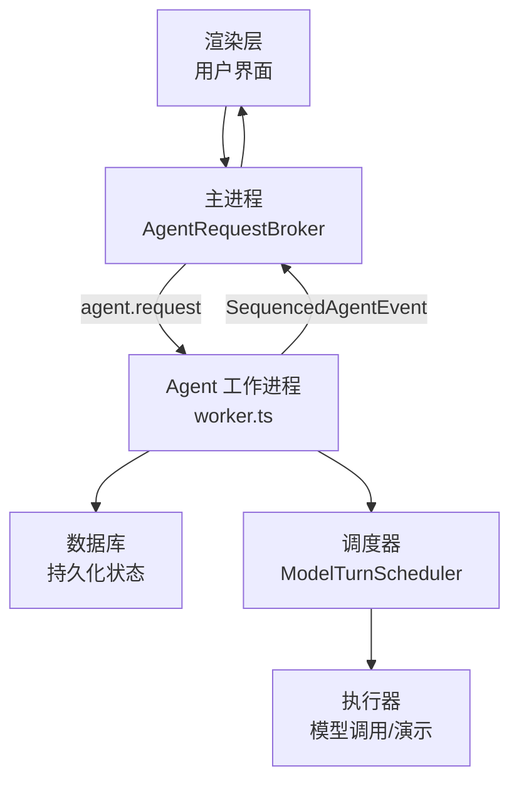
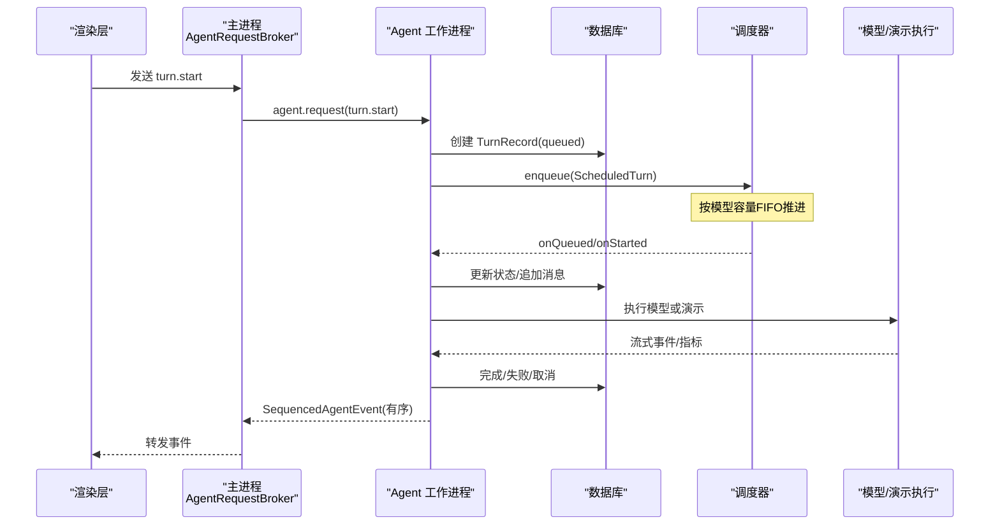
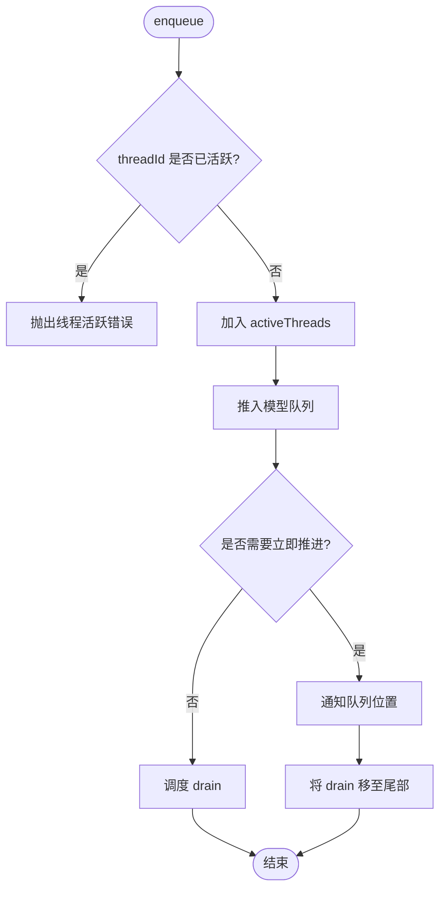
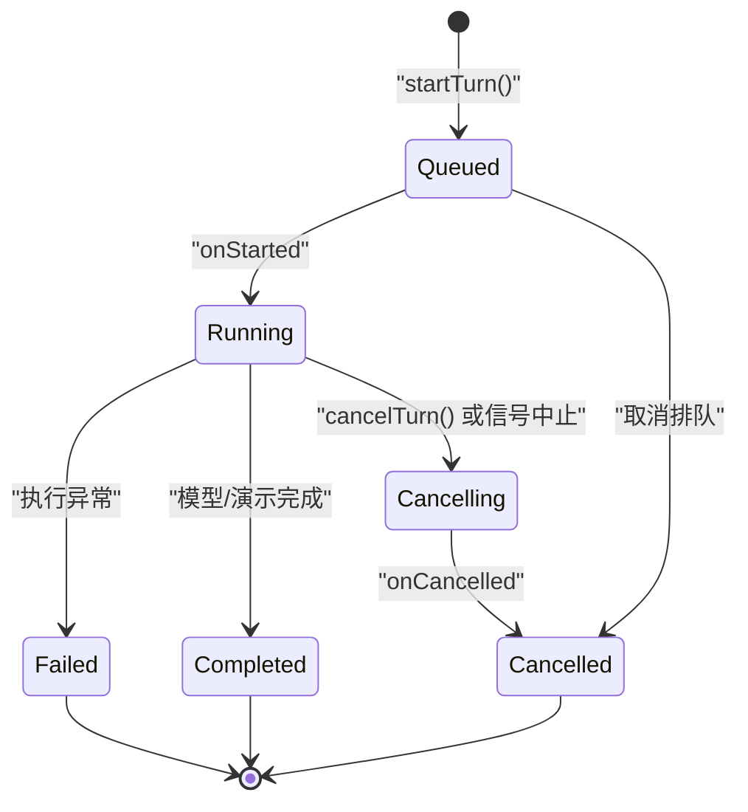
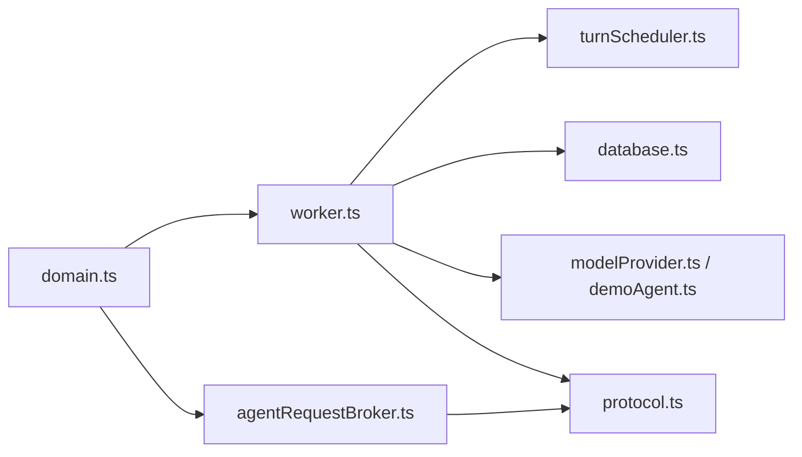

# 并发控制和任务调度

<cite>
**本文引用的文件**
- [turnScheduler.ts](file://src/agent/turnScheduler.ts)
- [worker.ts](file://src/agent/worker.ts)
- [agentRequestBroker.ts](file://src/main/agentRequestBroker.ts)
- [protocol.ts](file://src/shared/protocol.ts)
- [domain.ts](file://src/shared/domain.ts)
- [modelCapabilities.ts](file://src/agent/modelCapabilities.ts)
- [turnScheduler.test.ts](file://tests/turnScheduler.test.ts)
</cite>

## 目录
1. [简介](#简介)
2. [项目结构](#项目结构)
3. [核心组件](#核心组件)
4. [架构总览](#架构总览)
5. [详细组件分析](#详细组件分析)
6. [依赖关系分析](#依赖关系分析)
7. [性能考量](#性能考量)
8. [故障诊断指南](#故障诊断指南)
9. [结论](#结论)
10. [附录：配置与优化建议](#附录：配置与优化建议)

## 简介
本文件面向 Private AI Desktop 的并发控制与任务调度系统，聚焦多进程架构下的任务分配、请求队列管理、资源协调策略，以及 Agent 工作进程的启动、调度与生命周期管理。文档同时覆盖并发限制、超时控制、错误恢复、负载均衡、优先级调度、死锁预防、性能监控、资源统计与故障诊断方法，并给出可操作的配置与优化建议。

## 项目结构
围绕并发与调度的关键代码分布在以下模块：
- 调度器：按模型维度维护队列、运行槽位与线程活跃性，提供 FIFO 执行与动态限流能力。
- Worker（Agent 工作进程）：接收主进程请求，创建并调度“轮次”（turn），持久化状态，回传事件。
- 主进程代理：封装对 Agent 子进程的请求/响应，带超时与断线处理。
- 协议与领域模型：定义跨进程消息类型、事件序列号、运行指标等。
- 能力与限制：规范化模型能力与并发上限，约束实际生效的并发度。

图表来源
- [agentRequestBroker.ts:15-86](file://src/main/agentRequestBroker.ts#L15-L86)
- [worker.ts:115-128](file://src/agent/worker.ts#L115-L128)
- [turnScheduler.ts:32-45](file://src/agent/turnScheduler.ts#L32-L45)

章节来源
- [agentRequestBroker.ts:15-86](file://src/main/agentRequestBroker.ts#L15-L86)
- [worker.ts:115-128](file://src/agent/worker.ts#L115-L128)
- [turnScheduler.ts:32-45](file://src/agent/turnScheduler.ts#L32-L45)

## 核心组件
- ModelTurnScheduler：按模型维度维护队列、预留槽位、运行中集合与线程活跃集合；支持 enqueue/cancel/updateLimit；通过回调通知 onQueued/onStarted/onCancelling/onCancelled/onQueuePositions。
- WorkerTurnRuntime：封装 turn.start/cancel/approval/respond 等接口；将调度器与数据库、事件投递、模型执行集成；保证事件有序、幂等、可重放。
- AgentRequestBroker：主进程侧的请求代理，维护 pending 请求、超时、断线清理。
- Protocol/Domain：定义桌面端请求、事件、指标、状态等类型，确保跨进程一致性。
- ModelCapabilities：规范化模型能力与并发上限，约束 maxConcurrency 的有效范围。

章节来源
- [turnScheduler.ts:1-45](file://src/agent/turnScheduler.ts#L1-L45)
- [worker.ts:85-101](file://src/agent/worker.ts#L85-L101)
- [agentRequestBroker.ts:15-86](file://src/main/agentRequestBroker.ts#L15-L86)
- [protocol.ts:22-65](file://src/shared/protocol.ts#L22-L65)
- [domain.ts:238-305](file://src/shared/domain.ts#L238-L305)
- [modelCapabilities.ts:106-111](file://src/agent/modelCapabilities.ts#L106-L111)

## 架构总览
下图展示从 UI 发起一次对话到结果返回的整体流程，重点体现并发控制与事件序列化。

图表来源
- [worker.ts:159-225](file://src/agent/worker.ts#L159-L225)
- [turnScheduler.ts:47-72](file://src/agent/turnScheduler.ts#L47-L72)
- [agentRequestBroker.ts:33-52](file://src/main/agentRequestBroker.ts#L33-L52)

## 详细组件分析

### 调度器 ModelTurnScheduler
职责
- 按 modelProfileId 维护独立队列与运行槽位，避免跨模型争用。
- 保证同一 threadId 在同一时刻仅有一个 active turn，防止重复提交导致的竞争。
- 支持动态调整并发上限，并在上限变化时重新评估队列。
- 提供取消机制：可在排队阶段移除、在预留阶段释放、在运行阶段中止。
- 输出队列位置快照，便于前端显示等待顺序。

关键设计
- 有效并发上限 effectiveLimit：将配置值归一化为至少 1 的整数，避免无效配置导致饥饿。
- 预留-执行两阶段：先 reserveSlot，再 onStarted，最后 execute；取消在任一阶段均可安全处理。
- 操作去重与串行化：每个模型的 drain/position 等操作被合并为唯一任务，避免抖动。
- 异常隔离：回调异常不会泄漏未处理拒绝，也不会泄露槽位。

并发与复杂度
- 入队 O(1)，取消 O(n) 但 n 通常为较小队列长度。
- 每次 drain 最多遍历队列一次，整体摊销线性。
- 内存占用与活跃线程数、队列长度成比例。

图表来源
- [turnScheduler.ts:47-72](file://src/agent/turnScheduler.ts#L47-L72)
- [turnScheduler.ts:146-151](file://src/agent/turnScheduler.ts#L146-L151)

章节来源
- [turnScheduler.ts:47-72](file://src/agent/turnScheduler.ts#L47-L72)
- [turnScheduler.ts:137-140](file://src/agent/turnScheduler.ts#L137-L140)
- [turnScheduler.ts:153-200](file://src/agent/turnScheduler.ts#L153-L200)
- [turnScheduler.ts:229-263](file://src/agent/turnScheduler.ts#L229-L263)
- [turnScheduler.ts:265-297](file://src/agent/turnScheduler.ts#L265-L297)
- [turnScheduler.ts:299-377](file://src/agent/turnScheduler.ts#L299-L377)

### Worker 工作进程与生命周期
职责
- 接收主进程转发的桌面端请求，路由到具体处理逻辑。
- 创建并管理 turn 的生命周期：queued → running → completed/failed/cancelled。
- 将调度器与数据库、事件投递、模型执行串联，保证事件有序且可重建。
- 处理审批流（approval），在需要时暂停执行并等待外部决策。

生命周期要点
- startTurn：校验线程活跃性、构建历史上下文、写入初始记录、入队调度。
- cancelTurn：根据当前状态决定是否可取消，并更新数据库与调度器。
- respondApproval：解析审批响应，恢复执行或终止。
- 事件发射：createTurnEventEmitter 保证 sequence 单调递增，终端事件后不再追加。

图表来源
- [worker.ts:159-225](file://src/agent/worker.ts#L159-L225)
- [worker.ts:311-408](file://src/agent/worker.ts#L311-L408)
- [worker.ts:663-675](file://src/agent/worker.ts#L663-L675)

章节来源
- [worker.ts:115-128](file://src/agent/worker.ts#L115-L128)
- [worker.ts:132-157](file://src/agent/worker.ts#L132-L157)
- [worker.ts:159-225](file://src/agent/worker.ts#L159-L225)
- [worker.ts:311-408](file://src/agent/worker.ts#L311-L408)
- [worker.ts:421-449](file://src/agent/worker.ts#L421-L449)
- [worker.ts:663-675](file://src/agent/worker.ts#L663-L675)

### 主进程代理 AgentRequestBroker
职责
- 封装对 Agent 子进程的请求/响应，维护 pending 请求映射。
- 提供超时控制：超过 deadlineMs 自动拒绝并清理。
- 连接断开时批量拒绝所有 pending 请求，避免悬挂。

使用场景
- 渲染层通过主进程桥接调用 Agent 能力，屏蔽子进程细节。
- 超时保护避免 UI 长时间无响应。

章节来源
- [agentRequestBroker.ts:15-86](file://src/main/agentRequestBroker.ts#L15-L86)

### 协议与领域模型
- DesktopRequest：定义 turn.start/turn.cancel 等桌面端请求。
- SequencedAgentEvent：定义 turn.queued/started/completed/failed/cancelled 等事件，附带 threadId/turnId/modelProfileId/sequence。
- TurnRecord/ModelRunMetrics：持久化 turn 状态与运行指标，支撑监控与诊断。

章节来源
- [protocol.ts:22-65](file://src/shared/protocol.ts#L22-L65)
- [domain.ts:238-305](file://src/shared/domain.ts#L238-L305)

### 能力与并发限制
- normalizeMaxConcurrency：将输入值归一化到 [1, maxLimit]，默认上限由模型能力声明。
- 模型能力：qwen/openai 等提供 defaultLimit 与 maxLimit，用于约束调度器的有效并发。

章节来源
- [modelCapabilities.ts:106-111](file://src/agent/modelCapabilities.ts#L106-L111)
- [modelCapabilities.ts:14-43](file://src/agent/modelCapabilities.ts#L14-L43)

## 依赖关系分析
- worker.ts 依赖 turnScheduler.ts 进行并发控制，依赖 database.ts 进行状态持久化，依赖 modelProvider.ts/demoAgent.ts 执行任务。
- turnScheduler.ts 不直接访问 I/O，仅通过回调与上层交互，保持高内聚低耦合。
- agentRequestBroker.ts 与 worker.ts 通过 protocol.ts 定义的请求/事件类型通信。
- domain.ts 提供统一的数据结构，贯穿各层。

图表来源
- [worker.ts:159-225](file://src/agent/worker.ts#L159-L225)
- [turnScheduler.ts:32-45](file://src/agent/turnScheduler.ts#L32-L45)
- [agentRequestBroker.ts:15-86](file://src/main/agentRequestBroker.ts#L15-L86)
- [protocol.ts:22-65](file://src/shared/protocol.ts#L22-L65)
- [domain.ts:238-305](file://src/shared/domain.ts#L238-L305)

章节来源
- [worker.ts:159-225](file://src/agent/worker.ts#L159-L225)
- [turnScheduler.ts:32-45](file://src/agent/turnScheduler.ts#L32-L45)
- [agentRequestBroker.ts:15-86](file://src/main/agentRequestBroker.ts#L15-L86)
- [protocol.ts:22-65](file://src/shared/protocol.ts#L22-L65)
- [domain.ts:238-305](file://src/shared/domain.ts#L238-L305)

## 性能考量
- 队列推进采用“去重+串行化”的策略，避免频繁 drain 造成抖动。
- 有效并发下限为 1，避免零并发导致的饥饿。
- 回调异常被吞掉且不传播，防止单点失败影响全局调度。
- 事件发射使用尾 Promise 链，保证顺序与终端事件后的幂等。
- 模型能力限制 maxConcurrency，防止超出后端服务承载能力。

[本节为通用性能讨论，不直接分析具体文件]

## 故障诊断指南
常见问题与定位方法
- 线程冲突：同一 threadId 重复提交会抛错，检查上游是否误触发多次。
- 队列停滞：检查模型并发上限是否被设置为 0 或负数，调度器会将其钳制为 1；确认 updateLimit 是否正确调用。
- 取消无效：确认 turn 当前状态是否为 queued/running/cancelling；已完成的 turn 不可取消。
- 超时：主进程侧请求超时由 AgentRequestBroker 控制，可通过调整 deadlineMs 缓解网络或后端延迟。
- 指标缺失：若服务端不提供 token 计数或速率，speedSource/usageSource 可能为 unavailable，需结合客户端测量判断。

可观测点
- 事件序列号：通过 SequencedAgentEvent.sequence 检查事件是否丢失或乱序。
- 队列位置快照：onQueuePositions 提供 turnId→position 的快照，可用于前端排队提示。
- 运行指标：ModelRunMetrics 包含 durationMs、tokensPerSecond、timeToFirstTokenMs 等，用于性能分析。

章节来源
- [turnScheduler.ts:47-50](file://src/agent/turnScheduler.ts#L47-L50)
- [turnScheduler.ts:137-140](file://src/agent/turnScheduler.ts#L137-L140)
- [worker.ts:311-375](file://src/agent/worker.ts#L311-L375)
- [agentRequestBroker.ts:33-52](file://src/main/agentRequestBroker.ts#L33-L52)
- [protocol.ts:48-63](file://src/shared/protocol.ts#L48-L63)
- [domain.ts:238-257](file://src/shared/domain.ts#L238-L257)

## 结论
该并发与调度系统以“按模型维度隔离 + 线程级互斥 + 动态限流”为核心，配合有序事件与持久化状态，实现了稳定可靠的 Agent 工作进程调度。其设计兼顾了可扩展性与鲁棒性，适合在多模型、多会话场景下提供一致的用户体验。通过合理的配置与监控，可在不同负载下获得良好的吞吐与延迟表现。

[本节为总结性内容，不直接分析具体文件]

## 附录：配置与优化建议
- 并发参数
  - 设置模型能力的 concurrency.defaultLimit 与 concurrency.maxLimit，并通过 normalizeMaxConcurrency 归一化。
  - 运行时可通过 updateLimit(modelProfileId) 动态调整并发，观察队列位置与开始时间变化。
- 超时与重试
  - 调整 AgentRequestBroker 的 deadlineMs，平衡用户体验与稳定性。
  - 对于长耗时任务，考虑分段执行与中间状态上报。
- 优先级与公平性
  - 当前实现为同模型 FIFO；如需优先级，可在入队前对 ScheduledTurn 排序，或在队列中插入优先标记并由调度器扩展支持。
- 负载均衡
  - 多模型场景天然具备负载均衡效果；可按业务需求选择不同模型 profile 分流。
- 死锁预防
  - 调度器内部操作去重与串行化，避免循环等待；回调异常隔离，防止阻塞后续推进。
- 监控与诊断
  - 关注 SequencedAgentEvent 的 sequence 与 type，结合数据库 TurnRecord 状态进行回溯。
  - 利用 ModelRunMetrics 中的 durationMs、tokensPerSecond、timeToFirstTokenMs 评估端到端性能。

章节来源
- [modelCapabilities.ts:106-111](file://src/agent/modelCapabilities.ts#L106-L111)
- [worker.ts:390-392](file://src/agent/worker.ts#L390-L392)
- [agentRequestBroker.ts:33-52](file://src/main/agentRequestBroker.ts#L33-L52)
- [turnScheduler.ts:299-377](file://src/agent/turnScheduler.ts#L299-L377)
- [domain.ts:238-257](file://src/shared/domain.ts#L238-L257)