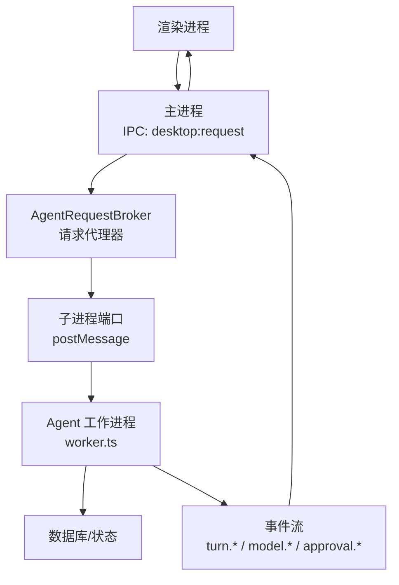
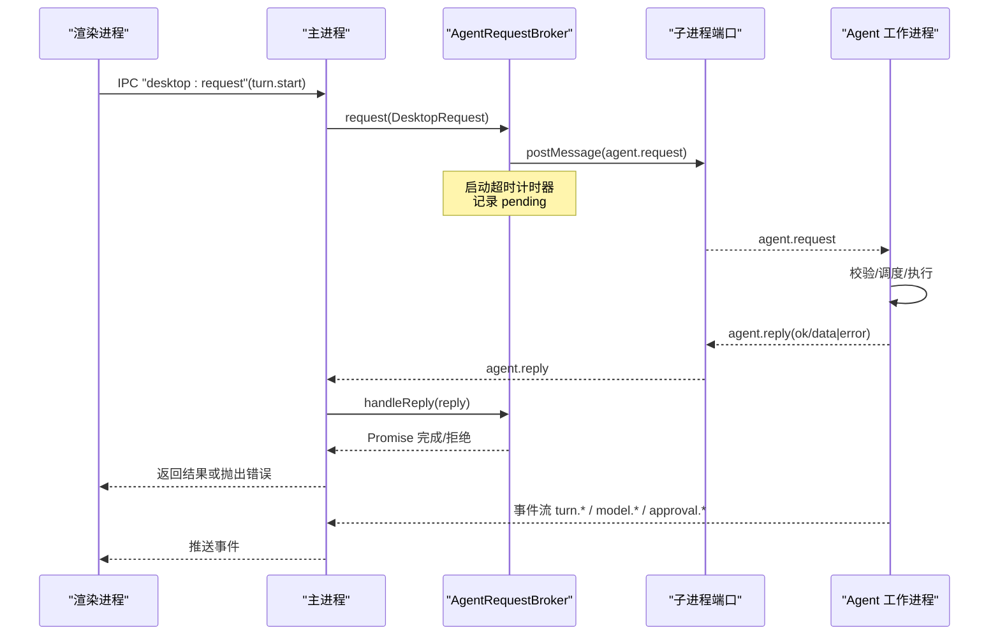
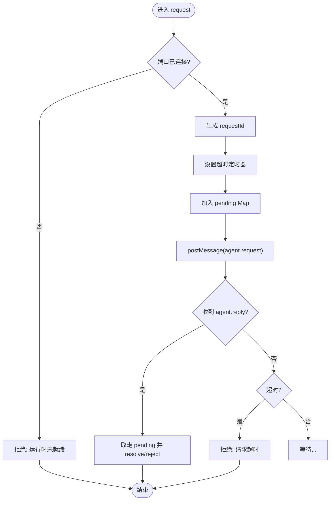
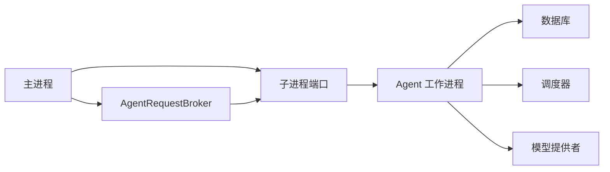

# 请求代理器

<cite>
**本文引用的文件**
- [src/main/agentRequestBroker.ts](file://src/main/agentRequestBroker.ts)
- [src/main.ts](file://src/main.ts)
- [src/agent/worker.ts](file://src/agent/worker.ts)
- [src/shared/protocol.ts](file://src/shared/protocol.ts)
- [src/shared/domain.ts](file://src/shared/domain.ts)
- [tests/agentRequestBroker.test.ts](file://tests/agentRequestBroker.test.ts)
</cite>

## 目录
1. [简介](#简介)
2. [项目结构](#项目结构)
3. [核心组件](#核心组件)
4. [架构总览](#架构总览)
5. [详细组件分析](#详细组件分析)
6. [依赖关系分析](#依赖关系分析)
7. [性能与并发控制](#性能与并发控制)
8. [故障处理与恢复](#故障处理与恢复)
9. [配置选项与调优建议](#配置选项与调优建议)
10. [集成示例](#集成示例)
11. [故障排除指南](#故障排除指南)
12. [结论](#结论)

## 简介
本文件围绕主进程中的 AgentRequestBroker，系统化阐述主进程与 Agent 工作进程之间的请求代理机制。内容涵盖：
- 请求路由、生命周期管理（从渲染进程到 Agent 的完整链路）
- 并发控制（超时、连接替换、断连清理）
- 错误处理模式（网络异常、Agent 崩溃、响应超时）
- 配置项说明与性能调优建议
- 实际集成要点与排障指引

## 项目结构
AgentRequestBroker 位于主进程，负责将来自渲染进程的桌面端请求转发给独立的 Agent 工作进程，并协调请求-响应的匹配、超时与断连清理。Agent 工作进程在独立进程中运行，接收请求后执行业务逻辑并通过事件通道回推状态更新。

图表来源
- [src/main.ts:103-143](file://src/main.ts#L103-L143)
- [src/main/agentRequestBroker.ts:15-85](file://src/main/agentRequestBroker.ts#L15-L85)
- [src/agent/worker.ts:115-127](file://src/agent/worker.ts#L115-L127)
- [src/agent/worker.ts:411-449](file://src/agent/worker.ts#L411-L449)

章节来源
- [src/main.ts:103-143](file://src/main.ts#L103-L143)
- [src/main/agentRequestBroker.ts:15-85](file://src/main/agentRequestBroker.ts#L15-L85)
- [src/agent/worker.ts:115-127](file://src/agent/worker.ts#L115-L127)
- [src/agent/worker.ts:411-449](file://src/agent/worker.ts#L411-L449)

## 核心组件
- AgentRequestBroker：维护与 Agent 工作进程的通信端口、待处理请求映射、请求 ID 生成、超时计时器、断连清理。
- 主进程桥接：监听 IPC 请求，调用 Broker 发送请求；转发 Agent 回复与事件。
- Agent 工作进程：解析请求、调度执行（含队列与并发）、持久化与回推事件、返回结果或错误。

章节来源
- [src/main/agentRequestBroker.ts:15-85](file://src/main/agentRequestBroker.ts#L15-L85)
- [src/main.ts:103-143](file://src/main.ts#L103-L143)
- [src/agent/worker.ts:115-127](file://src/agent/worker.ts#L115-L127)
- [src/agent/worker.ts:411-449](file://src/agent/worker.ts#L411-L449)

## 架构总览
下图展示一次“turn.start”请求从渲染进程到 Agent 工作进程的完整时序，包括请求路由、超时、回复与事件推送。

图表来源
- [src/main.ts:103-143](file://src/main.ts#L103-L143)
- [src/main/agentRequestBroker.ts:33-63](file://src/main/agentRequestBroker.ts#L33-L63)
- [src/agent/worker.ts:411-449](file://src/agent/worker.ts#L411-L449)

## 详细组件分析

### AgentRequestBroker：请求代理与生命周期
- 职责
  - 维护唯一端口引用，支持连接替换时主动断开旧连接
  - 为每个请求分配唯一 requestId，维护 pending Map
  - 设置超时定时器，超时时拒绝对应 Promise 并清理
  - 收到 agent.reply 时按 requestId 匹配并 resolve/reject
  - 断连时批量拒绝所有 pending 请求
- 关键行为
  - connect：若已有端口且不同，先 disconnect 再替换
  - request：未就绪直接拒绝；发送前捕获 postMessage 异常并拒绝
  - handleReply：找不到 requestId 返回 false，否则完成/拒绝
  - disconnect：清空端口并拒绝所有 pending
- 复杂度
  - pending 查找/删除 O(1)
  - 内存占用与并发请求数线性相关

图表来源
- [src/main/agentRequestBroker.ts:33-84](file://src/main/agentRequestBroker.ts#L33-L84)

章节来源
- [src/main/agentRequestBroker.ts:15-85](file://src/main/agentRequestBroker.ts#L15-L85)
- [tests/agentRequestBroker.test.ts:8-37](file://tests/agentRequestBroker.test.ts#L8-L37)

### 主进程桥接：IPC 与事件分发
- 暴露 IPC 处理器 desktop:request，校验请求类型后交由 Broker 发送
- 监听子进程消息：
  - agent.reply：交给 Broker.handleReply 完成 Promise
  - 其他事件：转发给渲染进程
- 进程关闭/重启：
  - stopAgentRuntime 中调用 Broker.disconnect，确保 pending 全部被拒绝
  - 可选终止子进程并关闭端口

章节来源
- [src/main.ts:103-143](file://src/main.ts#L103-L143)
- [src/main.ts:146-169](file://src/main.ts#L146-L169)

### Agent 工作进程：请求处理与事件回推
- 初始化：通过 parentPort 接收端口与数据库路径，建立 workerPort，发送 agent.ready
- 请求处理：
  - 校验是否为 agent.request 且 request 为 DesktopRequest
  - 根据 type 路由到具体处理函数（如 snapshot.get、turn.start、modelProfile.test 等）
  - 成功则 postReply(ok=true, data)，失败则 postReply(ok=false, error)
- 事件回推：
  - 使用 createTurnEventEmitter 顺序化输出带 sequence 的事件
  - 事件类型包括 turn.queued/started/cancelling/completed/failed/cancelled、answer.delta、reasoning.*.delta、model.metrics、approval.required 等
- 并发与调度：
  - 使用 ModelTurnScheduler 按模型配置限制并发度
  - 对 demo 模式强制单并发，普通模型读取 maxConcurrency

章节来源
- [src/agent/worker.ts:115-127](file://src/agent/worker.ts#L115-L127)
- [src/agent/worker.ts:132-157](file://src/agent/worker.ts#L132-L157)
- [src/agent/worker.ts:159-225](file://src/agent/worker.ts#L159-L225)
- [src/agent/worker.ts:411-449](file://src/agent/worker.ts#L411-L449)
- [src/agent/worker.ts:481-491](file://src/agent/worker.ts#L481-L491)

### 协议与数据模型
- DesktopRequest：定义所有桌面端可发起的请求类型（如 snapshot.get、turn.start、modelProfile.save/test 等）
- SequencedAgentEvent：定义带 threadId/turnId/modelProfileId/sequence 的事件类型集合
- Domain：定义 AppSnapshot、TurnRecord、ModelProfile、ModelRunMetrics 等核心数据结构

章节来源
- [src/shared/protocol.ts:22-65](file://src/shared/protocol.ts#L22-L65)
- [src/shared/protocol.ts:274-316](file://src/shared/protocol.ts#L274-L316)
- [src/shared/domain.ts:283-319](file://src/shared/domain.ts#L283-L319)

## 依赖关系分析
- 主进程依赖
  - AgentRequestBroker：封装请求-响应匹配、超时、断连
  - 子进程端口：用于与 Agent 工作进程通信
  - 协议校验：isDesktopRequest/isAgentEvent
- Agent 工作进程依赖
  - 数据库：持久化快照、会话、审批等
  - 调度器：ModelTurnScheduler 控制并发
  - 模型提供者：streamChatCompletion 或 demo 模式
- 耦合点
  - 协议层（protocol.ts）是主进程与 Agent 进程之间的契约
  - 事件流（SequencedAgentEvent）驱动前端状态机

图表来源
- [src/main.ts:103-143](file://src/main.ts#L103-L143)
- [src/main/agentRequestBroker.ts:15-85](file://src/main/agentRequestBroker.ts#L15-L85)
- [src/agent/worker.ts:159-225](file://src/agent/worker.ts#L159-L225)

章节来源
- [src/main.ts:103-143](file://src/main.ts#L103-L143)
- [src/main/agentRequestBroker.ts:15-85](file://src/main/agentRequestBroker.ts#L15-L85)
- [src/agent/worker.ts:159-225](file://src/agent/worker.ts#L159-L225)

## 性能与并发控制
- 请求限流
  - Agent 侧通过 ModelTurnScheduler 按模型配置的 maxConcurrency 限制并发
  - demo 模式固定并发为 1，避免资源竞争
- 超时处理
  - Broker 侧为每个请求设置 deadlineMs 超时，超时自动拒绝并清理
  - 测试覆盖超时场景，验证 pending 清理与拒绝语义
- 重试策略
  - 当前实现未内置重试；可在上层调用处根据错误类型决定是否重试
  - 建议在业务层区分瞬时错误（网络抖动）与不可恢复错误（参数非法）
- 背压与排队
  - Agent 侧对 queued 状态会持续推送 queuePosition，便于前端显示排队进度
  - 可通过调整 maxConcurrency 与上游调用频率控制整体吞吐

章节来源
- [src/agent/worker.ts:174-225](file://src/agent/worker.ts#L174-L225)
- [src/main/agentRequestBroker.ts:41-44](file://src/main/agentRequestBroker.ts#L41-L44)
- [tests/agentRequestBroker.test.ts:9-22](file://tests/agentRequestBroker.test.ts#L9-L22)

## 故障处理与恢复
- 网络异常
  - postMessage 抛错：Broker 立即拒绝该请求
  - 端口关闭：主进程 stopAgentRuntime 调用 Broker.disconnect，批量拒绝 pending
- Agent 进程崩溃
  - 子进程退出触发 close 事件，主进程停止运行时并清理
  - 所有挂起请求统一以指定原因拒绝
- 响应超时
  - 到达 deadlineMs 仍未收到 reply：拒绝并清理 pending
- 错误传播
  - Agent 侧捕获异常并以 safeErrorText 脱敏后返回
  - Broker 将错误包装为 Error 对象传递给调用方

章节来源
- [src/main/agentRequestBroker.ts:46-50](file://src/main/agentRequestBroker.ts#L46-L50)
- [src/main/agentRequestBroker.ts:65-71](file://src/main/agentRequestBroker.ts#L65-L71)
- [src/main.ts:146-169](file://src/main.ts#L146-L169)
- [src/agent/worker.ts:411-418](file://src/agent/worker.ts#L411-L418)
- [src/agent/worker.ts:677-679](file://src/agent/worker.ts#L677-L679)

## 配置选项与调优建议
- 超时时间（deadlineMs）
  - 由 Broker 构造参数决定，需结合模型响应特性与用户体验设定
  - 过长导致资源占用久，过短易误判超时
- 并发度（maxConcurrency）
  - 在模型配置中声明，Agent 侧据此限制同时运行的 turn 数量
  - 高并发提升吞吐但增加资源压力，需监控 CPU/内存/网络
- 事件节流
  - 事件通过 createTurnEventEmitter 顺序化投递，避免乱序与丢失
- 日志与指标
  - 利用 model.metrics 观察 tokensPerSecond、durationMs 等指标，辅助定位瓶颈
- 建议
  - 针对长文本/大图片输入适当提高超时与并发上限
  - 对高频短请求采用批量化或合并策略降低开销
  - 监控 pendingCount 与队列位置，动态调整负载

章节来源
- [src/main/agentRequestBroker.ts:20-24](file://src/main/agentRequestBroker.ts#L20-L24)
- [src/agent/worker.ts:174-225](file://src/agent/worker.ts#L174-L225)
- [src/agent/worker.ts:132-157](file://src/agent/worker.ts#L132-L157)

## 集成示例
- 主进程注册 IPC 处理器并转发请求
  - 入口：desktop:request -> sendAgentRequest -> Broker.request
  - 事件：agent:event 推送至渲染进程
- Agent 工作进程处理请求
  - 校验并路由：handleDesktopRequest
  - 执行：startTurn/cancelTurn 等
  - 返回：postReply(ok/data|error)
  - 事件：createTurnEventEmitter 顺序输出

章节来源
- [src/main.ts:103-143](file://src/main.ts#L103-L143)
- [src/agent/worker.ts:411-449](file://src/agent/worker.ts#L411-L449)
- [src/agent/worker.ts:132-157](file://src/agent/worker.ts#L132-L157)

## 故障排除指南
- 症状：请求一直 pending
  - 检查 Broker.pendingCount 是否大于 0
  - 确认 Agent 是否 ready（worker 发送 agent.ready）
  - 查看是否有超时或断连事件
- 症状：频繁超时
  - 评估模型响应时间与 deadlineMs 是否匹配
  - 检查并发是否过高导致排队严重
- 症状：断连后大量失败
  - 确认主进程是否正确调用 Broker.disconnect
  - 检查子进程是否意外退出
- 症状：事件乱序或缺失
  - 确认事件通过 createTurnEventEmitter 顺序化投递
  - 核对 sequence 字段递增性

章节来源
- [src/main/agentRequestBroker.ts:22-24](file://src/main/agentRequestBroker.ts#L22-L24)
- [src/main/agentRequestBroker.ts:41-44](file://src/main/agentRequestBroker.ts#L41-L44)
- [src/agent/worker.ts:132-157](file://src/agent/worker.ts#L132-L157)

## 结论
AgentRequestBroker 作为主进程与 Agent 工作进程之间的可靠桥梁，提供了简洁而健壮的请求代理能力：唯一请求标识、超时保护、连接替换与断连清理。配合 Agent 侧的并发调度与事件流，实现了从渲染进程到 Agent 的端到端可控流程。通过合理配置超时与并发、在上层实现重试策略，并结合指标与日志进行观测，可以在保证稳定性的同时获得良好的性能表现。