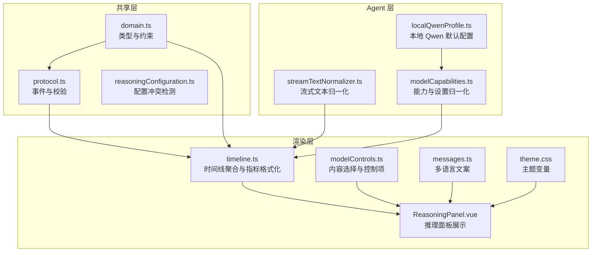
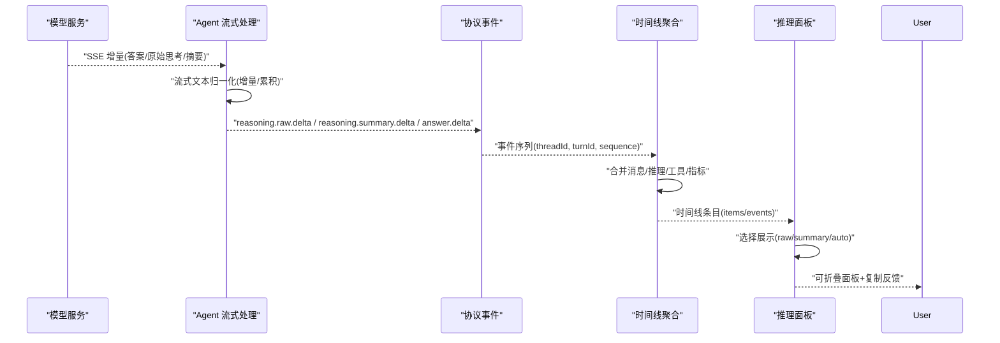
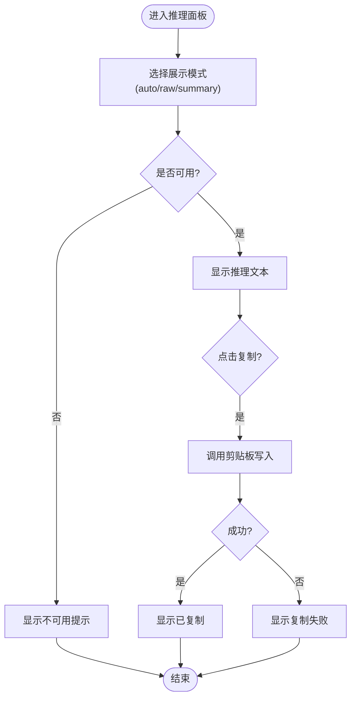
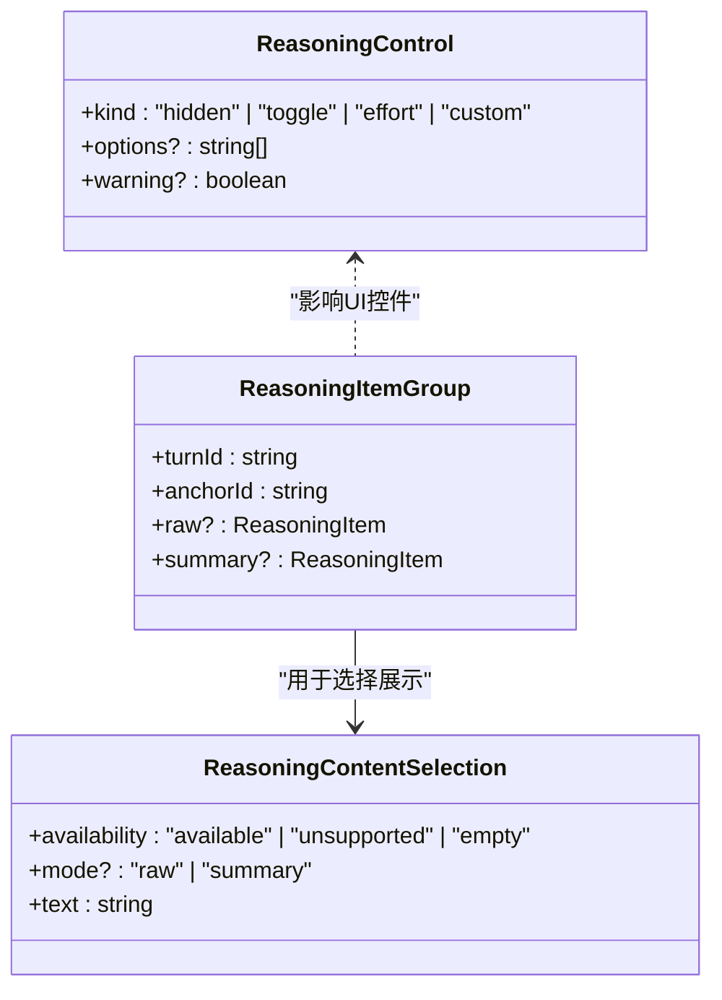
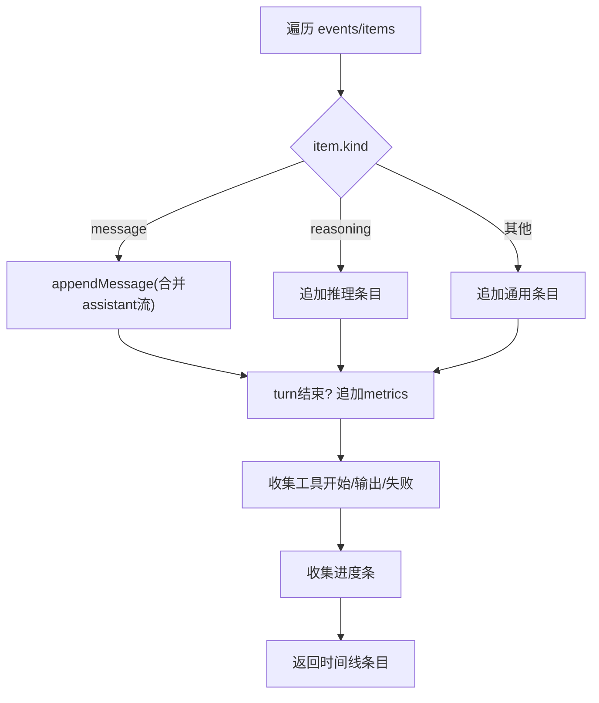
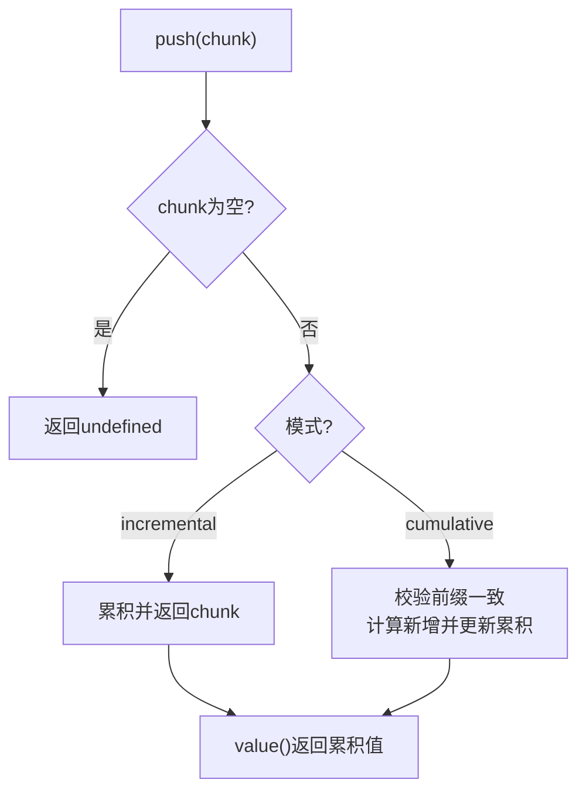
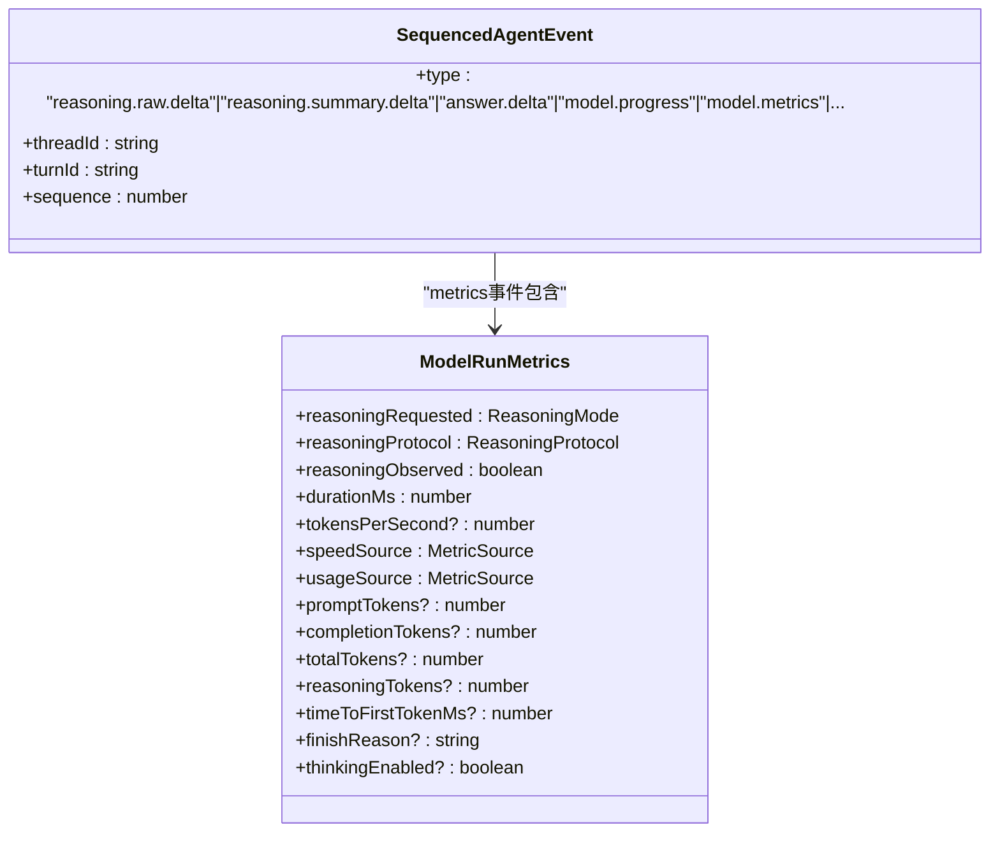
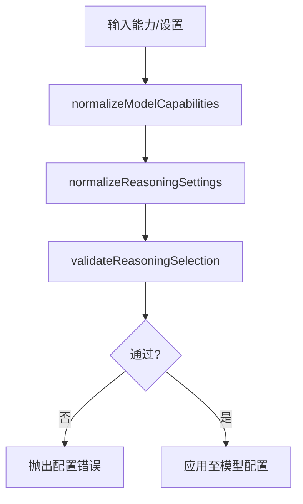
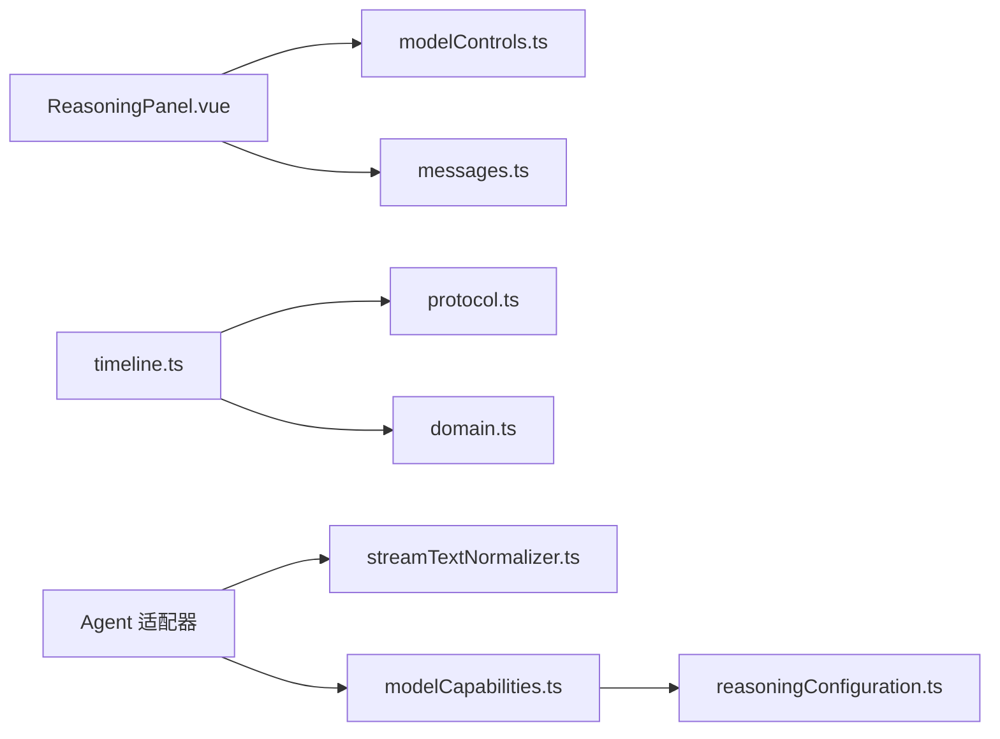

# 推理过程可视化

<cite>
**本文引用的文件**
- [ReasoningPanel.vue](file://src/renderer/components/ReasoningPanel.vue)
- [modelControls.ts](file://src/renderer/modelControls.ts)
- [timeline.ts](file://src/renderer/timeline.ts)
- [domain.ts](file://src/shared/domain.ts)
- [protocol.ts](file://src/shared/protocol.ts)
- [reasoningConfiguration.ts](file://src/shared/reasoningConfiguration.ts)
- [streamTextNormalizer.ts](file://src/agent/streamTextNormalizer.ts)
- [modelCapabilities.ts](file://src/agent/modelCapabilities.ts)
- [localQwenProfile.ts](file://src/agent/localQwenProfile.ts)
- [messages.ts](file://src/renderer/i18n/messages.ts)
- [theme.css](file://src/renderer/styles/theme.css)
</cite>

## 目录
1. [简介](#简介)
2. [项目结构](#项目结构)
3. [核心组件](#核心组件)
4. [架构总览](#架构总览)
5. [详细组件分析](#详细组件分析)
6. [依赖关系分析](#依赖关系分析)
7. [性能考量](#性能考量)
8. [故障排查指南](#故障排查指南)
9. [结论](#结论)
10. [附录](#附录)

## 简介
本文件面向 Private AI Desktop 的“推理过程可视化”功能，系统性说明推理步骤的捕获、处理与展示机制，覆盖不同推理协议的适配、思维链格式化与结构化显示、推理摘要生成与关键信息提取、用户交互设计、自定义推理模板、样式主题与国际化支持，以及调试工具、性能分析与用户体验优化建议。同时提供扩展新模型推理格式的指引，帮助开发者在不破坏现有能力的前提下接入新的推理协议或输出格式。

## 项目结构
推理可视化由“共享领域定义 + 协议事件 + Agent 流式归一化 + 渲染层 UI 组件”构成：
- 共享领域定义：统一描述推理模式、协议、输出模式、运行指标等类型与约束。
- 协议事件：定义推理原始增量、推理摘要增量、回答增量等事件类型及校验规则。
- Agent 流式归一化：将不同模型的流式片段归一为增量或累积文本，避免重复与乱序。
- 渲染层：时间线聚合、推理面板选择与展示、复制反馈、状态提示与国际化文案。

**图表来源**
- [domain.ts:1-319](file://src/shared/domain.ts#L1-L319)
- [protocol.ts:1-371](file://src/shared/protocol.ts#L1-L371)
- [reasoningConfiguration.ts:1-19](file://src/shared/reasoningConfiguration.ts#L1-L19)
- [streamTextNormalizer.ts:1-34](file://src/agent/streamTextNormalizer.ts#L1-L34)
- [modelCapabilities.ts:1-207](file://src/agent/modelCapabilities.ts#L1-L207)
- [localQwenProfile.ts:1-32](file://src/agent/localQwenProfile.ts#L1-L32)
- [timeline.ts:1-236](file://src/renderer/timeline.ts#L1-L236)
- [ReasoningPanel.vue:1-114](file://src/renderer/components/ReasoningPanel.vue#L1-L114)
- [modelControls.ts:1-149](file://src/renderer/modelControls.ts#L1-L149)
- [messages.ts:1-393](file://src/renderer/i18n/messages.ts#L1-L393)
- [theme.css:1-38](file://src/renderer/styles/theme.css#L1-L38)

**章节来源**
- [domain.ts:1-319](file://src/shared/domain.ts#L1-L319)
- [protocol.ts:1-371](file://src/shared/protocol.ts#L1-L371)
- [timeline.ts:1-236](file://src/renderer/timeline.ts#L1-L236)
- [ReasoningPanel.vue:1-114](file://src/renderer/components/ReasoningPanel.vue#L1-L114)

## 核心组件
- 推理面板 ReasoningPanel.vue：根据当前偏好与上下文选择并展示推理内容（原始/摘要），提供复制与错误反馈，支持折叠展开与运行中指示。
- 内容选择 modelControls.ts：依据用户偏好、可用输出模式与运行态决定展示内容与可用性；聚合同一 turn 的推理项；控制推理控制面板的显隐。
- 时间线 timeline.ts：将消息、推理、工具调用、进度与指标整合为统一时间线条目；在 turn 结束时附加指标；对助手消息进行合并以支持流式拼接。
- 流式文本归一化 streamTextNormalizer.ts：提供增量与累积两种模式，确保流式片段不重复、可安全拼接。
- 协议与领域 protocol.ts / domain.ts：定义推理模式、协议、输出模式、显示模式、运行阶段、指标等类型与校验规则，保障跨模块数据一致性。
- 能力与配置 modelCapabilities.ts / reasoningConfiguration.ts：归一化模型能力与推理设置，检测配置冲突（如不支持的输入模式启用）。
- 本地 Qwen 配置 localQwenProfile.ts：提供默认本地模型配置，包含推理协议与显示模式。
- 国际化 messages.ts：提供中英文文案，涵盖推理相关提示、状态与错误信息。
- 主题 theme.css：定义明暗主题变量，支撑推理面板与整体界面视觉一致性。

**章节来源**
- [ReasoningPanel.vue:1-114](file://src/renderer/components/ReasoningPanel.vue#L1-L114)
- [modelControls.ts:1-149](file://src/renderer/modelControls.ts#L1-L149)
- [timeline.ts:1-236](file://src/renderer/timeline.ts#L1-L236)
- [streamTextNormalizer.ts:1-34](file://src/agent/streamTextNormalizer.ts#L1-L34)
- [protocol.ts:1-371](file://src/shared/protocol.ts#L1-L371)
- [domain.ts:1-319](file://src/shared/domain.ts#L1-L319)
- [modelCapabilities.ts:1-207](file://src/agent/modelCapabilities.ts#L1-L207)
- [reasoningConfiguration.ts:1-19](file://src/shared/reasoningConfiguration.ts#L1-L19)
- [localQwenProfile.ts:1-32](file://src/agent/localQwenProfile.ts#L1-L32)
- [messages.ts:1-393](file://src/renderer/i18n/messages.ts#L1-L393)
- [theme.css:1-38](file://src/renderer/styles/theme.css#L1-L38)

## 架构总览
推理可视化的端到端流程如下：
- 模型侧通过 SSE/流式返回三类增量：推理原始、推理摘要、回答。
- Agent 层使用流式文本归一器分别维护 answer/rawReasoning/reasoningSummary 三段累积文本，按增量推送。
- 协议层将增量封装为标准化事件（reasoning.raw.delta、reasoning.summary.delta、answer.delta），附带 threadId、turnId、sequence 等标识。
- 渲染层时间线聚合这些事件与持久化 items，形成统一视图；在 turn 结束处插入指标条目。
- 推理面板根据用户偏好与上下文选择展示 raw 或 summary，并提供复制与状态反馈。

**图表来源**
- [streamTextNormalizer.ts:1-34](file://src/agent/streamTextNormalizer.ts#L1-L34)
- [protocol.ts:48-63](file://src/shared/protocol.ts#L48-L63)
- [timeline.ts:41-169](file://src/renderer/timeline.ts#L41-L169)
- [ReasoningPanel.vue:17-37](file://src/renderer/components/ReasoningPanel.vue#L17-L37)

## 详细组件分析

### 推理面板 ReasoningPanel.vue
- 功能要点：
  - 基于用户偏好（auto/raw/summary）与当前运行态，选择要展示的推理内容。
  - 当内容为空或不可用时，显示相应提示（如“此模型不提供思考摘要/原始思考”、“无思考内容”）。
  - 支持一键复制推理内容，并在失败时给出友好提示。
  - 运行时显示进度点，折叠/展开交互清晰。
- 关键逻辑路径：
  - 选择逻辑委托给 modelControls.ts 的 selectReasoningContent。
  - 标题与不可用文案来自 i18n messages.ts。
  - 复制操作使用 copyTextWithFeedback 包装剪贴板写入，提供状态反馈。

**图表来源**
- [ReasoningPanel.vue:17-54](file://src/renderer/components/ReasoningPanel.vue#L17-L54)
- [modelControls.ts:67-87](file://src/renderer/modelControls.ts#L67-L87)
- [messages.ts:127-140](file://src/renderer/i18n/messages.ts#L127-L140)

**章节来源**
- [ReasoningPanel.vue:1-114](file://src/renderer/components/ReasoningPanel.vue#L1-L114)
- [modelControls.ts:67-87](file://src/renderer/modelControls.ts#L67-L87)
- [messages.ts:127-140](file://src/renderer/i18n/messages.ts#L127-L140)

### 内容选择与分组 modelControls.ts
- 选择策略：
  - auto：优先展示摘要(summary)，若无则回退到原始(raw)。
  - 指定模式：若该模式不可用且处于运行中，返回“空”占位；否则返回“不支持”。
- 分组聚合：
  - 将同一 turnId 下的 raw 与 summary 推理项组合为一组，便于 UI 渲染与切换。
- 控制面板：
  - 根据模型能力（toggle/effort/custom/unsupported）决定推理控制面板的呈现形式。

**图表来源**
- [modelControls.ts:10-34](file://src/renderer/modelControls.ts#L10-L34)
- [modelControls.ts:53-65](file://src/renderer/modelControls.ts#L53-L65)
- [modelControls.ts:123-132](file://src/renderer/modelControls.ts#L123-L132)

**章节来源**
- [modelControls.ts:1-149](file://src/renderer/modelControls.ts#L1-L149)

### 时间线聚合 timeline.ts
- 事件与持久化数据融合：
  - 将 message、reasoning、tool、metrics、progress 统一为 TimelineEntry。
  - 在 turn 结束时追加 metrics 条目，支持实时与持久化指标。
- 助手消息合并：
  - 对同一 turn 的 assistant 消息进行增量拼接，保持流式体验。
- 指标格式化：
  - 将推理请求、协议、耗时、速率、Token 数、完成原因等拼接为可读字符串。

**图表来源**
- [timeline.ts:41-169](file://src/renderer/timeline.ts#L41-L169)
- [timeline.ts:172-204](file://src/renderer/timeline.ts#L172-L204)
- [timeline.ts:208-235](file://src/renderer/timeline.ts#L208-L235)

**章节来源**
- [timeline.ts:1-236](file://src/renderer/timeline.ts#L1-L236)

### 流式文本归一化 streamTextNormalizer.ts
- 模式：
  - incremental：仅返回新增片段，适合增量渲染。
  - cumulative：要求每次 chunk 是完整快照的前缀，返回新增部分，保证幂等与去重。
- 用途：
  - 在模型适配器中分别维护 answer、rawReasoning、reasoningSummary 三段累积文本，避免重复与乱序。

**图表来源**
- [streamTextNormalizer.ts:1-34](file://src/agent/streamTextNormalizer.ts#L1-L34)

**章节来源**
- [streamTextNormalizer.ts:1-34](file://src/agent/streamTextNormalizer.ts#L1-L34)

### 协议与领域 protocol.ts / domain.ts
- 协议事件：
  - reasoning.raw.delta、reasoning.summary.delta、answer.delta 携带 text 增量。
  - model.progress 携带阶段（connecting/compressing/reasoning/answering）。
  - model.metrics 携带推理请求、协议、观察到的推理、耗时、速率、Token 等指标。
- 领域类型：
  - ReasoningMode、ReasoningProtocol、ReasoningOutputMode、ReasoningDisplayMode、ModelRunPhase、ModelRunMetrics 等。
- 校验：
  - isAgentEvent/isDesktopRequest 严格校验事件与请求结构，防止非法数据进入渲染层。

**图表来源**
- [protocol.ts:48-63](file://src/shared/protocol.ts#L48-L63)
- [domain.ts:238-257](file://src/shared/domain.ts#L238-L257)

**章节来源**
- [protocol.ts:1-371](file://src/shared/protocol.ts#L1-L371)
- [domain.ts:1-319](file://src/shared/domain.ts#L1-L319)

### 能力与配置 modelCapabilities.ts / reasoningConfiguration.ts
- 能力归一化：
  - qwenCapabilities/openAiCapabilities 声明支持的推理输入模式、输出模式与默认强度。
  - normalizeModelCapabilities/normalizeReasoningSettings 将外部输入规范化为内部一致结构。
- 配置冲突检测：
  - reasoningConfigurationIssue 检测不支持的输入模式被启用的情况，阻止无效配置。

**图表来源**
- [modelCapabilities.ts:45-104](file://src/agent/modelCapabilities.ts#L45-L104)
- [modelCapabilities.ts:120-148](file://src/agent/modelCapabilities.ts#L120-L148)
- [reasoningConfiguration.ts:9-18](file://src/shared/reasoningConfiguration.ts#L9-L18)

**章节来源**
- [modelCapabilities.ts:1-207](file://src/agent/modelCapabilities.ts#L1-L207)
- [reasoningConfiguration.ts:1-19](file://src/shared/reasoningConfiguration.ts#L1-L19)

### 本地 Qwen 配置 localQwenProfile.ts
- 提供默认本地模型配置，包含推理协议为 qwen、显示模式为 auto，便于开箱即用。
- 兼容旧占位符检测，便于迁移与提示。

**章节来源**
- [localQwenProfile.ts:1-32](file://src/agent/localQwenProfile.ts#L1-L32)

### 国际化 messages.ts
- 覆盖推理相关文案：思考模式、原始思考、思考摘要、不可用提示、复制反馈、运行状态等。
- 中英双语，便于多语言环境切换。

**章节来源**
- [messages.ts:1-393](file://src/renderer/i18n/messages.ts#L1-L393)

### 主题 theme.css
- 定义明暗主题变量，确保推理面板与整体界面视觉一致。
- 可通过 data-theme 切换主题，适配不同用户偏好。

**章节来源**
- [theme.css:1-38](file://src/renderer/styles/theme.css#L1-L38)

## 依赖关系分析
- 渲染层依赖：
  - ReasoningPanel.vue 依赖 modelControls.ts 的选择逻辑与 i18n 文案。
  - timeline.ts 依赖 protocol.ts 的事件结构与 domain.ts 的类型定义。
- Agent 层依赖：
  - streamTextNormalizer.ts 被模型适配器使用，确保流式文本正确累积。
  - modelCapabilities.ts 与 reasoningConfiguration.ts 共同保证推理设置的合法性。
- 共享层：
  - domain.ts 与 protocol.ts 作为契约，贯穿所有模块，确保类型与事件一致性。

**图表来源**
- [ReasoningPanel.vue:1-114](file://src/renderer/components/ReasoningPanel.vue#L1-L114)
- [modelControls.ts:1-149](file://src/renderer/modelControls.ts#L1-L149)
- [timeline.ts:1-236](file://src/renderer/timeline.ts#L1-L236)
- [protocol.ts:1-371](file://src/shared/protocol.ts#L1-L371)
- [domain.ts:1-319](file://src/shared/domain.ts#L1-L319)
- [streamTextNormalizer.ts:1-34](file://src/agent/streamTextNormalizer.ts#L1-L34)
- [modelCapabilities.ts:1-207](file://src/agent/modelCapabilities.ts#L1-L207)
- [reasoningConfiguration.ts:1-19](file://src/shared/reasoningConfiguration.ts#L1-L19)

**章节来源**
- [ReasoningPanel.vue:1-114](file://src/renderer/components/ReasoningPanel.vue#L1-L114)
- [modelControls.ts:1-149](file://src/renderer/modelControls.ts#L1-L149)
- [timeline.ts:1-236](file://src/renderer/timeline.ts#L1-L236)
- [protocol.ts:1-371](file://src/shared/protocol.ts#L1-L371)
- [domain.ts:1-319](file://src/shared/domain.ts#L1-L319)
- [streamTextNormalizer.ts:1-34](file://src/agent/streamTextNormalizer.ts#L1-L34)
- [modelCapabilities.ts:1-207](file://src/agent/modelCapabilities.ts#L1-L207)
- [reasoningConfiguration.ts:1-19](file://src/shared/reasoningConfiguration.ts#L1-L19)

## 性能考量
- 流式增量渲染：
  - 使用增量模式减少重绘开销，提升首字延迟体验。
  - 累积模式用于幂等场景，避免重复片段导致内存膨胀。
- 时间线合并：
  - 助手消息合并减少条目数量，降低渲染压力。
  - 指标仅在 turn 结束时追加，避免频繁刷新。
- 选择逻辑优化：
  - 优先摘要模式，减少长文本渲染成本；自动回退到原始模式。
- 主题与样式：
  - 使用 CSS 变量切换主题，避免 JS 动态样式带来的重排。

[本节为通用性能指导，不直接分析具体文件]

## 故障排查指南
- 推理内容不可用：
  - 检查模型能力是否声明了 raw/summary 输出模式。
  - 确认推理协议与输入模式匹配（如 toggle 需要 qwen，effort 需要 openai）。
- 复制失败：
  - 浏览器剪贴板权限限制可能导致失败，需引导用户授权或重试。
- 流式重复或乱序：
  - 确认适配器使用累积模式并校验前缀一致性。
  - 检查事件 sequence 字段是否正确递增。
- 指标缺失：
  - 确认 model.metrics 事件是否到达，或在 turn 结束时是否有持久化指标。

**章节来源**
- [protocol.ts:114-164](file://src/shared/protocol.ts#L114-L164)
- [modelCapabilities.ts:120-148](file://src/agent/modelCapabilities.ts#L120-L148)
- [messages.ts:127-140](file://src/renderer/i18n/messages.ts#L127-L140)

## 结论
Private AI Desktop 的推理过程可视化通过清晰的领域契约、严格的协议校验、稳健的流式归一化与友好的渲染层交互，实现了多模型推理过程的统一展示。其模块化设计便于扩展新的推理协议与输出格式，同时兼顾性能与用户体验。通过合理的配置校验与国际化支持，系统在不同环境下均能提供一致的推理可视化体验。

[本节为总结性内容，不直接分析具体文件]

## 附录

### 如何扩展推理可视化以支持新的模型推理格式
- 新增协议与事件：
  - 在 protocol.ts 中扩展 SequencedAgentEvent，增加新的推理增量事件类型（如 new.reasoning.delta）。
  - 在 isAgentEvent 中添加对应校验逻辑。
- 新增领域类型：
  - 在 domain.ts 中扩展 ReasoningProtocol、ReasoningOutputMode 或新增输出模式。
  - 更新 ModelRunMetrics 以支持新的指标字段。
- 适配流式归一化：
  - 在模型适配器中使用 streamTextNormalizer 维护新的推理文本段。
  - 确保增量推送符合累积或增量模式约定。
- 渲染层适配：
  - 在 timeline.ts 中新增对应 TimelineEntry 类型与处理逻辑。
  - 在 ReasoningPanel.vue 与 modelControls.ts 中扩展选择逻辑与展示分支。
  - 在 messages.ts 中补充多语言文案。
- 能力与配置：
  - 在 modelCapabilities.ts 中声明新协议的能力与默认设置。
  - 在 reasoningConfiguration.ts 中增加配置冲突检测规则。

**章节来源**
- [protocol.ts:48-63](file://src/shared/protocol.ts#L48-L63)
- [domain.ts:99-106](file://src/shared/domain.ts#L99-L106)
- [streamTextNormalizer.ts:1-34](file://src/agent/streamTextNormalizer.ts#L1-L34)
- [timeline.ts:5-39](file://src/renderer/timeline.ts#L5-L39)
- [ReasoningPanel.vue:17-37](file://src/renderer/components/ReasoningPanel.vue#L17-L37)
- [modelControls.ts:67-87](file://src/renderer/modelControls.ts#L67-L87)
- [modelCapabilities.ts:14-43](file://src/agent/modelCapabilities.ts#L14-L43)
- [reasoningConfiguration.ts:9-18](file://src/shared/reasoningConfiguration.ts#L9-L18)