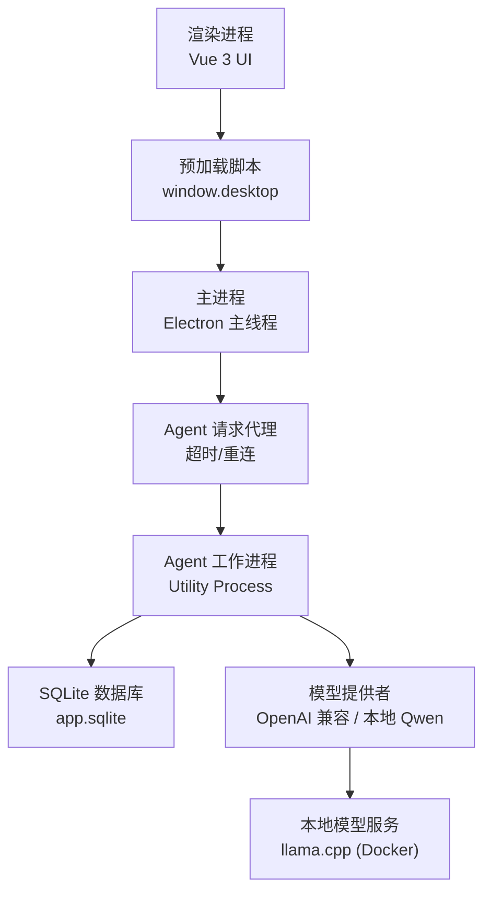
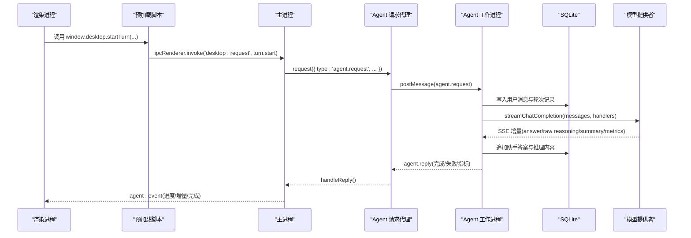
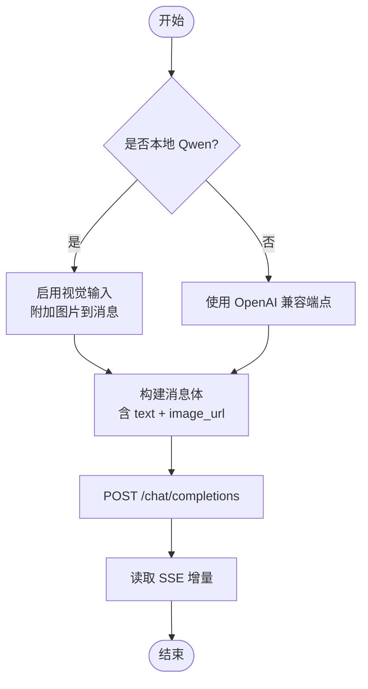
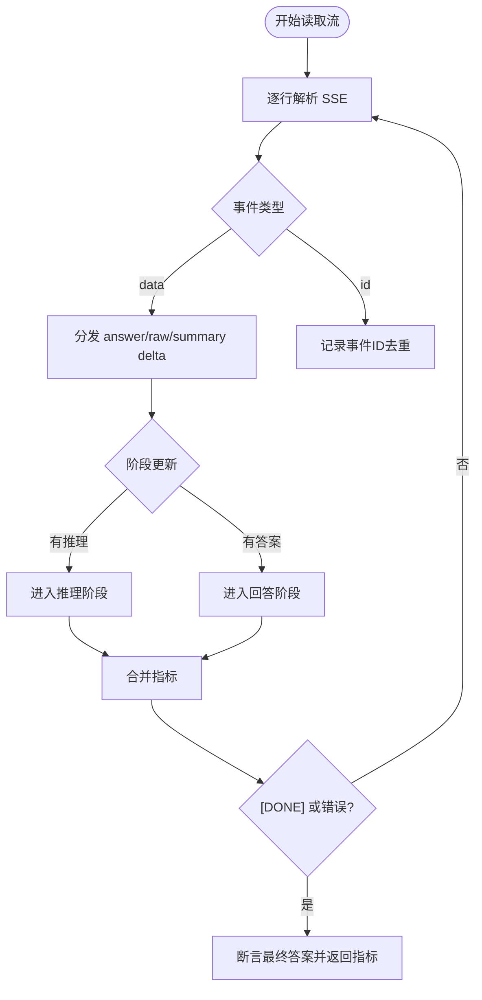
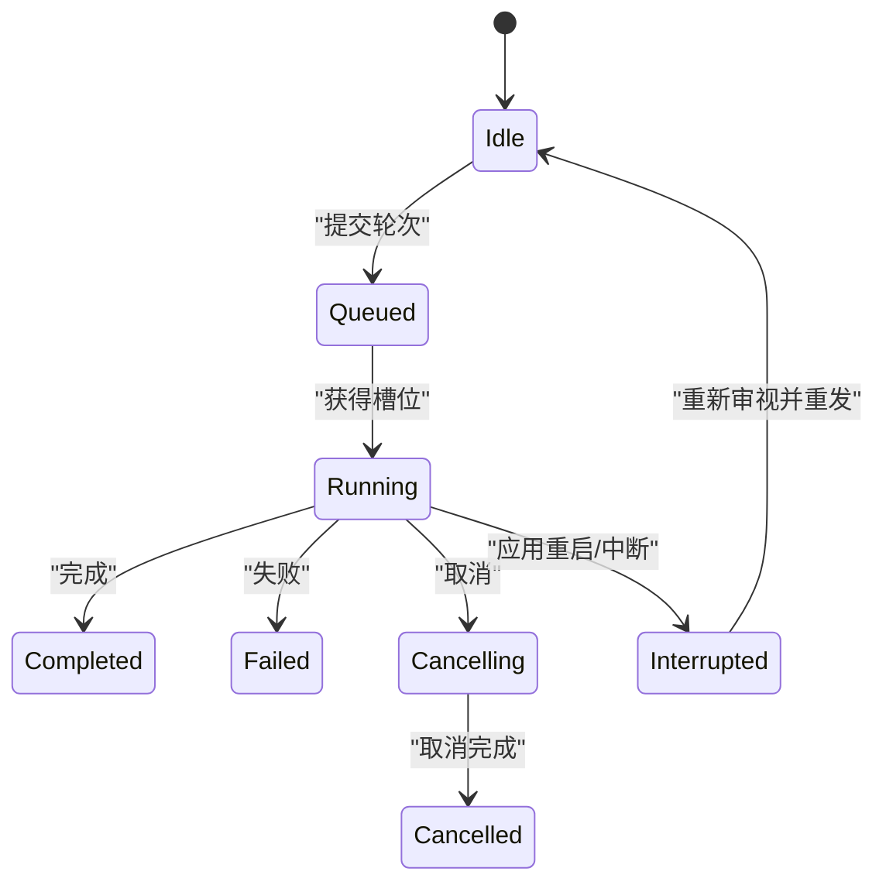
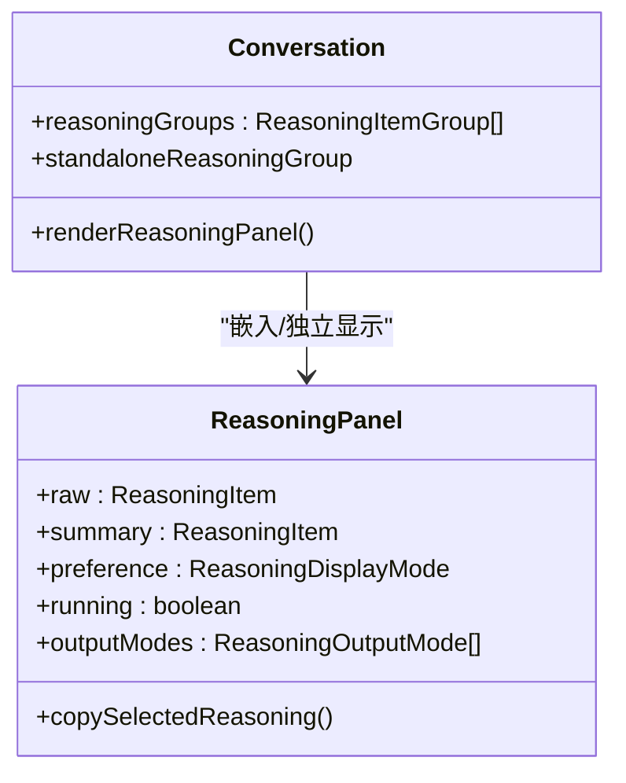
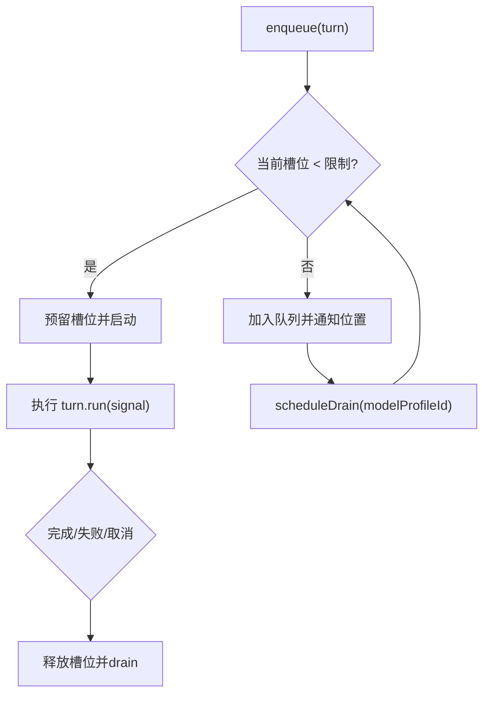
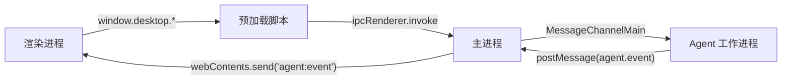
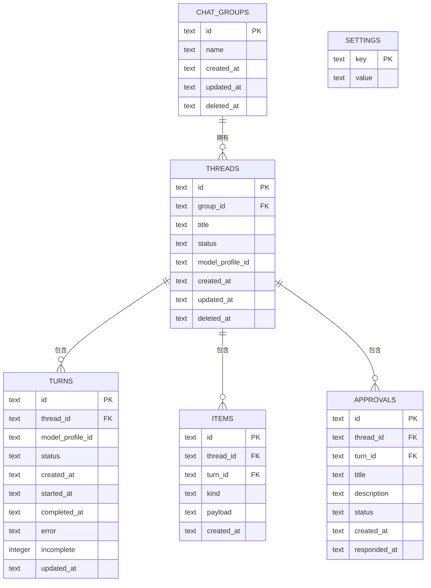
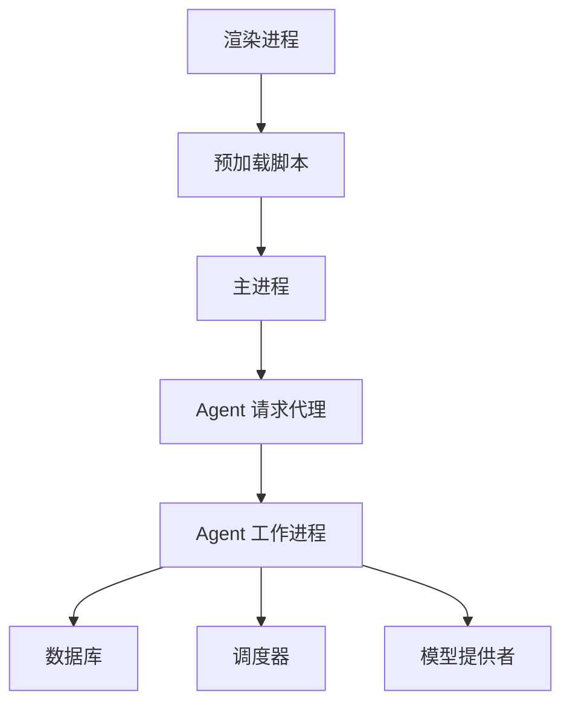

# 核心特性

<cite>
**本文引用的文件**
- [README.md](file://README.md)
- [package.json](file://package.json)
- [src/main.ts](file://src/main.ts)
- [src/preload.ts](file://src/preload.ts)
- [src/agent/worker.ts](file://src/agent/worker.ts)
- [src/agent/modelProvider.ts](file://src/agent/modelProvider.ts)
- [src/agent/database.ts](file://src/agent/database.ts)
- [src/agent/turnScheduler.ts](file://src/agent/turnScheduler.ts)
- [src/main/agentRequestBroker.ts](file://src/main/agentRequestBroker.ts)
- [src/shared/domain.ts](file://src/shared/domain.ts)
- [src/shared/protocol.ts](file://src/shared/protocol.ts)
- [src/shared/localQwenIdentity.ts](file://src/shared/localQwenIdentity.ts)
- [model-runtime/README.md](file://model-runtime/README.md)
- [src/renderer/components/Conversation.vue](file://src/renderer/components/Conversation.vue)
- [src/renderer/components/ReasoningPanel.vue](file://src/renderer/components/ReasoningPanel.vue)
</cite>

## 目录
1. [简介](#简介)
2. [项目结构](#项目结构)
3. [核心组件](#核心组件)
4. [架构总览](#架构总览)
5. [详细组件分析](#详细组件分析)
6. [依赖关系分析](#依赖关系分析)
7. [性能考量](#性能考量)
8. [故障排查指南](#故障排查指南)
9. [结论](#结论)
10. [附录：使用示例与最佳实践](#附录使用示例与最佳实践)

## 简介
Private AI Desktop 是一个基于 Electron、Vue 3、TypeScript 的跨平台桌面客户端原型。它采用主进程、渲染进程、Utility Process（Agent 工作进程）的多进程架构，将 UI、安全边界、调度与持久化隔离。支持 OpenAI 兼容 API 与本地 Qwen 模型，提供流式响应、会话与线程管理、推理过程可视化、并发控制与任务队列等关键能力。数据通过 SQLite 持久化，API Key 仅存在于 Agent 工作进程与数据库中，渲染层不可见。

## 项目结构
- 渲染层：Vue 3 组件负责对话、推理面板、设置等交互。
- 预加载脚本：通过 contextBridge 暴露最小化的 window.desktop API。
- 主进程：管理窗口生命周期、安全策略、IPC 转发与 Agent 工作进程生命周期。
- Agent 工作进程：实现请求调度、模型调用、流式解析、SQLite 持久化、事件推送。
- 共享协议与领域模型：定义 IPC 消息类型、领域实体、能力声明与配置约束。
- 本地模型运行时：独立 Docker Compose 服务，暴露 OpenAI 兼容接口。

图表来源
- [src/main.ts:1-170](file://src/main.ts#L1-L170)
- [src/preload.ts:1-32](file://src/preload.ts#L1-L32)
- [src/agent/worker.ts:1-689](file://src/agent/worker.ts#L1-L689)
- [src/agent/database.ts:1-800](file://src/agent/database.ts#L1-L800)
- [src/agent/modelProvider.ts:1-800](file://src/agent/modelProvider.ts#L1-L800)
- [model-runtime/README.md:1-53](file://model-runtime/README.md#L1-L53)

章节来源
- [README.md:1-121](file://README.md#L1-L121)
- [package.json:1-35](file://package.json#L1-L35)

## 核心组件
- 多模型支持：统一通过 OpenAI 兼容端点接入；内置本地 Qwen 标识用于视觉与模板能力判断。
- 流式响应处理：SSE 增量解析、重复 id 去重、阶段推进（连接/压缩/推理/回答）、指标聚合。
- 会话管理与线程组织：群组、线程、轮次（Turn）状态机，按线程限制单活跃轮次。
- 推理过程可视化：原始推理与摘要推理分开展示，支持复制与选择范围。
- 并发控制与任务队列：按模型配置的最大并发度进行 FIFO 排队与动态限流。
- 多进程架构与安全：主进程负责 IPC 与进程管理，Agent 工作进程持有密钥与数据库，渲染进程无敏感权限。
- 数据持久化：SQLite WAL、外键、忙等待超时；会话、轮次、审批、模型配置与设置持久化。

章节来源
- [src/shared/domain.ts:1-319](file://src/shared/domain.ts#L1-L319)
- [src/shared/protocol.ts:1-371](file://src/shared/protocol.ts#L1-L371)
- [src/agent/modelProvider.ts:1-800](file://src/agent/modelProvider.ts#L1-L800)
- [src/agent/turnScheduler.ts:1-378](file://src/agent/turnScheduler.ts#L1-L378)
- [src/agent/database.ts:1-800](file://src/agent/database.ts#L1-L800)
- [src/shared/localQwenIdentity.ts:1-21](file://src/shared/localQwenIdentity.ts#L1-L21)

## 架构总览
- 渲染进程：仅负责 UI 与用户交互，通过 window.desktop 调用 IPC。
- 主进程：创建 BrowserWindow、设置安全策略、启动并维护 Agent 工作进程，转发请求与事件。
- Agent 工作进程：实现请求路由、调度、模型调用、流式解析、持久化与事件推送。
- 外部模型服务：OpenAI 兼容服务端或本地 llama.cpp 服务，遵循 OpenAI 兼容接口。

图表来源
- [src/preload.ts:1-32](file://src/preload.ts#L1-L32)
- [src/main.ts:1-170](file://src/main.ts#L1-L170)
- [src/main/agentRequestBroker.ts:1-86](file://src/main/agentRequestBroker.ts#L1-L86)
- [src/agent/worker.ts:1-689](file://src/agent/worker.ts#L1-L689)
- [src/agent/modelProvider.ts:1-800](file://src/agent/modelProvider.ts#L1-L800)
- [src/agent/database.ts:1-800](file://src/agent/database.ts#L1-L800)

## 详细组件分析

### 多模型支持与本地 Qwen
- 统一通过 OpenAI 兼容端点发起请求，支持自定义 baseUrl、模型名与可选 API Key。
- 本地 Qwen 通过固定地址与模型名识别，启用视觉输入与思考开关模板参数。
- 能力契约由配置文件声明，包括文本、视觉、长上下文、推理模式、并发、流式与用量上报。

图表来源
- [src/shared/localQwenIdentity.ts:1-21](file://src/shared/localQwenIdentity.ts#L1-L21)
- [src/agent/modelProvider.ts:1-800](file://src/agent/modelProvider.ts#L1-L800)
- [src/agent/worker.ts:1-689](file://src/agent/worker.ts#L1-L689)

章节来源
- [src/shared/domain.ts:1-319](file://src/shared/domain.ts#L1-L319)
- [src/shared/localQwenIdentity.ts:1-21](file://src/shared/localQwenIdentity.ts#L1-L21)
- [src/agent/modelProvider.ts:1-800](file://src/agent/modelProvider.ts#L1-L800)

### 流式响应处理
- 增量解析：按行读取 SSE，维护 buffer，解析 data/id 字段，支持重复 id 校验避免重复推送。
- 阶段推进：根据是否有推理内容切换阶段（connecting → reasoning → answering），并在压缩上下文时报告 compressing。
- 指标聚合：合并多次尝试的 token 用量、首字时间、每秒速率，区分 server/client/unavailable 来源。
- 长度限制处理：当 finishReason=length 时，构造 continuation 消息继续生成，直至完成或达到重试上限。

图表来源
- [src/agent/modelProvider.ts:1-800](file://src/agent/modelProvider.ts#L1-L800)

章节来源
- [src/agent/modelProvider.ts:1-800](file://src/agent/modelProvider.ts#L1-L800)

### 会话管理与线程组织
- 群组与线程：支持创建/删除群组与线程，线程可绑定模型配置。
- 轮次状态机：idle → queued → running → completed/failed/cancelled/interrupted，每个线程最多一个活跃轮次。
- 审批机制：需要审批的操作会生成 pending 审批，等待用户响应后继续或拒绝。

图表来源
- [src/agent/database.ts:1-800](file://src/agent/database.ts#L1-L800)
- [src/agent/worker.ts:1-689](file://src/agent/worker.ts#L1-L689)

章节来源
- [src/agent/database.ts:1-800](file://src/agent/database.ts#L1-L800)
- [src/agent/worker.ts:1-689](file://src/agent/worker.ts#L1-L689)

### 推理过程可视化
- 原始推理与摘要推理分别存储为独立的 reasoning 项，支持按偏好显示与复制。
- 运行中推理面板可独立展示，未就绪时提示不可用或正在推理。
- 复制行为限定在推理内容区域，避免误选答案内容。

图表来源
- [src/renderer/components/ReasoningPanel.vue:1-114](file://src/renderer/components/ReasoningPanel.vue#L1-L114)
- [src/renderer/components/Conversation.vue:1-515](file://src/renderer/components/Conversation.vue#L1-L515)

章节来源
- [src/renderer/components/ReasoningPanel.vue:1-114](file://src/renderer/components/ReasoningPanel.vue#L1-L114)
- [src/renderer/components/Conversation.vue:1-515](file://src/renderer/components/Conversation.vue#L1-L515)

### 并发控制与任务队列管理
- 每模型配置最大并发度，超出则入队并按 FIFO 顺序执行。
- 动态限流：更新配置后触发 drain，重新评估槽位与队列位置。
- 取消与抢占：支持取消排队中或运行中的轮次，释放槽位并通知前端。

图表来源
- [src/agent/turnScheduler.ts:1-378](file://src/agent/turnScheduler.ts#L1-L378)
- [src/agent/worker.ts:1-689](file://src/agent/worker.ts#L1-L689)

章节来源
- [src/agent/turnScheduler.ts:1-378](file://src/agent/turnScheduler.ts#L1-L378)
- [src/agent/worker.ts:1-689](file://src/agent/worker.ts#L1-L689)

### 多进程架构与安全控制
- 主进程：创建窗口、设置沙箱与上下文隔离、启动 Agent 工作进程、转发 IPC。
- Agent 工作进程：持有数据库路径、API Key、调度与持久化逻辑，向主进程发送事件。
- 预加载脚本：仅暴露必要方法，禁止直接访问文件系统、网络与密钥。

图表来源
- [src/main.ts:1-170](file://src/main.ts#L1-L170)
- [src/preload.ts:1-32](file://src/preload.ts#L1-L32)
- [src/agent/worker.ts:1-689](file://src/agent/worker.ts#L1-L689)

章节来源
- [src/main.ts:1-170](file://src/main.ts#L1-L170)
- [src/preload.ts:1-32](file://src/preload.ts#L1-L32)
- [src/agent/worker.ts:1-689](file://src/agent/worker.ts#L1-L689)

### 数据持久化机制（SQLite）
- 数据库位于 userData/app.sqlite，开启 WAL、外键、忙等待超时。
- 表结构包含群组、线程、轮次、条目（消息/推理/工具/变更）、审批、设置、工作区。
- 快照查询聚合群组、线程、轮次、条目、审批、模型配置与设置，供 UI 渲染。

图表来源
- [src/agent/database.ts:1-800](file://src/agent/database.ts#L1-L800)

章节来源
- [src/agent/database.ts:1-800](file://src/agent/database.ts#L1-L800)

## 依赖关系分析
- 主进程依赖 Agent 请求代理以管理超时与重连。
- Agent 工作进程依赖数据库、模型提供者、调度器与领域模型。
- 渲染进程依赖预加载脚本暴露的 API 与共享协议类型。

图表来源
- [src/main.ts:1-170](file://src/main.ts#L1-L170)
- [src/main/agentRequestBroker.ts:1-86](file://src/main/agentRequestBroker.ts#L1-L86)
- [src/agent/worker.ts:1-689](file://src/agent/worker.ts#L1-L689)
- [src/agent/turnScheduler.ts:1-378](file://src/agent/turnScheduler.ts#L1-L378)
- [src/agent/modelProvider.ts:1-800](file://src/agent/modelProvider.ts#L1-L800)
- [src/preload.ts:1-32](file://src/preload.ts#L1-L32)

章节来源
- [src/main/agentRequestBroker.ts:1-86](file://src/main/agentRequestBroker.ts#L1-L86)
- [src/agent/turnScheduler.ts:1-378](file://src/agent/turnScheduler.ts#L1-L378)
- [src/agent/modelProvider.ts:1-800](file://src/agent/modelProvider.ts#L1-L800)

## 性能考量
- 流式传输：增量解析减少内存占用，重复 id 去重避免冗余渲染。
- 上下文压缩：接近上下文窗口时自动压缩历史，降低请求大小并提高成功率。
- 并发控制：按模型配置限制并发，避免过载导致延迟或失败。
- 指标统计：区分服务器与客户端速率来源，准确反映性能。
- 数据库优化：WAL 模式提升并发读写性能，外键保证一致性。

## 故障排查指南
- 模型连接测试：检查 baseUrl、模型名、API Key 与网络可达性；若超时或模型不匹配，调整配置。
- 流式错误：若出现重复 id 冲突或空答案，检查服务端实现与重试逻辑。
- 并发异常：若队列位置抖动或无法启动，检查模型配置的最大并发与后端容量。
- 数据库问题：若快照为空或写入失败，检查 WAL、外键与忙等待超时设置。
- 进程通信：若请求超时或端口关闭，检查主进程与 Agent 工作进程的 MessageChannel 状态。

章节来源
- [src/agent/modelProvider.ts:1-800](file://src/agent/modelProvider.ts#L1-L800)
- [src/agent/database.ts:1-800](file://src/agent/database.ts#L1-L800)
- [src/main/agentRequestBroker.ts:1-86](file://src/main/agentRequestBroker.ts#L1-L86)

## 结论
Private AI Desktop 通过清晰的多进程架构与严格的权限边界，实现了安全的本地与云端模型集成。其流式响应、并发控制、会话管理与推理可视化共同提供了稳定且可观测的用户体验。SQLite 持久化确保数据一致性与可恢复性。建议在生产环境中合理配置并发与上下文窗口，并结合监控指标持续优化性能。

## 附录：使用示例与最佳实践
- 安装与运行：使用包管理器安装依赖并启动应用；在设置中配置模型提供商与端点。
- 本地 Qwen：独立启动 Docker Compose 服务，确保端口与模型名称匹配；使用前验证健康与模型列表。
- 会话操作：创建群组与线程，选择模型配置，提交轮次并观察推理面板；必要时暂停或取消。
- 并发与队列：根据后端容量调整最大并发；关注队列位置与槽位释放。
- 数据备份：定期备份 app.sqlite 以保留会话与配置；谨慎清理历史条目以避免丢失上下文。
- 安全实践：不在 UI 中暴露 API Key；仅在 Agent 工作进程与数据库中保存；避免在日志与错误信息中包含敏感数据。

章节来源
- [README.md:1-121](file://README.md#L1-L121)
- [model-runtime/README.md:1-53](file://model-runtime/README.md#L1-L53)
- [src/preload.ts:1-32](file://src/preload.ts#L1-L32)
- [src/agent/database.ts:1-800](file://src/agent/database.ts#L1-L800)