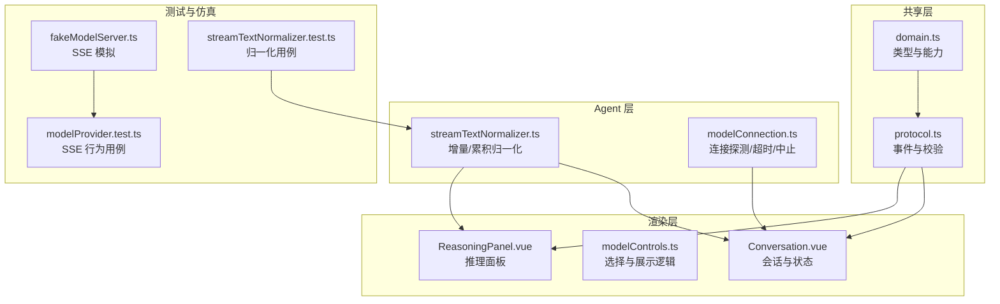
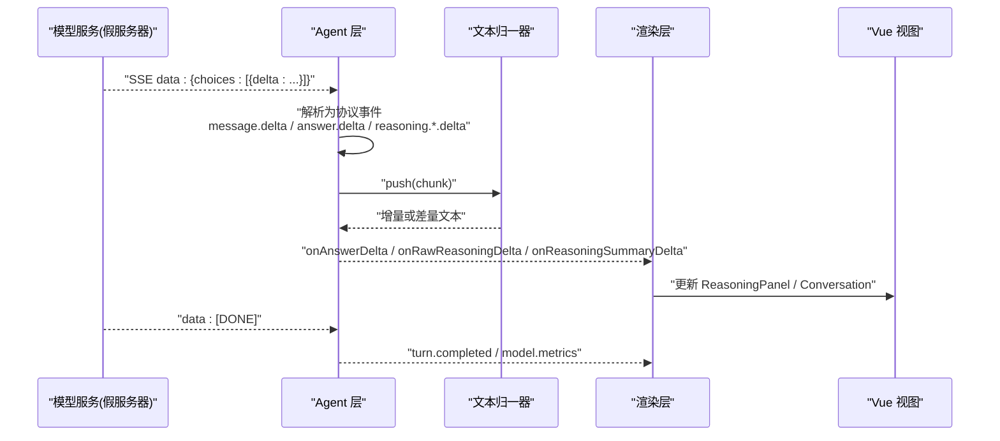
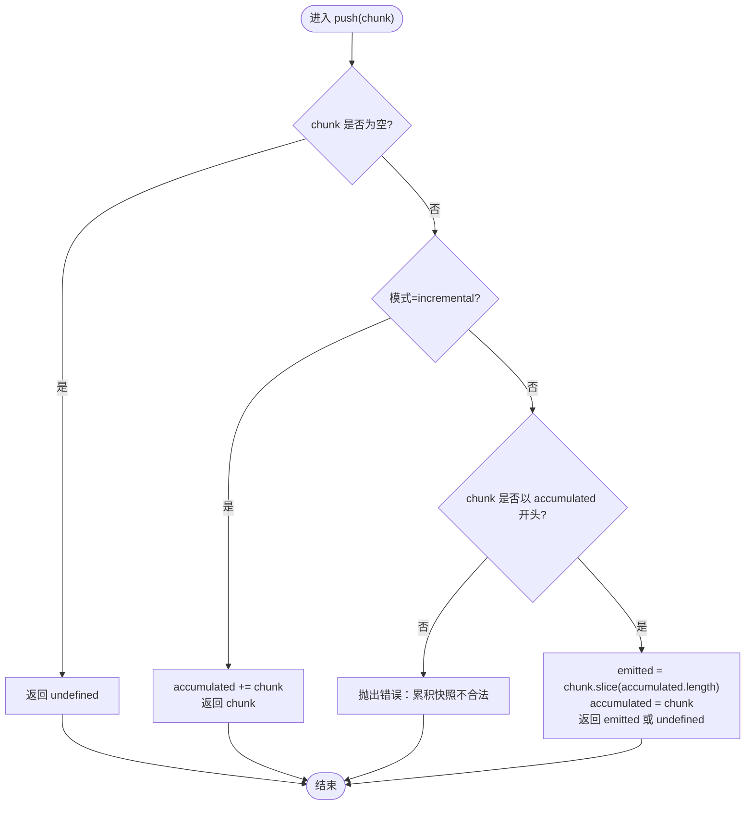
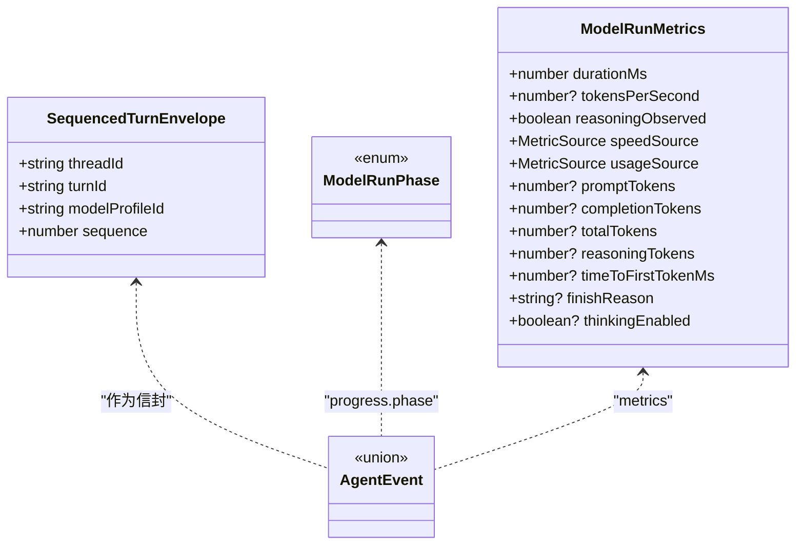
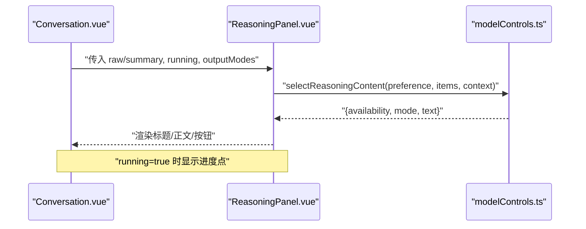
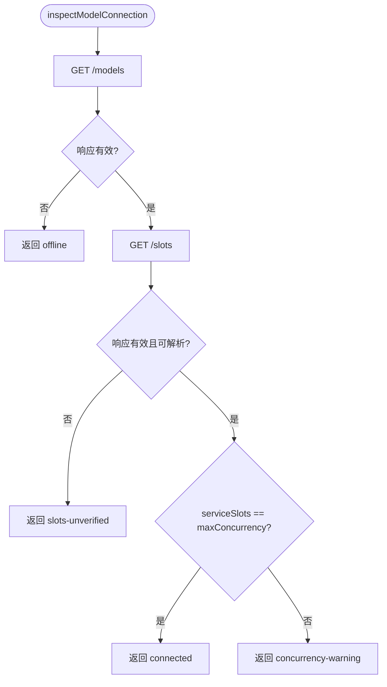
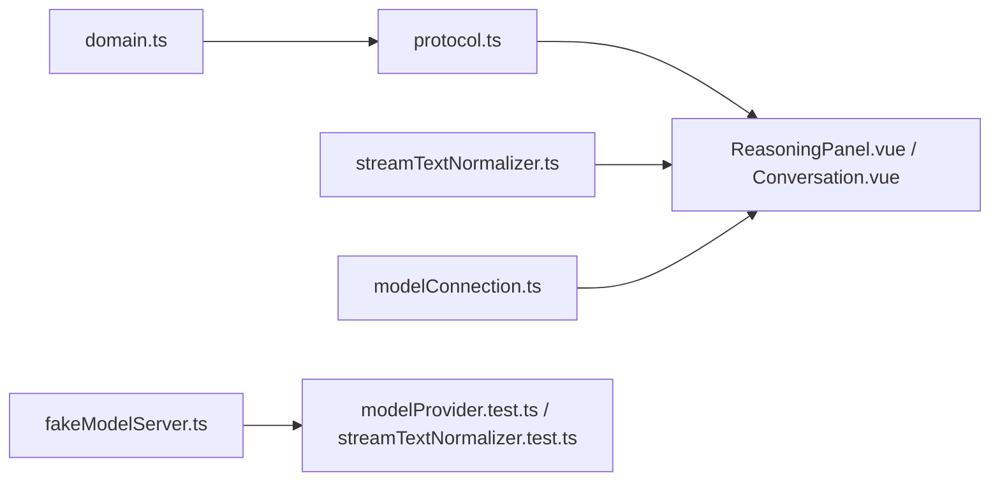

# 流式响应处理

<cite>
**本文引用的文件**
- [src/agent/streamTextNormalizer.ts](file://src/agent/streamTextNormalizer.ts)
- [tests/streamTextNormalizer.test.ts](file://tests/streamTextNormalizer.test.ts)
- [src/shared/domain.ts](file://src/shared/domain.ts)
- [src/shared/protocol.ts](file://src/shared/protocol.ts)
- [src/renderer/components/ReasoningPanel.vue](file://src/renderer/components/ReasoningPanel.vue)
- [src/renderer/modelControls.ts](file://src/renderer/modelControls.ts)
- [src/renderer/components/Conversation.vue](file://src/renderer/components/Conversation.vue)
- [tests/e2e/fakeModelServer.ts](file://tests/e2e/fakeModelServer.ts)
- [tests/modelProvider.test.ts](file://tests/modelProvider.test.ts)
- [src/agent/modelConnection.ts](file://src/agent/modelConnection.ts)
</cite>

## 目录
1. [简介](#简介)
2. [项目结构](#项目结构)
3. [核心组件](#核心组件)
4. [架构总览](#架构总览)
5. [详细组件分析](#详细组件分析)
6. [依赖关系分析](#依赖关系分析)
7. [性能考虑](#性能考虑)
8. [故障排查指南](#故障排查指南)
9. [结论](#结论)
10. [附录](#附录)

## 简介
本技术文档聚焦 Private AI Desktop 的流式响应处理，围绕 SSE（Server-Sent Events）协议实现、增量数据处理与实时文本渲染机制展开。重点说明推理过程可视化、思考步骤展示与响应状态跟踪；解释流式数据的解析、校验与错误处理策略；提供性能优化、内存管理与网络异常恢复建议；并给出调试方法与监控指标收集方案，帮助前端高效处理大量流式数据更新。

## 项目结构
本项目将流式能力拆分为多层：
- 共享领域与协议层：定义模型能力、运行阶段、事件类型与度量字段，确保前后端一致的数据契约。
- Agent 层：负责连接探测、流读取与事件归一化，屏蔽底层传输差异。
- 渲染层：基于 Vue 组件消费事件，进行增量渲染与交互。
- 测试与仿真：通过端到端假服务器与单元测试验证字节级分片、重复事件去重、多通道独立归一化等边界场景。

图表来源
- [src/shared/domain.ts:100-148](file://src/shared/domain.ts#L100-L148)
- [src/shared/protocol.ts:48-65](file://src/shared/protocol.ts#L48-L65)
- [src/agent/streamTextNormalizer.ts:1-33](file://src/agent/streamTextNormalizer.ts#L1-L33)
- [src/agent/modelConnection.ts:11-91](file://src/agent/modelConnection.ts#L11-L91)
- [src/renderer/components/ReasoningPanel.vue:1-114](file://src/renderer/components/ReasoningPanel.vue#L1-L114)
- [src/renderer/modelControls.ts:67-87](file://src/renderer/modelControls.ts#L67-L87)
- [src/renderer/components/Conversation.vue:406-437](file://src/renderer/components/Conversation.vue#L406-L437)
- [tests/e2e/fakeModelServer.ts:75-109](file://tests/e2e/fakeModelServer.ts#L75-L109)
- [tests/modelProvider.test.ts:879-949](file://tests/modelProvider.test.ts#L879-L949)
- [tests/streamTextNormalizer.test.ts:1-72](file://tests/streamTextNormalizer.test.ts#L1-L72)

章节来源
- [src/shared/domain.ts:100-148](file://src/shared/domain.ts#L100-L148)
- [src/shared/protocol.ts:48-65](file://src/shared/protocol.ts#L48-L65)

## 核心组件
- 流式文本归一器：支持“增量”和“累积”两种模式，分别用于不同传输语义，保证重复片段与字节切分下的正确性。
- 事件协议与校验：统一的事件类型、序列号与会话上下文，配合严格的字段校验，保障消息完整性。
- 推理面板与选择逻辑：根据用户偏好与运行时能力，动态选择并渲染原始或摘要推理内容。
- 连接与中断控制：统一的 AbortSignal 与超时封装，确保网络异常可恢复、资源可释放。
- 仿真与测试：字节级分片的 SSE 模拟与覆盖用例，验证去重、顺序与多通道隔离。

章节来源
- [src/agent/streamTextNormalizer.ts:1-33](file://src/agent/streamTextNormalizer.ts#L1-L33)
- [src/shared/protocol.ts:48-65](file://src/shared/protocol.ts#L48-L65)
- [src/renderer/components/ReasoningPanel.vue:1-114](file://src/renderer/components/ReasoningPanel.vue#L1-L114)
- [src/renderer/modelControls.ts:67-87](file://src/renderer/modelControls.ts#L67-L87)
- [src/agent/modelConnection.ts:11-91](file://src/agent/modelConnection.ts#L11-L91)
- [tests/e2e/fakeModelServer.ts:75-109](file://tests/e2e/fakeModelServer.ts#L75-L109)
- [tests/modelProvider.test.ts:879-949](file://tests/modelProvider.test.ts#L879-L949)
- [tests/streamTextNormalizer.test.ts:1-72](file://tests/streamTextNormalizer.test.ts#L1-L72)

## 架构总览
下图展示了从 SSE 到 UI 的端到端流程：服务端以 text/event-stream 推送 JSON delta，客户端逐条解析为协议事件，经归一器处理后驱动视图增量更新，并在完成时输出度量指标。

图表来源
- [tests/e2e/fakeModelServer.ts:75-109](file://tests/e2e/fakeModelServer.ts#L75-L109)
- [src/shared/protocol.ts:48-65](file://src/shared/protocol.ts#L48-L65)
- [src/agent/streamTextNormalizer.ts:1-33](file://src/agent/streamTextNormalizer.ts#L1-L33)
- [src/renderer/components/ReasoningPanel.vue:1-114](file://src/renderer/components/ReasoningPanel.vue#L1-L114)

## 详细组件分析

### 流式文本归一器（增量与累积）
- 增量模式：直接追加 chunk，保留所有语义重复，适合“纯增量”传输。
- 累积模式：要求每次 chunk 是上一次完整快照的扩展，仅返回新增部分；若不符合前缀约束则抛出错误，便于上游快速发现协议不一致。
- 多通道隔离：每个 channel（如 answer、rawReasoning、summary）拥有独立归一器实例，避免相互污染。

图表来源
- [src/agent/streamTextNormalizer.ts:8-33](file://src/agent/streamTextNormalizer.ts#L8-L33)

章节来源
- [src/agent/streamTextNormalizer.ts:1-33](file://src/agent/streamTextNormalizer.ts#L1-L33)
- [tests/streamTextNormalizer.test.ts:1-72](file://tests/streamTextNormalizer.test.ts#L1-L72)

### SSE 协议与事件流
- 事件类型：包含 turn 生命周期、消息增量、推理增量、工具调用、进度与度量等。
- 校验：对 threadId、turnId、sequence、phase、metrics 等关键字段进行严格类型与范围检查，防止脏数据进入渲染管线。
- 度量：durationMs、tokensPerSecond、reasoningObserved、timeToFirstTokenMs 等字段用于性能与体验评估。

图表来源
- [src/shared/protocol.ts:41-65](file://src/shared/protocol.ts#L41-L65)
- [src/shared/domain.ts:238-257](file://src/shared/domain.ts#L238-L257)

章节来源
- [src/shared/protocol.ts:48-65](file://src/shared/protocol.ts#L48-L65)
- [src/shared/domain.ts:238-257](file://src/shared/domain.ts#L238-L257)

### 推理面板与实时渲染
- 选择逻辑：根据用户偏好与运行时能力，优先显示摘要推理，回退到原始推理；未启用时显示为空或不支持。
- 运行态反馈：running 状态下显示进度点，提示内容正在生成；完成后允许复制推理内容。
- 组合展示：按 turnId 聚合 raw 与 summary，形成一组推理条目，提升可读性与操作效率。

图表来源
- [src/renderer/components/ReasoningPanel.vue:1-114](file://src/renderer/components/ReasoningPanel.vue#L1-L114)
- [src/renderer/modelControls.ts:67-87](file://src/renderer/modelControls.ts#L67-L87)
- [src/renderer/components/Conversation.vue:406-437](file://src/renderer/components/Conversation.vue#L406-L437)

章节来源
- [src/renderer/components/ReasoningPanel.vue:1-114](file://src/renderer/components/ReasoningPanel.vue#L1-L114)
- [src/renderer/modelControls.ts:67-87](file://src/renderer/modelControls.ts#L67-L87)
- [src/renderer/components/Conversation.vue:406-437](file://src/renderer/components/Conversation.vue#L406-L437)

### 连接探测与中断控制
- 连接探测：访问 /models 与 /slots，校验模型与并发槽位一致性，返回 connected / concurrency-warning / slots-unverified 等结果。
- 中断与超时：使用 AbortSignal 包装 fetch/json 操作，取消时抛出明确原因；封装 linkedTimeoutSignal 以便在超时或外部中止时及时释放资源。
- 错误分类：offline、model-mismatch、slots-unverified 等，便于上层决策重试或降级。

图表来源
- [src/agent/modelConnection.ts:11-91](file://src/agent/modelConnection.ts#L11-L91)
- [src/agent/modelConnection.ts:117-136](file://src/agent/modelConnection.ts#L117-L136)

章节来源
- [src/agent/modelConnection.ts:11-91](file://src/agent/modelConnection.ts#L11-L91)
- [src/agent/modelConnection.ts:117-136](file://src/agent/modelConnection.ts#L117-L136)

### SSE 仿真与关键用例
- 字节级分片：将 payload 逐字节发送，验证 UTF-8 字符跨块边界时的正确性。
- 重复事件去重：仅对显式 id 重复的事件去重，不影响普通增量重复。
- 多通道独立：answer、rawReasoning、summary 各自维护独立归一器状态，互不干扰。

章节来源
- [tests/e2e/fakeModelServer.ts:75-109](file://tests/e2e/fakeModelServer.ts#L75-L109)
- [tests/modelProvider.test.ts:879-949](file://tests/modelProvider.test.ts#L879-L949)
- [tests/streamTextNormalizer.test.ts:1-72](file://tests/streamTextNormalizer.test.ts#L1-L72)

## 依赖关系分析
- 渲染层依赖协议与领域类型，确保事件结构与展示逻辑一致。
- Agent 层通过归一器解耦传输语义（增量/累积），降低对上游实现的耦合。
- 测试层通过假服务器与断言用例，反向约束 Agent 与渲染层的稳定性。

图表来源
- [src/shared/domain.ts:100-148](file://src/shared/domain.ts#L100-L148)
- [src/shared/protocol.ts:48-65](file://src/shared/protocol.ts#L48-L65)
- [src/agent/streamTextNormalizer.ts:1-33](file://src/agent/streamTextNormalizer.ts#L1-L33)
- [src/agent/modelConnection.ts:11-91](file://src/agent/modelConnection.ts#L11-L91)
- [tests/e2e/fakeModelServer.ts:75-109](file://tests/e2e/fakeModelServer.ts#L75-L109)
- [tests/modelProvider.test.ts:879-949](file://tests/modelProvider.test.ts#L879-L949)
- [tests/streamTextNormalizer.test.ts:1-72](file://tests/streamTextNormalizer.test.ts#L1-L72)

章节来源
- [src/shared/domain.ts:100-148](file://src/shared/domain.ts#L100-L148)
- [src/shared/protocol.ts:48-65](file://src/shared/protocol.ts#L48-L65)
- [src/agent/streamTextNormalizer.ts:1-33](file://src/agent/streamTextNormalizer.ts#L1-L33)
- [src/agent/modelConnection.ts:11-91](file://src/agent/modelConnection.ts#L11-L91)
- [tests/e2e/fakeModelServer.ts:75-109](file://tests/e2e/fakeModelServer.ts#L75-L109)
- [tests/modelProvider.test.ts:879-949](file://tests/modelProvider.test.ts#L879-L949)
- [tests/streamTextNormalizer.test.ts:1-72](file://tests/streamTextNormalizer.test.ts#L1-L72)

## 性能考虑
- 增量渲染：优先使用增量模式，减少冗余计算与 DOM 更新；仅在需要时切换到累积模式。
- 批处理与节流：对高频 delta 合并渲染批次，避免每帧多次重排；必要时结合 requestAnimationFrame。
- 内存管理：及时释放 AbortController 与监听器；在组件卸载时清理定时器与事件绑定。
- 网络恢复：对超时与中断采用指数退避重试；区分 offline、model-mismatch、slots-unverified 等错误类型采取不同策略。
- 指标采集：利用 protocol 中的 metrics 字段统计首字延迟、吞吐、推理观察标志等，辅助定位瓶颈。

[本节为通用指导，无需特定文件引用]

## 故障排查指南
- 现象：推理面板无内容或显示“不支持/为空”
  - 检查 selectReasoningContent 的选择逻辑与 outputModes 配置。
  - 确认 running 状态与 preference 设置。
- 现象：重复或乱序文本
  - 核对传输模式（增量/累积）是否与归一器匹配；累积模式下需满足前缀扩展约束。
  - 检查 SSE id 重复事件的去重策略是否符合预期。
- 现象：连接失败或并发告警
  - 查看 inspectModelConnection 返回的状态；对比 serviceSlots 与 maxConcurrency。
  - 关注 AbortSignal 与超时封装是否正确释放。
- 现象：长时间无首字
  - 通过 metrics.timeToFirstTokenMs 与 phase 变化定位阻塞点。

章节来源
- [src/renderer/modelControls.ts:67-87](file://src/renderer/modelControls.ts#L67-L87)
- [src/agent/streamTextNormalizer.ts:1-33](file://src/agent/streamTextNormalizer.ts#L1-L33)
- [tests/modelProvider.test.ts:879-949](file://tests/modelProvider.test.ts#L879-L949)
- [src/agent/modelConnection.ts:11-91](file://src/agent/modelConnection.ts#L11-L91)

## 结论
本项目通过清晰的协议定义、健壮的归一器与完善的测试体系，实现了稳定高效的流式响应处理。增量与累积模式的分离使传输语义更清晰；推理面板的动态选择与运行态反馈提升了用户体验；连接探测与中断控制保障了鲁棒性。借助指标与仿真用例，团队可持续优化性能与可靠性。

[本节为总结，无需特定文件引用]

## 附录
- 调试建议
  - 在浏览器控制台或 Electron DevTools 中订阅协议事件，观察 message.delta / answer.delta / reasoning.*.delta 的顺序与内容。
  - 使用假服务器回放典型负载（字节级分片、重复 id、多通道叠加）复现问题。
- 监控指标
  - 首字延迟：timeToFirstTokenMs
  - 吞吐：tokensPerSecond
  - 推理可见性：reasoningObserved
  - 阶段推进：connecting → compressing → reasoning → answering
  - 用量：prompt/completion/total/reasoning tokens

[本节为补充信息，无需特定文件引用]