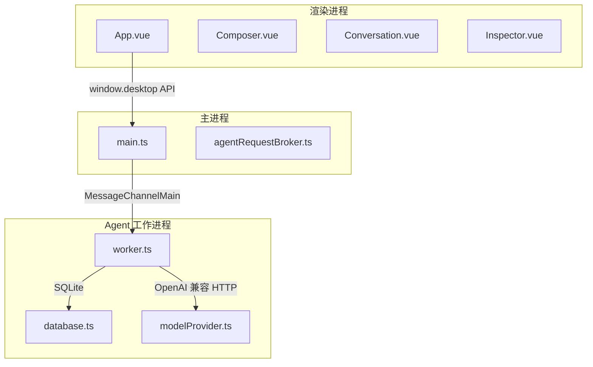
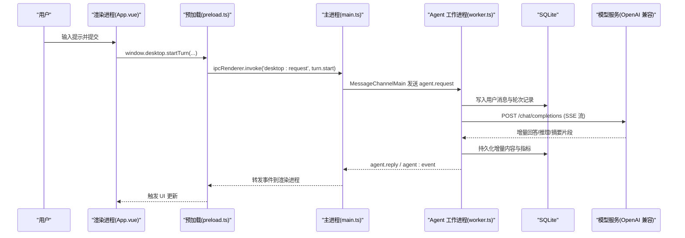
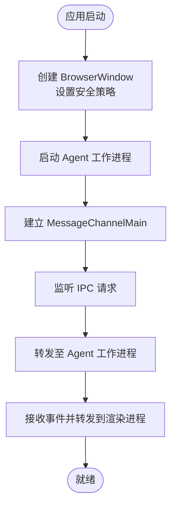
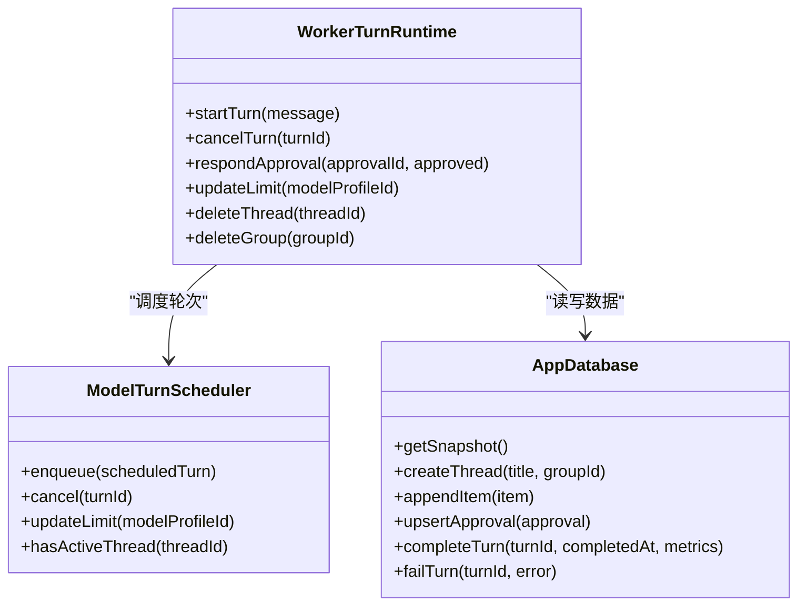
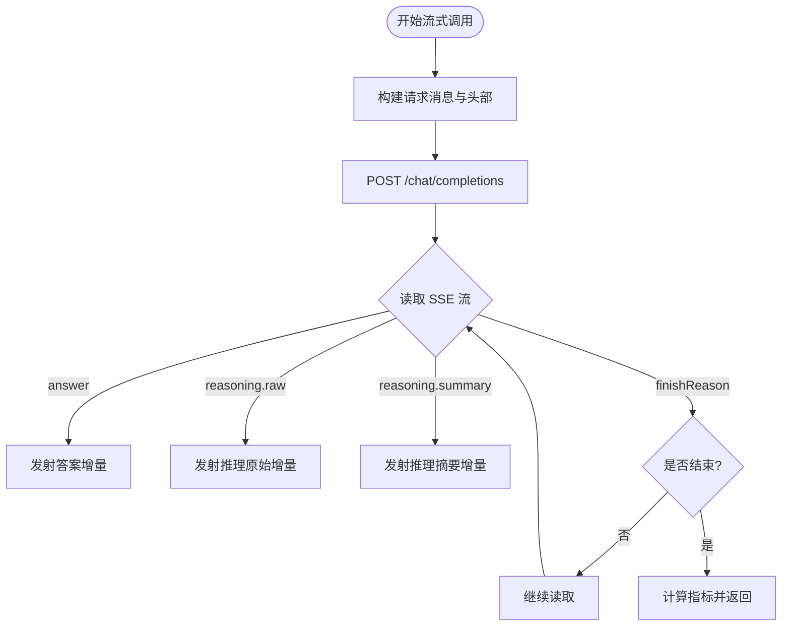
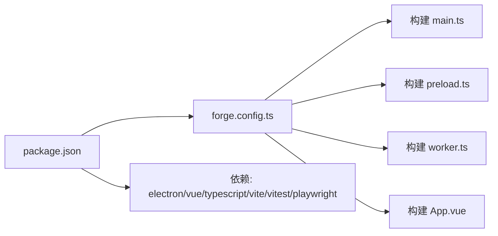

# 项目介绍

<cite>
**本文引用的文件**
- [README.md](file://README.md)
- [package.json](file://package.json)
- [forge.config.ts](file://forge.config.ts)
- [src/main.ts](file://src/main.ts)
- [src/preload.ts](file://src/preload.ts)
- [src/agent/worker.ts](file://src/agent/worker.ts)
- [src/shared/domain.ts](file://src/shared/domain.ts)
- [src/agent/modelProvider.ts](file://src/agent/modelProvider.ts)
- [src/renderer/App.vue](file://src/renderer/App.vue)
- [docs/superpowers/plans/2026-08-17-universal-ai-desktop-mvp.md](file://docs/superpowers/plans/2026-08-17-universal-ai-desktop-mvp.md)
</cite>

## 目录
1. [简介](#简介)
2. [项目结构](#项目结构)
3. [核心组件](#核心组件)
4. [架构总览](#架构总览)
5. [详细组件分析](#详细组件分析)
6. [依赖关系分析](#依赖关系分析)
7. [性能与可靠性](#性能与可靠性)
8. [故障排查指南](#故障排查指南)
9. [结论](#结论)
10. [附录](#附录)

## 简介
Private AI Desktop 是一个基于 Electron 的跨平台私有化 AI 桌面客户端原型。它通过沙箱化的渲染进程、安全的预加载桥接、以及一个独立的 Utility Process（Agent 工作进程）来运行对话调度、模型调用、演示 Agent 和 SQLite 持久化，确保敏感信息（如 API Key）不进入渲染层，且 UI 仅负责展示与交互。项目支持 OpenAI 兼容的模型提供商配置，并通过“能力契约”驱动 UI 行为，而非猜测模型名称。

核心价值主张：
- 隐私优先：API Key 与对话数据保存在本地 SQLite；渲染进程无直接文件系统、网络或密钥访问权限。
- 多进程隔离：主进程管理窗口与安全策略，Agent 工作进程承载业务逻辑与 I/O，渲染进程专注 UI。
- 可插拔模型：以 OpenAI 兼容接口对接多种模型服务，包括本地 Qwen 等。
- 可验证与可测试：提供单元测试、类型检查、打包校验与端到端测试，保障交付质量。

技术选型原因：
- Electron + Forge：统一的桌面应用生命周期、打包与分发能力，覆盖 Windows/macOS/Linux。
- Vue 3 + TypeScript：响应式 UI 与强类型约束，提升可维护性与开发体验。
- Vite：快速构建与热更新，分别为主进程、预加载、Agent、渲染进程提供独立构建管线。
- Node sqlite：避免原生编译依赖，简化安装与打包体积。
- MessagePort IPC：主进程与 Agent 之间使用高性能、类型安全的双向通道。

与其他 AI 桌面应用的区别与优势：
- 严格的安全边界：渲染进程不可见系统资源与密钥；所有请求经 Preload 白名单方法转发。
- 显式的能力契约：UI 根据模型声明的能力（推理模式、并发限制、流式输出等）动态启用功能，避免“黑盒猜测”。
- 本地优先的数据与流程：SQLite WAL 模式、会话与事件序列持久化，重启后状态可恢复但不会自动重放未完成任务。
- 面向生产的质量保障：ASAR 包内容扫描、E2E 用例覆盖关键路径（并发、取消、复制行为、重启中断等）。

许可证与社区：
- 仓库未包含 LICENSE 文件；如需开源许可，请遵循组织或贡献者约定并在发布前补充。
- 社区支持与贡献方式：通过 Issues 提交问题与改进建议；参考 README 中的命令进行本地启动、测试与打包；E2E 与单元测试为贡献者提供回归保障。

**章节来源**
- [README.md:1-121](file://README.md#L1-L121)
- [docs/superpowers/plans/2026-08-17-universal-ai-desktop-mvp.md:1-20](file://docs/superpowers/plans/2026-08-17-universal-ai-desktop-mvp.md#L1-L20)

## 项目结构
项目采用按职责划分的目录组织：
- src/main.ts：Electron 主进程入口，创建窗口、安全策略、启动 Agent 工作进程、IPC 路由。
- src/preload.ts：预加载脚本，暴露最小化 window.desktop API 给渲染进程。
- src/agent/worker.ts：Utility Process 入口，实现对话调度、模型调用、演示 Agent、SQLite 持久化与事件序列化。
- src/shared/*：共享类型与协议定义（domain、protocol、redaction 等），被主进程、Agent、渲染进程共同引用。
- src/renderer/*：Vue 3 渲染层，包含组件、样式、国际化与状态管理。
- model-runtime/*：本地 Qwen 服务的 Docker Compose 与脚本，独立于 Electron 进程运行。
- tests/*：单元、集成与 E2E 测试。
- forge.config.ts：Electron Forge 配置，定义多入口构建与打包目标。

**图表来源**
- [src/main.ts:1-170](file://src/main.ts#L1-L170)
- [src/agent/worker.ts:1-689](file://src/agent/worker.ts#L1-L689)
- [src/renderer/App.vue:1-199](file://src/renderer/App.vue#L1-L199)

**章节来源**
- [forge.config.ts:1-50](file://forge.config.ts#L1-L50)
- [package.json:1-35](file://package.json#L1-L35)

## 核心组件
- 渲染进程（Renderer）：纯 UI，通过 Preload 暴露的 window.desktop 方法发起请求与订阅事件。
- 预加载（Preload）：使用 contextBridge 暴露最小 API，屏蔽底层 IPC 细节。
- 主进程（Main）：管理 BrowserWindow、安全策略、启动并维护 Agent 工作进程，转发请求与事件。
- Agent 工作进程（Worker）：实现对话调度、模型调用、演示 Agent、SQLite 持久化、事件序列化与错误脱敏。
- 模型提供者（Model Provider）：封装 OpenAI 兼容的 chat/completions 流式调用、上下文压缩、超时控制与指标收集。
- 数据库（SQLite）：WAL 模式、外键约束、忙等待超时，存储线程、轮次、消息、审批与设置。

这些组件通过严格的类型与协议通信，保证跨进程数据安全与一致性。

**章节来源**
- [src/preload.ts:1-32](file://src/preload.ts#L1-L32)
- [src/main.ts:1-170](file://src/main.ts#L1-L170)
- [src/agent/worker.ts:1-689](file://src/agent/worker.ts#L1-L689)
- [src/agent/modelProvider.ts:1-800](file://src/agent/modelProvider.ts#L1-L800)
- [src/shared/domain.ts:1-319](file://src/shared/domain.ts#L1-L319)

## 架构总览
Private AI Desktop 采用三进程架构：
- 渲染进程：仅负责 UI 渲染与用户交互，禁止直接访问系统资源与密钥。
- 主进程：负责 Electron 生命周期、窗口安全策略、Agent 进程管理与 IPC 路由。
- Agent 工作进程：承载业务逻辑（调度、模型调用、演示 Agent）、SQLite 持久化与事件序列化。

**图表来源**
- [src/renderer/App.vue:105-112](file://src/renderer/App.vue#L105-L112)
- [src/preload.ts:15-17](file://src/preload.ts#L15-L17)
- [src/main.ts:103-108](file://src/main.ts#L103-L108)
- [src/agent/worker.ts:417-441](file://src/agent/worker.ts#L417-L441)
- [src/agent/modelProvider.ts:55-197](file://src/agent/modelProvider.ts#L55-L197)

## 详细组件分析

### 主进程（Main）
- 创建 BrowserWindow 并启用安全选项：contextIsolation、sandbox、禁用 nodeIntegration。
- 启动 Agent 工作进程，建立 MessageChannelMain 双向通道，传递数据库路径与应用版本。
- 处理健康检查与桌面请求，将请求转发至 Agent 工作进程，并将事件回推至渲染进程。
- 在应用退出时清理 Agent 进程与端口。

**图表来源**
- [src/main.ts:56-96](file://src/main.ts#L56-L96)
- [src/main.ts:98-108](file://src/main.ts#L98-L108)
- [src/main.ts:131-144](file://src/main.ts#L131-L144)

**章节来源**
- [src/main.ts:1-170](file://src/main.ts#L1-L170)

### 预加载（Preload）
- 通过 contextBridge.exposeInMainWorld 暴露 window.desktop API，包括健康检查、快照获取、群组/线程管理、轮次开始/取消、语言设置、模型配置保存/删除/测试、事件订阅等。
- 所有方法均通过 ipcRenderer.invoke 调用主进程，确保渲染进程无法直接访问系统资源。

**章节来源**
- [src/preload.ts:1-32](file://src/preload.ts#L1-L32)

### Agent 工作进程（Worker）
- 初始化数据库连接，创建 WorkerTurnRuntime，负责：
  - 轮次调度：每个线程最多一个活动轮次；按模型配置的并发限制进行队列与执行。
  - 模型调用：通过 streamChatCompletion 调用 OpenAI 兼容接口，处理 SSE 流、上下文压缩、超时与重试。
  - 演示 Agent：无需真实模型即可演示审批与流式输出。
  - 事件序列化：为每个事件附加 threadId、turnId、modelProfileId、sequence，确保顺序与幂等。
  - 持久化：将增量答案、推理原始文本、推理摘要、审批请求写入 SQLite。
  - 错误脱敏：对错误信息进行敏感信息过滤，避免泄露 API Key。

**图表来源**
- [src/agent/worker.ts:155-405](file://src/agent/worker.ts#L155-L405)
- [src/agent/worker.ts:417-441](file://src/agent/worker.ts#L417-L441)

**章节来源**
- [src/agent/worker.ts:1-689](file://src/agent/worker.ts#L1-L689)

### 模型提供者（Model Provider）
- 实现 streamChatCompletion：
  - 构建请求头与消息体，支持 Authorization Bearer。
  - 读取 SSE 流，解析 answer/raw reasoning/reasoning summary 增量。
  - 上下文压缩：当接近上下文限制时，压缩历史消息与最新用户输入，必要时分片续写。
  - 超时控制：默认 5 分钟，最大 60 分钟；按 token 估算超时时间。
  - 指标收集：durationMs、timeToFirstTokenMs、tokensPerSecond、usage 等。
- 实现 testModelProfile：连接测试，返回连接状态与服务槽位信息。

**图表来源**
- [src/agent/modelProvider.ts:55-197](file://src/agent/modelProvider.ts#L55-L197)
- [src/agent/modelProvider.ts:563-680](file://src/agent/modelProvider.ts#L563-L680)

**章节来源**
- [src/agent/modelProvider.ts:1-800](file://src/agent/modelProvider.ts#L1-L800)

### 渲染进程（Renderer）
- App.vue 作为应用外壳，组合侧边栏、对话区、检查器与设置页。
- 通过 useApp 管理状态、事件订阅与用户操作（创建线程、提交提示、取消轮次、响应审批）。
- 支持主题切换、语言切换与模型配置测试。

**章节来源**
- [src/renderer/App.vue:1-199](file://src/renderer/App.vue#L1-L199)

## 依赖关系分析
- 构建与打包：
  - Electron Forge 配置多入口构建（main、preload、agent、renderer）。
  - ASAR 打包限制，仅允许 package.json 与生产 .vite/** 产物，拒绝敏感与缓存文件。
- 运行时依赖：
  - Vue 3 用于渲染层。
  - Electron 提供桌面环境与 IPC。
  - TypeScript 与 Vite 提供类型与构建工具链。
  - Vitest 与 Playwright 用于测试与 E2E。

**图表来源**
- [package.json:1-35](file://package.json#L1-L35)
- [forge.config.ts:1-50](file://forge.config.ts#L1-L50)

**章节来源**
- [package.json:1-35](file://package.json#L1-L35)
- [forge.config.ts:1-50](file://forge.config.ts#L1-L50)

## 性能与可靠性
- 并发与队列：
  - 每个模型配置文件有独立的并发限制与 FIFO 队列；不同 profile 互不影响。
  - 取消进行中轮次会释放一个槽位；取消排队中轮次移除一次。
- 上下文压缩：
  - 当接近上下文限制时，自动压缩历史消息与最新用户输入，必要时分片续写以避免长度限制失败。
- 超时与重试：
  - 默认 5 分钟基础超时，最大 60 分钟；按 token 估算超时时间；遇到长度限制时尝试续写。
- 指标与观测：
  - 记录 durationMs、timeToFirstTokenMs、tokensPerSecond、usage 等；速度来源区分服务端与客户端。
- 数据持久化：
  - SQLite WAL 模式、外键约束、忙等待超时；事件与增量内容持久化，重启后状态可恢复但不自动重放未完成任务。

[本节为通用指导，不直接分析具体文件]

## 故障排查指南
- 连接测试失败：
  - 检查模型服务是否在线、模型名称是否匹配、API Key 是否正确。
  - 连接测试仅证明可达性，不推断或认证模型能力。
- 流式输出异常：
  - 确认 SSE 流包含 id 与 data；重复 id 与冲突数据会被拒绝。
  - 若流结束但未产生最终答案，视为失败并保持不完整。
- 上下文限制：
  - 观察是否触发上下文压缩；必要时调整 maxOutputTokens 与 longContext 能力。
- 重启后状态：
  - 重启后 queued/running/cancelling 轮次变为 interrupted；需重新发送提示。
- 错误信息脱敏：
  - 错误信息已过滤敏感内容；若仍出现泄露，检查 safeErrorText 与 API Key 配置。

**章节来源**
- [README.md:36-77](file://README.md#L36-L77)
- [src/agent/modelProvider.ts:563-680](file://src/agent/modelProvider.ts#L563-L680)
- [src/agent/worker.ts:294-304](file://src/agent/worker.ts#L294-L304)

## 结论
Private AI Desktop 通过严格的多进程隔离、显式的能力契约与本地优先的数据策略，提供了一个安全、可验证、可扩展的 AI 桌面客户端原型。其技术栈选择兼顾了开发效率与生产可用性，适合需要私有化部署与可控能力的场景。未来可在现有基础上扩展更多模型适配、工具调用与工作区治理。

[本节为总结性内容，不直接分析具体文件]

## 附录
- 安装与运行：
  - 使用 pnpm install 与 pnpm start 启动开发环境。
  - 本地 Qwen 服务通过 Docker Compose 独立运行，不在 Electron 进程内。
- 模型配置：
  - 在设置中添加模型提供商，配置基础 URL、模型名称、可选 API Key、推理能力与最大并发。
- 测试与打包：
  - 使用 pnpm test、pnpm typecheck、pnpm test:e2e、pnpm make 进行验证与分发。

**章节来源**
- [README.md:5-35](file://README.md#L5-L35)
- [README.md:78-103](file://README.md#L78-L103)