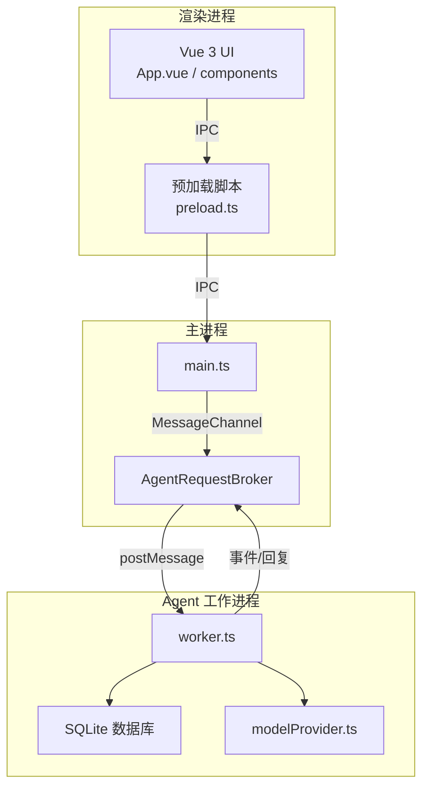
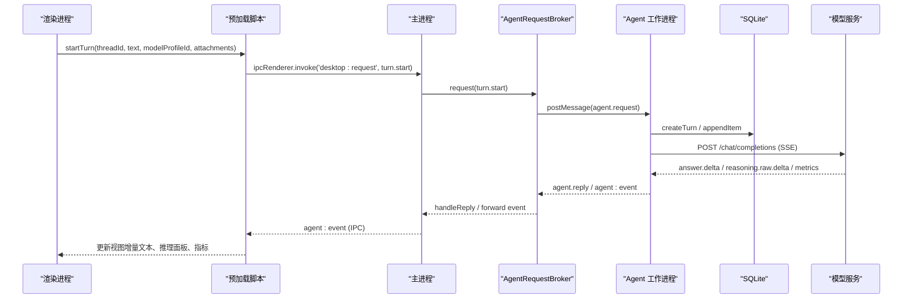
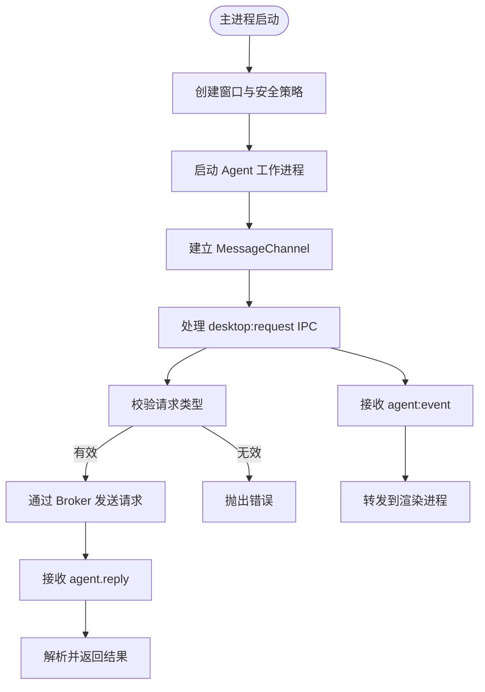
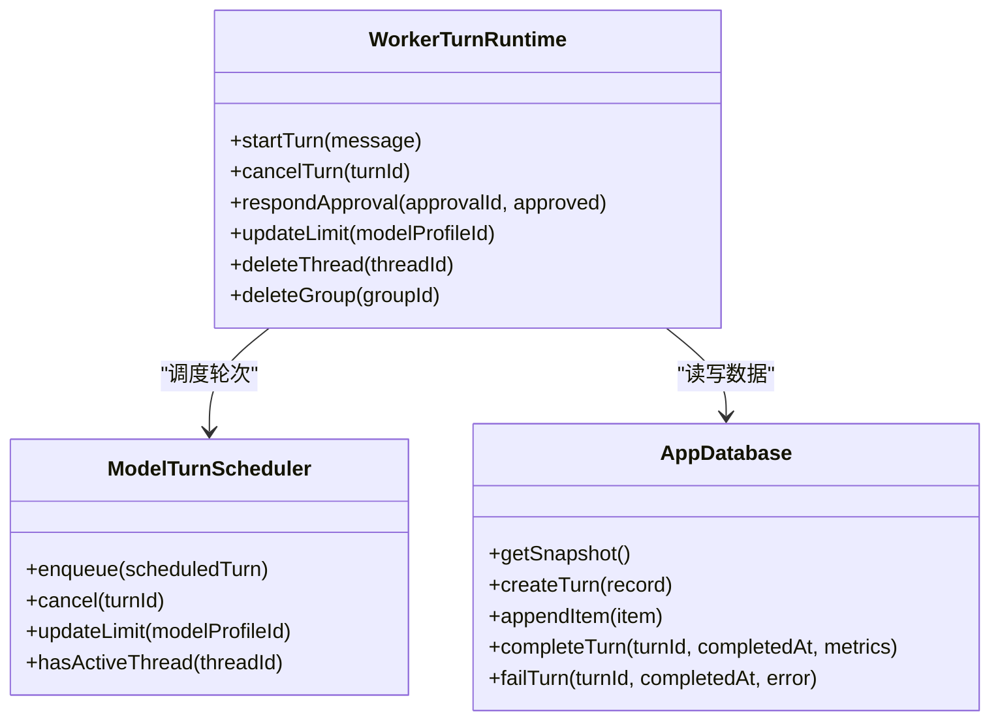
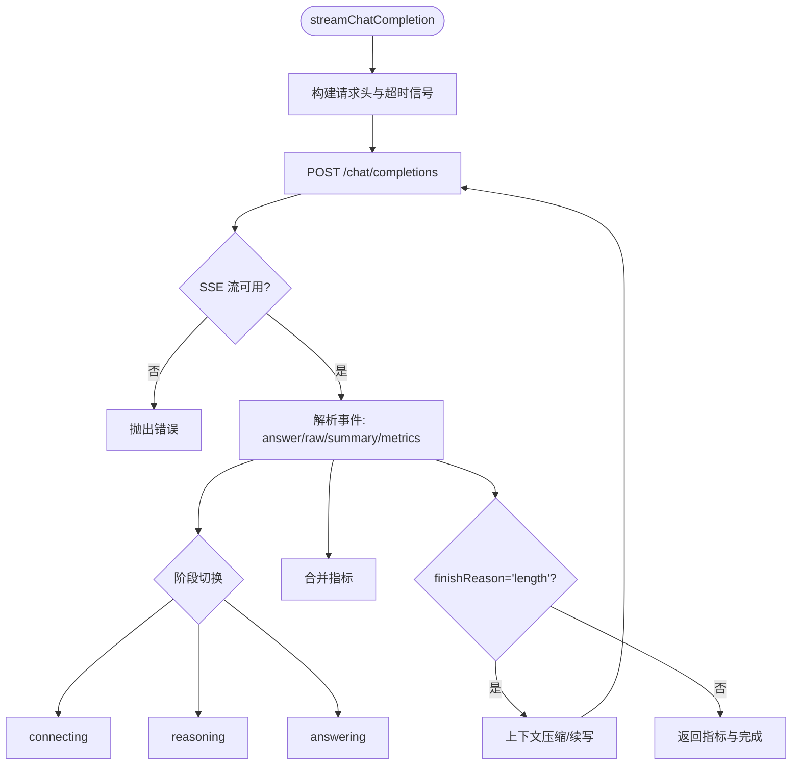
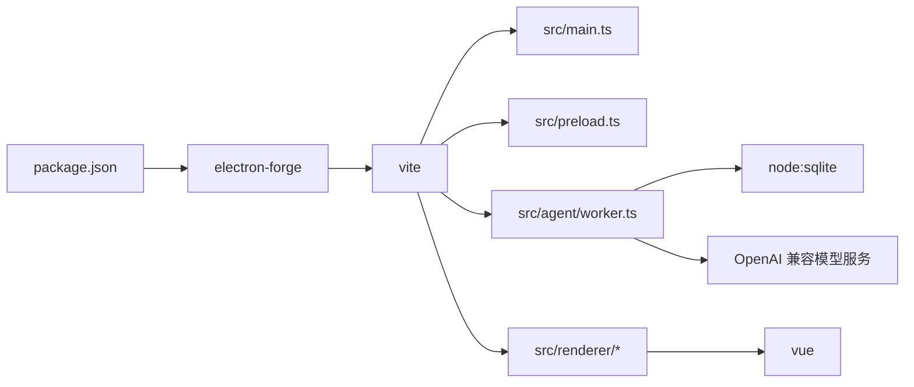

# 项目概述

<cite>
**本文引用的文件**
- [README.md](file://README.md)
- [package.json](file://package.json)
- [forge.config.ts](file://forge.config.ts)
- [src/main.ts](file://src/main.ts)
- [src/preload.ts](file://src/preload.ts)
- [src/renderer/main.ts](file://src/renderer/main.ts)
- [src/renderer/App.vue](file://src/renderer/App.vue)
- [src/main/agentRequestBroker.ts](file://src/main/agentRequestBroker.ts)
- [src/agent/worker.ts](file://src/agent/worker.ts)
- [src/agent/modelProvider.ts](file://src/agent/modelProvider.ts)
- [src/shared/protocol.ts](file://src/shared/protocol.ts)
- [src/shared/domain.ts](file://src/shared/domain.ts)
- [model-runtime/README.md](file://model-runtime/README.md)
</cite>

## 目录
1. [简介](#简介)
2. [项目结构](#项目结构)
3. [核心组件](#核心组件)
4. [架构总览](#架构总览)
5. [详细组件分析](#详细组件分析)
6. [依赖关系分析](#依赖关系分析)
7. [性能考量](#性能考量)
8. [故障排查指南](#故障排查指南)
9. [结论](#结论)
10. [附录：快速开始与配置模型](#附录快速开始与配置模型)

## 简介
Private AI Desktop 是一个基于 Electron 的跨平台 AI 桌面客户端原型，采用 Vue 3、TypeScript、沙箱渲染进程、Utility Process Agent 运行时以及本地 SQLite 数据库。它支持确定性演示对话和“OpenAI 兼容”的模型提供商配置，提供流式响应、推理过程展示、并发控制与本地数据持久化。应用将敏感信息（如 API Key）限制在 Utility Process 与 SQLite 中，并在渲染层进行脱敏处理。

## 项目结构
- 渲染层（Renderer）：Vue 3 UI，仅负责界面交互与状态展示，不直接访问文件系统、网络或数据库。
- 预加载脚本（Preload）：通过 contextBridge 暴露最小化的 window.desktop API，桥接渲染进程与主进程 IPC。
- 主进程（Main）：管理 Electron 生命周期、窗口安全策略、请求转发与事件广播。
- Agent 工作进程（Utility Process）：实现调度、模型调用、演示代理、SQLite 持久化与事件序列化。
- 共享协议与领域模型：定义跨进程通信协议、类型与约束校验。
- 构建与打包：Electron Forge + Vite，分别构建 main、preload、agent、renderer 四个产物。

**图表来源**
- [src/main.ts:1-170](file://src/main.ts#L1-L170)
- [src/preload.ts:1-32](file://src/preload.ts#L1-L32)
- [src/main/agentRequestBroker.ts:1-86](file://src/main/agentRequestBroker.ts#L1-L86)
- [src/agent/worker.ts:1-689](file://src/agent/worker.ts#L1-L689)
- [src/agent/modelProvider.ts:1-800](file://src/agent/modelProvider.ts#L1-L800)

**章节来源**
- [README.md:104-112](file://README.md#L104-L112)
- [package.json:6-14](file://package.json#L6-L14)
- [forge.config.ts:9-49](file://forge.config.ts#L9-L49)

## 核心组件
- 主进程与窗口安全：启用 contextIsolation、sandbox，禁用 nodeIntegration；外部链接通过 shell.openExternal 打开；导航拦截防止越界跳转。
- 预加载 API：暴露 health、snapshot、group/thread 管理、turn 启动/取消、审批响应、语言设置、模型配置保存/删除/测试、事件订阅等能力。
- Agent 工作进程：维护会话上下文、消息历史、轮次调度、模型流式调用、演示模式、SQLite 持久化、事件序列化和错误脱敏。
- 模型提供者：封装 OpenAI 兼容的 chat/completions 流式读取、SSE 解析、上下文压缩与续写、指标聚合、连接测试。
- 协议与领域模型：严格校验 DesktopRequest、AgentEvent、ModelProfileInput、AppSnapshot 等数据结构，确保跨进程数据安全。

**章节来源**
- [src/main.ts:56-95](file://src/main.ts#L56-L95)
- [src/preload.ts:5-31](file://src/preload.ts#L5-L31)
- [src/agent/worker.ts:155-405](file://src/agent/worker.ts#L155-L405)
- [src/agent/modelProvider.ts:55-197](file://src/agent/modelProvider.ts#L55-L197)
- [src/shared/protocol.ts:22-65](file://src/shared/protocol.ts#L22-L65)
- [src/shared/domain.ts:283-305](file://src/shared/domain.ts#L283-L305)

## 架构总览
应用采用多进程隔离设计：
- 渲染进程仅持有 UI 状态，通过 window.desktop 调用 IPC。
- 主进程作为安全边界，校验请求并转发到 Agent 工作进程。
- Agent 工作进程拥有数据库、调度器、模型调用与演示逻辑，并通过 MessageChannel 与主进程通信。
- 模型服务为外部 OpenAI 兼容端点（例如本地 Qwen 服务），通过 SSE 流式返回答案、推理内容与指标。

**图表来源**
- [src/preload.ts:15-25](file://src/preload.ts#L15-L25)
- [src/main.ts:103-143](file://src/main.ts#L103-L143)
- [src/main/agentRequestBroker.ts:33-63](file://src/main/agentRequestBroker.ts#L33-L63)
- [src/agent/worker.ts:223-305](file://src/agent/worker.ts#L223-L305)
- [src/agent/modelProvider.ts:563-680](file://src/agent/modelProvider.ts#L563-L680)

## 详细组件分析

### 主进程与请求路由
- 创建 BrowserWindow 时启用安全选项，并设置 preload。
- 使用 MessageChannelMain 与 Agent 工作进程建立双向通道。
- 通过 AgentRequestBroker 管理请求 ID、超时与重试清理。
- 将 Agent 事件转发给渲染进程，供 UI 实时更新。

**图表来源**
- [src/main.ts:56-143](file://src/main.ts#L56-L143)
- [src/main/agentRequestBroker.ts:15-86](file://src/main/agentRequestBroker.ts#L15-L86)

**章节来源**
- [src/main.ts:1-170](file://src/main.ts#L1-L170)
- [src/main/agentRequestBroker.ts:1-86](file://src/main/agentRequestBroker.ts#L1-L86)

### Agent 工作进程与会话调度
- 初始化数据库路径与端口，创建 WorkerTurnRuntime。
- 每个线程最多一个活跃轮次；按模型配置的最大并发度进行 FIFO 排队。
- 启动轮次时记录 TurnRecord，追加用户消息，构建聊天历史，进入调度队列。
- 执行阶段根据是否选择模型配置走真实模型流式调用或演示模式。
- 完成或失败后更新数据库，发送完成/失败事件，释放资源。

**图表来源**
- [src/agent/worker.ts:155-405](file://src/agent/worker.ts#L155-L405)
- [src/agent/database.ts:36-64](file://src/agent/database.ts#L36-L64)

**章节来源**
- [src/agent/worker.ts:106-124](file://src/agent/worker.ts#L106-L124)
- [src/agent/worker.ts:223-305](file://src/agent/worker.ts#L223-L305)
- [src/agent/worker.ts:307-405](file://src/agent/worker.ts#L307-L405)

### 模型提供者与流式响应
- 统一封装 OpenAI 兼容的 chat/completions 接口，支持 Authorization 头与可选 usage。
- 使用 ReadableStream 与 TextDecoder 解析 SSE 事件，去重重复 id，追踪 phase（connecting/reasoning/answering）。
- 自动上下文压缩与续写：当接近上下文上限或服务报错时，对历史进行摘要压缩，并提示继续生成。
- 指标聚合：合并多次尝试的 tokens、速率、时间戳，计算首 token 时间与每秒 token 数。
- 连接测试：探测 /v1/models 列表与模型名称匹配，报告连接状态与并发警告。

**图表来源**
- [src/agent/modelProvider.ts:55-197](file://src/agent/modelProvider.ts#L55-L197)
- [src/agent/modelProvider.ts:563-680](file://src/agent/modelProvider.ts#L563-L680)
- [src/agent/modelProvider.ts:762-795](file://src/agent/modelProvider.ts#L762-L795)

**章节来源**
- [src/agent/modelProvider.ts:55-197](file://src/agent/modelProvider.ts#L55-L197)
- [src/agent/modelProvider.ts:535-561](file://src/agent/modelProvider.ts#L535-L561)

### 协议与领域模型
- DesktopRequest：定义所有从渲染进程发起的操作类型，包括快照获取、群组/线程管理、轮次启动/取消、审批响应、模型配置保存/删除/测试、语言与主题设置等。
- AgentEvent：定义从 Agent 流向渲染进程的时序事件，包含轮次状态、增量文本、推理内容、工具调用、指标与审批请求等。
- Domain：定义应用快照、消息项、推理项、工具项、变更项、审批、设置、模型能力、运行指标、工作区等核心数据结构。

**章节来源**
- [src/shared/protocol.ts:22-65](file://src/shared/protocol.ts#L22-L65)
- [src/shared/protocol.ts:274-371](file://src/shared/protocol.ts#L274-L371)
- [src/shared/domain.ts:24-74](file://src/shared/domain.ts#L24-L74)
- [src/shared/domain.ts:87-176](file://src/shared/domain.ts#L87-L176)
- [src/shared/domain.ts:238-305](file://src/shared/domain.ts#L238-L305)

### 本地数据存储机制
- 使用 Node 内置 sqlite 模块，避免原生编译依赖。
- 数据库位于 Electron userData 下的 app.sqlite，开启 WAL、外键与忙等待超时。
- 通过 AppDatabase 接口提供快照查询、群组/线程/轮次/条目/审批/模型配置/设置的增删改查。
- 事件持久化：answer.delta、reasoning.raw.delta、reasoning.summary.delta 会追加为 Item；approval.required 转为 Approval 记录。

**章节来源**
- [src/agent/database.ts:1-200](file://src/agent/database.ts#L1-L200)
- [README.md:114-118](file://README.md#L114-L118)

## 依赖关系分析
- 构建与打包：Electron Forge + Vite，分别构建 main、preload、agent、renderer 四个入口。
- 运行时依赖：Vue 3（渲染层）、Electron（宿主）、Playwright（E2E）、Vitest（单元测试）。
- 外部集成：OpenAI 兼容模型服务（例如本地 Qwen 服务），通过 HTTP/SSE 通信。

**图表来源**
- [package.json:6-14](file://package.json#L6-L14)
- [forge.config.ts:9-49](file://forge.config.ts#L9-L49)

**章节来源**
- [package.json:16-33](file://package.json#L16-L33)
- [forge.config.ts:1-50](file://forge.config.ts#L1-L50)

## 性能考量
- 流式传输：SSE 增量推送，减少首屏延迟；重复 id 去重保证幂等。
- 上下文压缩：接近上下文上限时自动压缩历史，降低请求体积并提高成功率。
- 并发控制：按模型配置的 maxConcurrency 限制同时运行的轮次数，避免过载。
- 指标采集：记录 durationMs、timeToFirstTokenMs、tokensPerSecond、usage 等，便于评估性能。
- 超时保护：默认与最大超时限制，结合 AbortSignal 及时中断长时间无响应的请求。

[本节为通用指导，无需特定文件引用]

## 故障排查指南
- 连接失败：检查模型服务是否在线、baseUrl 是否正确、API Key 是否配置；使用“测试模型配置”功能验证连通性。
- 模型不匹配：连接测试会比对 /v1/models 返回的模型名称与配置；若不一致需修正配置。
- 上下文超限：观察是否触发压缩与续写；必要时调整 maxOutputTokens 或优化历史长度。
- 流式异常：检查 SSE 事件格式与 id 重复冲突；确认服务端稳定输出。
- 权限与隐私：API Key 仅在 Agent 与 SQLite 中存储，渲染层已脱敏；不要在日志或事件中泄露密钥。

**章节来源**
- [src/agent/modelProvider.ts:535-561](file://src/agent/modelProvider.ts#L535-L561)
- [src/agent/modelProvider.ts:563-680](file://src/agent/modelProvider.ts#L563-L680)
- [README.md:12-14](file://README.md#L12-L14)

## 结论
Private AI Desktop 通过清晰的多进程架构、严格的协议与类型校验、流式响应与本地持久化，提供了安全可控的 AI 桌面体验。其设计兼顾初学者易用性与开发者扩展性：用户可快速配置模型并对话，开发者可基于现有组件扩展新的模型适配器、工具与可视化能力。

[本节为总结性内容，无需特定文件引用]

## 附录：快速开始与配置模型

### 安装与启动
- 安装依赖：pnpm install
- 启动应用：pnpm start

**章节来源**
- [README.md:5-10](file://README.md#L5-L10)
- [package.json:7-14](file://package.json#L7-L14)

### 配置模型
- 在“设置 → 模型提供商”中新增 OpenAI 兼容配置：
  - 基础 URL（例如 http://127.0.0.1:8080/v1）
  - 模型名称
  - 可选 API Key
  - 推理能力（协议、输入模式、输出模式）
  - 最大并发与最大输出 token
- 使用“测试模型配置”验证端点可达性与模型名称匹配。

**章节来源**
- [README.md:12-14](file://README.md#L12-L14)
- [src/shared/protocol.ts:241-272](file://src/shared/protocol.ts#L241-L272)

### 本地 Qwen 服务（独立容器）
- 该服务由 Docker Compose 管理，不在 Electron 进程内；暴露 /v1/chat/completions。
- 使用提供的脚本启动、查看状态、验证与停止服务。
- 注意：启动/退出桌面应用不会自动启停模型容器；使用前需手动启动模型服务。

**章节来源**
- [README.md:16-35](file://README.md#L16-L35)
- [model-runtime/README.md:1-53](file://model-runtime/README.md#L1-L53)

### 常见用例示例
- 新建群组与线程：用于组织不同任务或项目。
- 启动一轮对话：选择模型配置，发送文本与图片附件（若模型支持视觉）。
- 查看推理过程：在右侧检查器中查看 raw reasoning 与 summary（取决于模型能力）。
- 取消进行中轮次：释放并发槽位，避免阻塞后续请求。
- 查看指标：durationMs、timeToFirstTokenMs、tokensPerSecond 等帮助评估响应速度与质量。

**章节来源**
- [src/renderer/App.vue:124-199](file://src/renderer/App.vue#L124-L199)
- [src/agent/worker.ts:223-305](file://src/agent/worker.ts#L223-L305)
- [src/agent/modelProvider.ts:55-197](file://src/agent/modelProvider.ts#L55-L197)