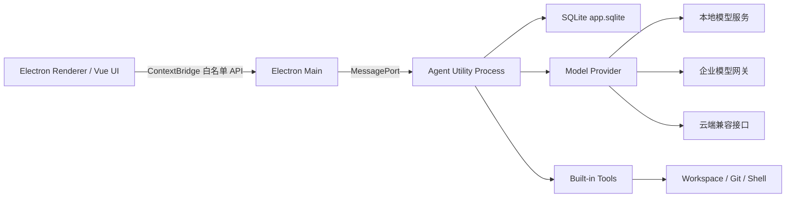

# 通用私有化 AI Desktop：技术栈与 UI 一体化方案

- 日期：2026-08-17
- 状态：待评审
- 产品形态：跨平台桌面应用
- 设计方向：Codex 式任务工作台交互，自有品牌视觉

## 1. 目标

构建一个可以运行在现代 Windows、macOS 和主流 Linux 桌面环境中的通用 AI Desktop。产品能够连接本地或远端大模型，管理工作区和会话，展示 Agent 的执行过程，并在用户批准后执行文件、Git 和 Shell 工具。

第一版优先满足：

1. 单机可运行，无强制云依赖。
2. 同一套代码覆盖 Windows、macOS、Linux。
3. 模型可替换，不绑定单一厂商。
4. 凭证不进入模型上下文。
5. 文件修改和危险命令必须可见、可审批、可审计。
6. UI 保持 Codex 式克制、任务导向和开发者工具感，但不复制其品牌资产。
7. 控制技术栈数量，第一版只使用 TypeScript/Node/Electron 和 SQLite。

## 2. 非目标

第一版不包含：

- 多人实时协作和云端同步。
- Kubernetes、Docker 或远端集群运维控制面。
- 自研模型推理引擎。
- 多 Agent 编排。
- 插件市场。
- 向量数据库和通用 RAG 平台。
- PostgreSQL、Redis、NATS、Kafka、gRPC。
- Go、Rust、Python Sidecar。
- 完整 MCP 扩展；只预留内部 Tool 接口。
- Windows 7、旧版 macOS 和全部 Linux 发行版的无条件兼容承诺。

## 3. 核心技术决策

| 层次 | 选型 | 决策理由 |
|---|---|---|
| Desktop | Electron | 捆绑统一 Chromium，降低三大桌面系统的渲染和输入兼容差异 |
| UI | Vue 3 + TypeScript | 单语言开发，适合复杂交互和流式状态 |
| 构建 | Vite + pnpm | 构建快、配置少、工作区管理简单 |
| Desktop 打包 | Electron Forge | 统一开发、打包和平台安装包流程 |
| Agent Runtime | Electron Utility Process + TypeScript | 保持进程隔离，同时避免引入第二种语言和独立运行时 |
| 本地通信 | Electron IPC + MessagePort | 使用平台内置通信，不额外引入 JSON-RPC 或本地 WebSocket |
| 数据库 | SQLite WAL + Node `node:sqlite` | 单机事务数据库，易迁移和备份；避免原生 npm 模块和 C++ 编译链，保持私有化交付更轻 |
| 密钥 | Electron safeStorage | 使用操作系统提供的加密能力，避免额外 Keychain SDK |
| 模型接入 | Node fetch + HTTP/SSE | 统一适配 OpenAI-Compatible 接口 |
| 样式 | CSS Variables + scoped CSS | 不引入 Tailwind、UnoCSS 或额外 Design System 工具链 |
| 测试 | Vitest + Playwright | 覆盖单元、协议和桌面主流程 |

## 4. 总体架构



### 4.1 Renderer

Renderer 只负责用户界面：

- 工作区、任务和会话列表。
- 消息、Markdown、代码块和流式文本展示。
- 工具执行状态、审批请求和文件 Diff。
- 模型与基础设置。

Renderer 不得直接访问 Node.js、文件系统、Shell、SQLite、环境变量或密钥。

### 4.2 Electron Main

Main 保持为薄层：

- 应用、窗口、菜单、托盘和通知生命周期。
- 单实例、Deep Link 和系统文件选择器。
- safeStorage 加解密。
- Utility Process 的启动、停止、崩溃检测和重启。
- Renderer 与 Utility Process 之间的受控消息转发。
- 自动更新与应用版本信息。

### 4.3 Agent Utility Process

Agent Runtime 使用 TypeScript 实现，负责：

- Thread、Turn、Item 状态管理。
- 模型请求和流式响应。
- Agent 状态机。
- Tool 注册、参数校验和执行。
- 权限判断和审批等待。
- Workspace、文件、Git 和 Shell 操作。
- SQLite 事务和任务恢复。
- 模型输出、命令输出和日志脱敏。

Utility Process 崩溃时不能拖垮 UI；Main 将任务标记为中断并允许用户恢复或重试。

## 5. 进程通信

第一版不使用 JSON-RPC。所有消息使用 TypeScript 可判别联合类型，并在 Main 和 Utility Process 两侧使用显式 Type Guard 做运行时校验；首版不为此引入通用 Schema 框架。

核心请求：

- `thread.create`
- `turn.start`
- `turn.cancel`
- `approval.respond`
- `workspace.select`
- `settings.read`
- `settings.write`

核心事件：

- `turn.started`
- `message.delta`
- `item.started`
- `item.completed`
- `tool.started`
- `tool.output`
- `approval.required`
- `turn.completed`
- `turn.failed`

每个事件包含 `threadId`、`turnId`、单调递增的 `sequence` 和时间戳。UI 根据 `sequence` 去重和恢复，不能把网络或进程到达顺序当作事实顺序。

Preload 仅暴露具名 API，禁止将原始 `ipcRenderer.send` 暴露给 Renderer。

## 6. 数据设计

第一版只使用一个数据库：`app.sqlite`。

### 6.1 核心表

| 表 | 用途 |
|---|---|
| `workspaces` | 用户授权的本地工作区 |
| `threads` | 会话及其归档状态 |
| `turns` | 单次用户请求和 Agent 执行状态 |
| `items` | 消息、工具调用、命令、文件修改和审批事件 |
| `tasks` | 可恢复的长执行任务 |
| `approvals` | 审批请求、决定、原因和时间 |
| `model_profiles` | 模型地址、模型名和能力配置，不保存明文密钥 |
| `settings` | 非敏感应用设置 |
| `schema_migrations` | 数据库迁移版本 |

### 6.2 SQLite 配置

- WAL 模式。
- Foreign Keys 开启。
- Busy Timeout。
- 写操作使用短事务。
- 启动时执行版本化 SQL Migration。
- 周期性 WAL Checkpoint。
- 普通运行日志写滚动文件，不写入单独日志数据库。
- 不持久化模型隐藏推理过程；只保存用户可见消息、工具输入输出和必要审计摘要。

## 7. 模型与工具

### 7.1 Model Provider

内部只定义一个模型接口：

- `listModels`
- `createResponse`
- `streamResponse`
- `cancelResponse`
- `healthCheck`
- `supportsTools`
- `supportsVision`

首版通过 OpenAI-Compatible HTTP 接口覆盖 llama.cpp Server、Ollama、vLLM、SGLang、企业模型网关和兼容云服务。不分别引入厂商 SDK。

模型能力必须由 Profile 显式声明，不能假设所有模型都支持 Tool Calling、Vision、JSON Schema 或长上下文。

### 7.2 Tool

首版内置工具：

- 文件读取。
- 文件搜索。
- Patch 生成和应用。
- Git Status、Diff。
- Shell 命令。

每个 Tool 必须声明名称、描述、输入 Schema、风险等级、工作区权限、超时、输出上限和是否需要审批。输入由 Tool 自身的 `validate` 函数在执行前校验，不能只依赖 TypeScript 编译期类型。

第一版不实现 MCP Client，但 Tool 接口保持独立，后续 MCP 只作为一个适配器加入，不改变 Agent 状态机。

## 8. 安全设计

### 8.1 Electron 安全基线

- `nodeIntegration: false`。
- `contextIsolation: true`。
- `sandbox: true`。
- 只加载随应用打包的本地 UI 资源。
- 使用严格 CSP。
- 禁止未授权导航、弹窗和远程代码执行。
- 校验所有 IPC Sender 和消息 Schema。
- 不向 Renderer 暴露通用文件、Shell 或密钥 API。

### 8.2 工作区边界

- 文件操作只能位于用户显式授权的 Workspace。
- 路径必须转换为规范化绝对路径后再判断。
- 防止 `..`、符号链接、Windows Junction 和大小写差异越界。
- 文件修改先生成 Diff，审批后落盘。
- 删除、覆盖、提权、外部网络和工作区外访问默认要求审批。

### 8.3 密钥

- API Key 使用 safeStorage 的异步接口加密。
- 数据库只保存加密后的 Buffer 和引用信息。
- 密钥不写入日志、Prompt、Tool 参数或模型上下文。
- Linux 检测到 `basic_text` 后禁止保存长期密钥，改为每次会话输入。
- Utility Process 只在发起模型请求的最短时间内取得解密后的密钥。

## 9. UI 设计方向

### 9.1 原则

采用“Codex 式交互骨架 + 自有品牌皮肤”：

- 保留克制、低噪声、任务导向和开发者工具感。
- 借鉴任务、会话、工具执行、审批和 Diff 的信息层级。
- 不复制 Codex 名称、Logo、专有图标、插画和品牌资产。
- 使用自己的强调色、空状态、图标库和产品命名。

### 9.2 主窗口布局

```text
┌────────────────┬────────────────────────────────┬──────────────────┐
│ 左侧导航        │ 主任务区                        │ 右侧检查器        │
│ 240–280 px     │ 自适应，最小 520 px             │ 320–380 px       │
│                │                                │ 可折叠            │
│ 新建任务        │ 任务标题 / 工作区 / 模型         │ 执行计划          │
│ 工作区          │ 用户消息                        │ 文件变更          │
│ 历史任务        │ Agent 消息                      │ 审批请求          │
│ 搜索            │ Tool / Command / Diff          │ 任务状态          │
│ 设置            │ 底部 Composer                  │                  │
└────────────────┴────────────────────────────────┴──────────────────┘
```

- 宽度小于 1100 px 时右侧检查器收起为抽屉。
- 宽度小于 760 px 时左侧导航变成覆盖式面板。
- 主任务区保持稳定宽度，流式输出不得引发明显横向和纵向跳动。

### 9.3 页面结构

第一版包含：

1. **任务主页**：左侧历史任务，中间对话，右侧执行检查器。
2. **工作区选择**：选择目录、最近目录和权限说明。
3. **模型设置**：Endpoint、模型、能力测试和密钥输入。
4. **审批弹窗**：展示动作、目标、风险、Diff 和批准范围。
5. **文件 Diff**：按文件查看变更、接受或拒绝。
6. **应用设置**：主题、字体、日志、更新和数据目录。

### 9.4 视觉 Token

#### Light

| Token | 值 |
|---|---|
| `--bg` | `#F7F7F5` |
| `--surface` | `#FFFFFF` |
| `--surface-muted` | `#F1F1EE` |
| `--border` | `#E4E4DF` |
| `--text` | `#20201E` |
| `--text-muted` | `#72726C` |
| `--accent` | `#2563EB` |
| `--success` | `#16815D` |
| `--danger` | `#D83A3A` |

#### Dark

| Token | 值 |
|---|---|
| `--bg` | `#171716` |
| `--surface` | `#1F1F1E` |
| `--surface-muted` | `#292927` |
| `--border` | `#383835` |
| `--text` | `#F1F1ED` |
| `--text-muted` | `#A5A59E` |
| `--accent` | `#7AA2F7` |
| `--success` | `#4DB88A` |
| `--danger` | `#F06A6A` |

品牌强调色只用于选中态、主要按钮、进度和链接，不大面积铺满界面。

### 9.5 字体、间距和动效

- 正文：操作系统 UI Sans 字体栈。
- 代码、路径、命令：系统等宽字体栈。
- 基础字号：14px；辅助文字 12px；任务标题 16–18px。
- 间距：4、8、12、16、24、32px。
- 圆角：6、8、12px。
- 普通面板不使用重阴影；Popover 和 Dialog 使用轻阴影。
- 动效时长：120–180ms。
- 遵守 `prefers-reduced-motion`。

### 9.6 核心组件

首版自建小型组件层，不引入第二套 Design System：

- Button、IconButton。
- Input、Textarea、Select。
- Tooltip、Popover、Dialog。
- Composer。
- UserMessage、AgentMessage。
- ToolCallCard、CommandCard。
- ApprovalCard。
- DiffViewer。
- TaskStatus、ProgressStep。
- EmptyState、ErrorState。

图标选用一个开源线性图标库，产品 Logo 和 Agent 标识使用自有资产。

## 10. 核心用户流程

### 10.1 新建任务

1. 用户选择 Workspace。
2. 用户选择已验证的 Model Profile。
3. 用户输入请求。
4. Renderer 创建 Turn 并立即展示本地乐观状态。
5. Agent Utility Process 请求模型并持续发出增量事件。
6. Tool 为只读低风险操作时自动执行；写入或危险操作进入审批。
7. 完成后展示摘要、文件变更和后续建议。

### 10.2 审批

审批界面必须回答：

- 将执行什么动作。
- 操作目标是什么。
- 为什么需要执行。
- 可能造成什么影响。
- 是批准一次、当前 Turn，还是拒绝。

审批决定写入数据库并附带用户、时间、作用域和动作摘要。

### 10.3 恢复

- 应用重启后，未完成 Turn 标记为 `interrupted`。
- UI 展示最后持久化的 Item 和中断原因。
- 用户可以重试当前步骤、重新开始 Turn 或放弃。
- 不自动重复执行已经产生外部副作用但结果未知的操作。

## 11. 错误处理

- 模型连接失败：显示可重试错误，保留已接收的增量内容。
- Utility Process 崩溃：Main 记录退出信息，自动重启一次；任务保持中断而非自动重放。
- SQLite 锁或迁移失败：进入只读诊断模式，禁止继续写入。
- Tool 超时：取消子进程并标记超时，保留已截断输出。
- 输出过大：按字节上限截断并保存摘要，避免拖垮 Renderer。
- 密钥不可用：禁止静默降级到明文保存。
- 文件已被外部修改：重新读取并要求用户确认新的 Diff。

## 12. 测试策略

### 12.1 单元测试

- Agent 状态机。
- Tool 权限与审批规则。
- 路径规范化和越界防护。
- 消息 Schema。
- SQLite Repository 和 Migration。
- 模型流式响应解析。
- 日志和密钥脱敏。

### 12.2 集成测试

- Renderer → Main → Utility Process 完整消息链。
- Utility Process 崩溃和恢复。
- SQLite WAL 并发读写。
- 模型取消、超时和断流。
- 文件变更、Diff 和审批落盘。

### 12.3 E2E

使用 Playwright 覆盖：

- 首次启动。
- Workspace 选择。
- 模型 Profile 配置和健康检查。
- 新建任务和流式消息。
- Tool 审批。
- Diff 查看和确认。
- 应用重启后的会话恢复。

Windows、macOS、Linux 分别执行安装包冒烟测试，不能只用浏览器模式代替 Desktop 验证。

## 13. 发布矩阵

| 平台 | 架构 | 格式 |
|---|---|---|
| Windows 10/11 | x64 | NSIS/EXE，企业场景补 MSI |
| Windows 11 | ARM64 | ARM64 安装包 |
| macOS | Intel x64 | DMG/PKG |
| macOS | Apple Silicon | arm64 DMG/PKG |
| Ubuntu/Debian | x64/arm64 | deb、AppImage |
| Fedora/openEuler | x64/arm64 | rpm |

Windows 和 macOS 发布必须代码签名；macOS 必须完成 Notarization。离线客户使用签名离线升级包，不依赖公共更新服务。

## 14. MVP 范围

### 阶段一：可用闭环

- Electron 三进程骨架。
- Workspace 和 Thread/Turn/Item。
- 一个 OpenAI-Compatible Model Provider。
- 流式对话。
- SQLite 持久化。
- 文件读取、搜索和 Git Diff。
- Light/Dark 主题。

### 阶段二：可控执行

- Shell Tool。
- Patch 和文件写入。
- 审批与审计。
- Utility Process 崩溃恢复。
- 模型 Profile 健康检查。
- 三个平台安装包。

### 阶段三：产品化

- 更完善的 Diff 和 Terminal。
- 离线升级。
- 数据导出、备份和诊断包。
- 可选 MCP Adapter。
- 企业策略文件和管理员预配置。

## 15. 验收标准

设计和 MVP 同时满足以下条件才算通过：

1. Windows、macOS、Linux 使用同一套 Vue 页面和 TypeScript Agent 代码。
2. Renderer 中无法直接调用 Node、文件系统、Shell 和 SQLite。
3. Utility Process 崩溃后 UI 仍可用，未完成任务可见且不自动重放副作用。
4. 模型地址可替换，本地模型和企业网关不需要修改 UI。
5. API Key 不出现在 SQLite 明文字段、日志、Prompt 和 Tool 输出中。
6. 文件写入、删除和危险 Shell 命令存在明确审批。
7. 主窗口具备左侧导航、主任务区和可折叠右侧检查器。
8. Light/Dark 主题、键盘导航、焦点态和减少动画模式可用。
9. 安装包在目标系统完成启动、新建任务、审批和恢复冒烟测试。

## 16. 主要风险与取舍

| 风险 | 取舍与控制 |
|---|---|
| Electron 包体和内存较大 | 接受资源成本，换取统一 Chromium 和客户端兼容性 |
| TypeScript Agent 的高权限面 | 使用 Utility Process、Tool 白名单和审批，避免把权限放入 Renderer |
| Node `node:sqlite` 仍在演进 | 锁定 Node/Electron 版本，使用仓储层隔离 API；后续如需可替换为其他 SQLite driver |
| Linux 桌面差异大 | 明确支持发行版矩阵；safeStorage 无安全后端时失败关闭 |
| Codex 风格过于相似 | 只复用交互模式，自建 Logo、强调色、图标和空状态视觉 |
| 第一版没有 MCP | 通过独立 Tool 接口保留扩展点，确认真实需求后再引入 |

## 17. 官方参考

- [Electron 跨平台说明](https://www.electronjs.org/)
- [Electron 进程模型](https://www.electronjs.org/docs/latest/tutorial/process-model)
- [Electron 安全指南](https://www.electronjs.org/docs/latest/tutorial/security)
- [Electron Utility Process](https://www.electronjs.org/docs/latest/api/utility-process)
- [Electron safeStorage](https://www.electronjs.org/docs/latest/api/safe-storage)
- [Node.js SQLite 状态](https://nodejs.org/download/release/latest-v24.x/docs/api/sqlite.html)
- [Codex App Server 公开协议](https://learn.chatgpt.com/docs/app-server)
